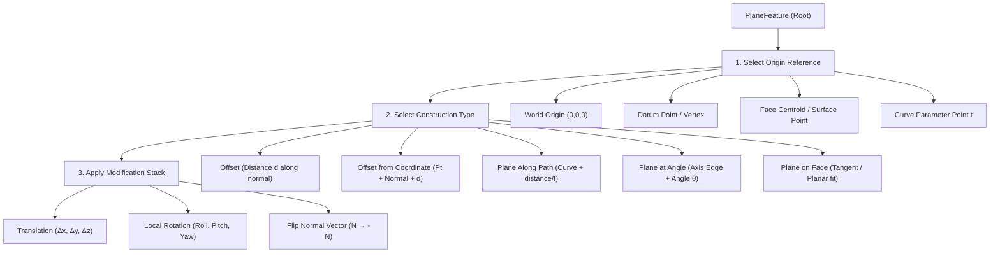

# Architectural Specification: Hierarchical Plane Coordinate Tree (`PlaneFeature`)

**Project GridPlane — Pillar A Extension**  
**Author:** Pair Programmed (Antigravity & User)  

---

## 1. Concept & Architectural Vision

Traditional CAD plane creation tools (e.g., Fusion 360, standard FreeCAD attachments) present flat dialog boxes that obscure the underlying coordinate transformations. This makes editing, re-ordering, or debugging plane alignments complex and error-prone.

The **Hierarchical Plane Coordinate Tree** models every construction plane (`PlaneFeature`) as a deterministic **B-Tree / Transform Stack**. The plane's local coordinate frame $(X', Y', Z')$ is computed by evaluating a sequence of parent-child coordinate nodes.



---

## 2. Construction Modes & Data Model

### Node 1: Origin Selection (`OriginRef`)
Defines the reference point $\mathbf{P}_0 \in \mathbb{R}^3$ for the plane's local origin:
* `AbsoluteOrigin`: $\mathbf{P}_0 = (0, 0, 0)^T$
* `VertexRef`: Bound to topological point or datum point
* `FaceCentroid`: Calculated surface center of selected face
* `CurveParameter`: Point $\mathbf{C}(t)$ on a selected edge curve at parameter $t \in [0, 1]$

### Node 2: Construction Type (`ConstructionMode`)

| Mode | Input Parameters | Geometric Matrix Derivation |
| :--- | :--- | :--- |
| **Offset** | Reference Plane / Face, Distance $d$ | $\mathbf{P}_{new} = \mathbf{P}_0 + d \cdot \mathbf{N}_{ref}$ |
| **Offset from Coordinate** | Coordinate $\mathbf{C}$, Normal $\mathbf{N}$, Distance $d$ | $\mathbf{P}_{new} = \mathbf{C} + d \cdot \mathbf{N}$ |
| **Plane Along Path** | Curve $\mathbf{C}(s)$, Length $s$ or parameter $t$ | Origin at $\mathbf{C}(s)$, Normal $\mathbf{N} = \mathbf{T}(s)$ (Tangent vector) |
| **Plane at Angle** | Axis Edge $\mathbf{L}$, Reference Plane, Angle $\theta$ | Rotate reference normal around axis $\mathbf{L}$ by angle $\theta$ |
| **Plane on Face** | Planar or Curved Surface, UV parameter | Tangent plane at surface $(u, v)$ |

### Node 3: Modification Stack (`TransformModifiers`)
User-editable post-transformations applied sequentially:
1. **Local Offset:** $(\Delta X', \Delta Y', \Delta Z')$ in plane space.
2. **Angular Tilt:** Rotations $(\theta_x, \theta_y, \theta_z)$ around local axes.
3. **Normal Flip:** Inverts $Z'$ local axis ($\mathbf{N} \to -\mathbf{N}$).

---

## 3. Mathematical Transform Cascade

The overall transformation matrix $\mathbf{M}_{\text{plane}} \in SE(3)$ maps local plane coordinates $(x', y', 0)$ to global space $(x, y, z)$:

$$\mathbf{M}_{\text{plane}} = \mathbf{T}(\mathbf{P}_{\text{origin}}) \cdot \mathbf{R}_{\text{construction}}(\text{Type}, \text{Params}) \cdot \mathbf{M}_{\text{modifier}}(\mathbf{\Delta x}, \mathbf{\mathbf{R}_{\text{tilt}}})$$

```cpp
// C++ Architectural Pseudocode for App::PlaneFeature
namespace App {
    class PlaneFeature : public App::GeoFeature {
    public:
        // Properties forming the Coordinate B-Tree
        App::PropertyLinkSub originReference;    // Node 1: Origin reference object
        App::PropertyEnumeration constructionType; // Node 2: Offset, AlongPath, AtAngle, etc.
        App::PropertyFloat offsetDistance;        // Node 2/3 parameters
        App::PropertyAngle angleOffset;
        App::PropertyFloat pathParameter;
        App::PropertyVector localTranslation;
        App::PropertyVector localRotation;
        App::PropertyBool flipNormal;

        // Evaluates the full cascade matrix
        Base::Matrix4D getPlaneTransform() const;
        gp_Pln getOpenCASCADEPlane() const;
    };
}
```

---

## 4. Tree View UX & Integration

In the FreeCAD GUI / Property Dock:
1. **Interactive Tree Structure:** The Plane object displays expandable child nodes in the Tree View representing `Origin` $\to$ `Mode` $\to$ `Modifiers`.
2. **On-Screen Handles:** Drag handles appear in the 3D View for:
   * Distance slider (pulling offset along normal $\mathbf{N}$)
   * Angle wheel (rotating around axis edge)
   * Path slider (dragging along 3D curve)
3. **Parametric Stability:** Changes to child node properties dynamically recalculate $\mathbf{M}_{\text{plane}}$ without breaking downstream Sketcher dependencies attached to the `PlaneFeature`.
