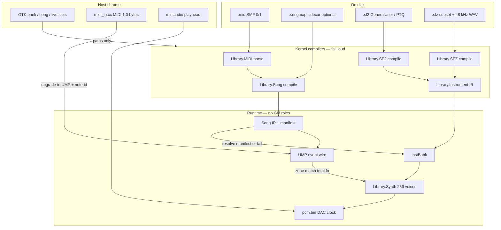
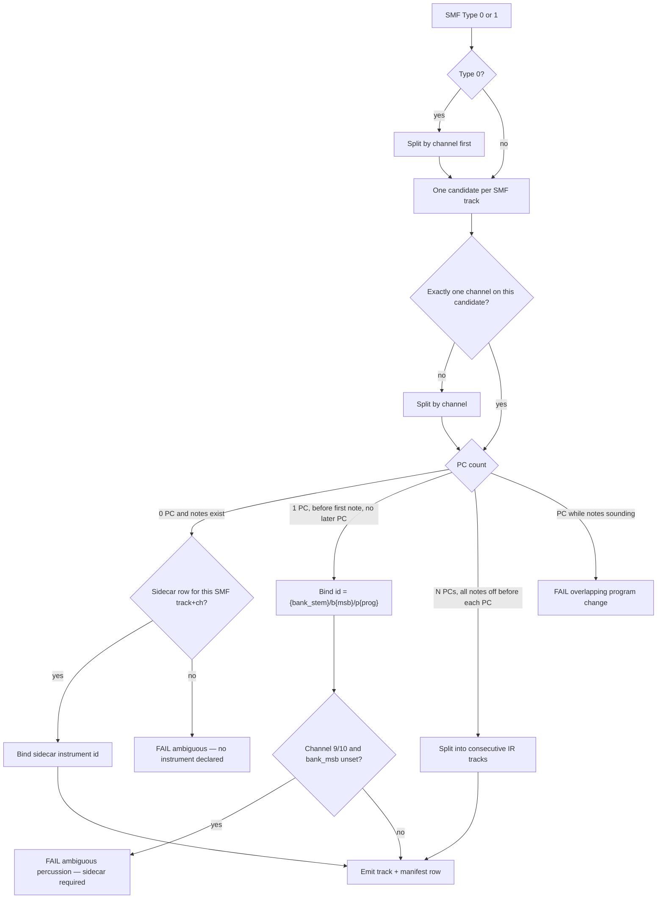
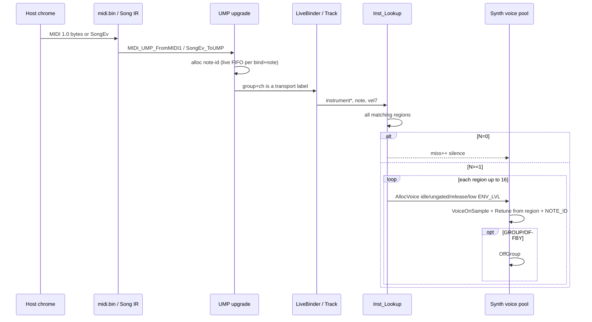

# Internal Song IR + Instrument IR

**Project:** AILANG Media / SynthKit  
**Author:** Sean Collins, 2 Paws Machine and Engineering  
**Date:** 2026-09-19  
**Status:** Draft  
**Supersedes:** slice order in `docs/apps/SYNTH_SAMPLER.md` for format work (S2 velocity / S2b exclusive / S3 SFZ as *engine* slices). Those remain useful as *importer* work, not as the playback model.

Copyright © 2026 Sean Collins, 2 Paws Machine and Engineering. SCSL.

---

## Overview

SynthKit today plays the MIDI 1.0 / SMF / General MIDI / SoundFont 2.0 world *as the runtime*. The kernel in `Applications/SynthKit/synth_app.ailang` feeds `MIDI_SongLoadPath` events straight into `SK_NoteOn`, which hard-maps channel 9 to SF2 bank 128, then falls back through bank 0 and program 0 until something sounds. `Library.SF2.ailang` is both parser *and* voice source. That is why a missing program becomes a piano, a drum convention from 1983 becomes a player special case, a dummy `originalPitch=60` detunes melody splits, and a song plus a bank that disagree become a cacophony.

The format is the bug. This document locks an **internal pair of fully specified IRs** that the engine is allowed to play:

1. **Instrument IR** — one named instrument, explicit regions, total zone match, 48 kHz samples, signed cents. Authored as a documented SFZ *subset*; SF2 compiles into the same structs or fails a preset with a counted diagnostic.
2. **Song IR** — named tracks, each bound to exactly one instrument id, events with note-id, pitch as MIDI note + signed cents, DAC clock as time authority. SMF is an importer that splits Type 1 tracks into clean tracks and emits a manifest. Missing instruments fail the load. Channel 9/10 is not drums.

External MIDI 1.0, SMF, GM/GS/XG, and SF2 are **importers**, not the runtime. MIDI 2.0 UMP (already in `Library.MIDIUMP.ailang`, not wired into SynthKit) is the **internal event wire**. The user does not have to supply MIDI 2.0 files. Once imported, no GM channel role remains.

The voice pool, mixer, and host/kernel split do not change: AILANG owns voices and PCM; GTK + miniaudio + rawmidi stay chrome.

---

## Background & Motivation

### Architecture law (unchanged)

- Kernel: `Applications/SynthKit/synth_app.ailang` via `/dev/shm/synth_app/` (`keys.txt`, `ctl.txt`, `cmd.txt`, `pcm.bin`, `bank.txt`, `midi.bin`, `song.txt`, `song_cmd.txt`).
- Host chrome: `Applications/SynthKit/host/pcm_play.cc`, `synth_shell_gtk.cxx`, `midi_in.cc`.
- One voice pool: `Librarys/Media/Library.Synth.ailang` (`Synth_New(256)`, `SWave.SAMPLE=8`, `SConst.MAXVOICE=4096`). Mixer `NCH=2`, 48 kHz S16LE.
- AILANG constraints (non-negotiable for every new library): explicit keywords, ≤6 arguments per call, flatten nested calls, no C DSP long-haul, no Kontakt, no third mixer in C.

### What the engine actually does today

| Path | Implementation | Role in the fiasco |
|---|---|---|
| SMF parse | `Library.MIDI.ailang` `MIDI_SongLoadPath` / `MIDI_SongSort` | Type 1 tracks are independent event lists with no required patch table. |
| Song play | `SK_PollSong` → `SK_SongTick` → `SK_SongApply` | Plays SMF channel voice *directly*: Note On/Off, CC, program change, pitch bend. |
| Live MIDI | host `midi_in.cc` byte ring → `MIDI_StreamFeed` → `SK_ApplyMidi` | MIDI 1.0 bytes. UMP exists and is unused. |
| Note on | `SK_NoteOn` | Channel 9 → `sfb=128`. Then `SK_StartZones(pr,sfb)`, then bank 0, then `(0,128)`, then `(0,0)`. Miss → `Synth_VoiceOnNote` oscillator (`OSC_FALLBACK`). |
| Zone lookup | `SF2_LookupP` + `SF2_SetNth` | nth matching region of a (bank, program) preset. Correct *as SF2*. Wrong *as a song format*. |
| Pitch | `Synth_RetuneSample` via `SF2_LastRoot/Coarse/Fine/Scale` | Reads compiler scratch globals. `Smp_StepD` is `2^(dsemi/12)` after the 48 kHz resample. Fine cents go through `SF2_S32` now; they used to be unsigned dwords (ice-pick). |
| Voice steal | `Synth_AllocVoice` | Idle scan, then rank (ungated, RELEASE) then quieter `ENV_LVL`. `ch` is `BitwiseAnd(ch, 15)`. `note` is unused. |
| Note off | `Synth_NoteOff(syn, note, ch)` | All voices with that (note, ch). Overlapping same-pitch notes share one Off. |
| GM names | `Library.MIDIGM.ailang` `MIDI_GM_IsDrumChannel` | `ch==9` → drums. Names only, except the player reimplemented the same rule. |
| UMP | `Library.MIDIUMP.ailang` | Pack/unpack/stream. Tests in `dev/compiler-regression/test_midi.ailang`. **Not imported by `synth_app.ailang`.** |
| SFZ / Instrument IR | — | **Do not exist.** `docs/apps/SYNTH_SAMPLER.md` listed them as future slices. |

The fallback ladder that this document bans:

```560:616:Applications/SynthKit/synth_app.ailang
Function.SK_NoteOn {
    ...
            IfCondition EqualTo(pch, 9) ThenBlock: { sfb = 128 }
            nst = SK_StartZones(pr, sfb, note, vv, ch)
            IfCondition EqualTo(nst, 0) ThenBlock: {
                IfCondition And(NotEqual(sfb, 0), NotEqual(sfb, 128)) ThenBlock: {
                    nst = SK_StartZones(pr, 0, note, vv, ch)
                }
            }
            IfCondition EqualTo(nst, 0) ThenBlock: {
                IfCondition EqualTo(sfb, 128) ThenBlock: {
                    nst = SK_StartZones(0, 128, note, vv, ch)
                }
            }
            IfCondition EqualTo(nst, 0) ThenBlock: {
                nst = SK_StartZones(0, 0, note, vv, ch)
            }
            ...
        IfCondition EqualTo(used, 0) ThenBlock: {
            vi = Synth_AllocVoice(SK.syn, note, ch)
            Synth_VoiceOnNote(SK.syn, vi, SK.wave, note, vv)
            ... "SF OSC_FALLBACK ...
```

`Synth_AllocVoice` still collapses track identity to 4 bits:

```686:693:Librarys/Media/Library.Synth.ailang
Function.Synth_AllocVoice {
    Input: syn: Address
    Input: note: Integer
    Input: ch: Integer
    ...
        chn = BitwiseAnd(ch, 15)
```

1943 Boss Win is 22 SMF tracks, 8296 events. They do not fit in 16 GM roles without collision. That is a format defect, not a voice-pool defect.

### Recent bugs that are format evidence (not the design)

These already happened on this tree. They motivate *leaving the format*, not another generator patch.

| Symptom | Cause | Heuristic that made it worse |
|---|---|---|
| Ice-pick on melody | `pitchCorrection` stored as dword, read unsigned → millions× step | “Just clamp the step” would hide the type error |
| Ocarina / calliope / clarinet splits off by semitones | Dummy `origPitch=60` plus key-range clamp for unpitched drums | Drum heuristic applied to pitched presets |
| Sung melody starts then dies | Steal always took voice 0 when envelope levels tied | GM voice-priority tables would be another heuristic |
| Channel 10 percussion | 1983 GM convention | `pch==9 → sfb=128` in the player |
| Cacophony | Spec-correct “play every matching SF2 zone” plus GM program numbers that do not name the samples the song’s arranger heard | Scoring a zone, guessing the lead, PTQ remap of Ice Rain 96 → piano |
| Ice Rain 100 s release / 230 Hz closed filter | SF2 vol-env and `modEnvToFilter` are underspecified relative to what a song needs | Applying gens 8/11/30 “because the spec says so” without an instrument document |

User banks and songs this IR must still *load* (as importer inputs, not as runtime):

- `/home/bob/Downloads/GeneralUser-GS.sf2` (~287 presets, ~21650 regions, resampled 48 kHz; `.orig` backup)
- `/home/bob/Downloads/PTQ.sf2` (4 presets)
- `/home/bob/Downloads/clean_midi/` including Ace of Base “The Sign”
- `/home/bob/Downloads/1943BossWin.mid` (Type 1, 22 tracks, div 480)

### What this is not

- Not another week of SF2 generators 8/9/11/43/48/51/52/54/56/58.
- Not FluidLite, TinySoundFont, sfizz-as-engine, or Kontakt.
- Not “play GeneralUser like Qsynth and hope.”
- Not MIDI 2.0 as a fashion switch that still consumes SMF with GM semantics.
- Not abandoning the AILANG voice pool or SynthKit IPC.
- Not a GUI-jargon rewrite. The GUI implications are a short section at the end.

---

## Goals & Non-Goals

### Goals

1. Define two runtime documents the engine may play: **Instrument IR** and **Song IR**. Every field has a total meaning. If a rule cannot be written as a total function of declared fields, it does not ship.
2. Make SMF, SF2, and (later) SFZ-subset **compilers** that either emit IR or fail with a diagnostic. They do not “do their best.”
3. Give every track exactly one instrument binding, by **instrument id**, resolved against the loaded bank **before the first sample**.
4. Compile channel numbers away. Percussion is `class=percussion` (or `pitch_keytrack=0` on a region), never “channel 10.”
5. Drive live controllers and the internal sequencer through **UMP** (MIDI 2.0 channel voice where it matters: 16-bit velocity, 32-bit CC, explicit note-id).
6. Keep one voice pool. Zone match is total: all matching regions layer (cap 16, overflow counted); zero matches are silence plus a miss counter; never nearest-sample.
7. Voice steal: idle, then ungated, then RELEASE, then lowest `ENV_LVL`. Never “always voice 0.” Never GM priority tables.
8. Honor AILANG constraints on `Library.Instrument`, `Library.Song`, `Library.SFZ`.

### Non-goals

- Matching Qsynth / FluidSynth / ARIA output on GeneralUser.
- Implementing the SFZ community opcode set (~200+).
- MIDI 2.0 Clip files as the only on-disk song format.
- Replacing analog waves 0–7 or the GTK knob path.
- 5.1 / 7.1 (`NCH=6/8`) — still later, same mix loop.
- mmap polish of the SF2 file (still `Allocate` today; not this design).
- Animated SF2 modulator matrix, chorus/reverb sends, 24-bit `sm24`, SF3/Vorbis.
- A third mixer, a C DSP engine, or Kontakt.

---

## Proposed Design

### Law

```
                    ┌──────────────────────────────────────────┐
                    │  On disk (user-visible, underspecified)  │
                    │  .mid / .sf2 / .sfz / .songmap           │
                    └──────────────────┬───────────────────────┘
                                       │ compile or fail
                                       ▼
                    ┌──────────────────────────────────────────┐
                    │  Runtime (fully specified)               │
                    │  Instrument IR  +  Song IR               │
                    │  Event wire = UMP (MT=4 CV + note-id)    │
                    └──────────────────┬───────────────────────┘
                                       │ lookup + start voices
                                       ▼
                    ┌──────────────────────────────────────────┐
                    │  Library.Synth voice pool (256)          │
                    │  WAVE=8 sample  or  WAVE=0..7 analog     │
                    │  Mixer NCH=2, 48 kHz S16LE → pcm.bin     │
                    └──────────────────────────────────────────┘
```

The player may not read SMF status bytes, GM program numbers, or SF2 generators. It reads IR fields.

### End-to-end data flow



### Library layout (durable names)

| Library | File | Job |
|---|---|---|
| `Media.Instrument` | `Librarys/Media/Library.Instrument.ailang` | IR structs, interned ids, total zone match, bank resolve, miss/warn counters |
| `Media.Song` | `Librarys/Media/Library.Song.ailang` | Song IR, SMF→IR compile, sidecar, manifest, sequencer |
| `Media.SFZ` | `Librarys/Media/Library.SFZ.ailang` | Strict opcode subset → Instrument IR |
| `Media.SF2` | `Librarys/Media/Library.SF2.ailang` | **Compiler front-end only** after the cutover. `SF2_CompileBank` emits Instrument IR. `SF2_LookupP` is deleted once SynthKit no longer calls it |
| `Media.MIDI` | `Librarys/Media/Library.MIDI.ailang` | SMF 0/1 parse unchanged. Input to Song compile, not the player |
| `Media.MIDIUMP` | `Librarys/Media/Library.MIDIUMP.ailang` | Kernel event wire. Extend Note On/Off with note-id attribute |
| `Media.Sample` | `Librarys/Media/Library.Sample.ailang` | Unchanged handle: 16.16 phase, Hermite, loop wrap at `le` |
| `Media.Synth` | `Librarys/Media/Library.Synth.ailang` | Unchanged pool. Stop importing `Media.SF2`. Retune from region fields. `NOTE_ID` / `GROUP` / unmasked track id |
| `Media.MIDIGM` / `MIDIBank` / `MIDIPatch` | existing | Importer *labels* and live patch-bay chrome. **Not consulted by the player** |

`Library.Synth` currently `LibraryImport.Media.SF2` so `Synth_RetuneSample` can read `SF2_LastRoot` et al. That layering violation goes away: retune takes (root, keytrack, transpose, tune_cents) from the region.

---

## Instrument IR

### Identity

An instrument is a named document, not a (MIDI channel, GM program) pair.

**Instrument id** is an interned UTF-8 string, unique inside one `InstBank`.

Compiler-assigned ids (stable, mechanical — not a timbre guess):

```
{bank_stem}/{preset_ascii}          # human
{bank_stem}/b{bank}/p{prog}         # SMF alias, only if the source file actually declared that bank+prog
```

Examples after compiling GeneralUser:

- `GeneralUser-GS/Synth Calliope`
- `GeneralUser-GS/b0/p82`
- `GeneralUser-GS/Standard Kit`
- `GeneralUser-GS/b128/p0`

`bank_stem` is the file basename without `.sf2`/`.sfz`. Preset ASCII is the SF2 `phdr` 20-byte name, trimmed, `/` replaced by `_`. Collision inside one bank → compile fail of the second preset (counted). We do **not** match “this sounds like a lead so use ocarina.”

A song binds to one of these ids. If the id is not in the loaded bank, **load fails**. Program 0 is the instrument that *is* `b0/p0` in that bank, and only if the song (or sidecar) selected it.

### Structs (AILANG `FixedPool` offsets)

Keep the existing style: named offsets, explicit sizes, no packed C bitfields. Accessors, not 10-argument constructors (six-arg rule).

```
InstOff (instrument header, 96 bytes)
  MAGIC     0     dword  InstConst.MAGIC = 1229867859  ("Inst")
  ID        8     ptr    interned id string
  NAME     16     ptr    display name (may equal ID)
  CLASS    24     dword  0=pitched  1=percussion
  NREG     32     dword
  REGS     40     ptr    Region array
  CCBITS   48     ptr    16 bytes, bit i set ⇒ CC i is understood
  GROUP    64     dword  default exclusive group (0=none)
  FLAGS    72     dword
  WARN     80     dword  compile-warning count captured at emit
  SIZE     96

RegOff (region, 80 bytes)
  SMP       0     ptr    Smp handle (Library.Sample)
  LOKEY     8     byte
  HIKEY     9     byte
  LOVEL    10     byte   0..127 MIDI 1 scale (see velocity below)
  HIVEL    11     byte
  ROOT     16     dword  pitch_keycenter, MIDI note
  KEYTRK   24     dword  0 = unpitched, 100 = 1 semitone per key (SF2 scaleTuning)
  XPOSE    32     dword  signed semitones (coarse)
  TUNE     40     dword  signed cents (fine + pitchCorrection, already sign-extended)
  LMODE    48     dword  0=no_loop  1=loop_continuous  2=one_shot  3=loop_sustain
  LS       56     dword  loop start frame
  LE       64     dword  loop end frame
  VOL      72     dword  0..256 linear (256=unity). SF2 atten compiled here
  PAN      76     i8     -127..127  (0 centre)
  GROUP    77     byte   exclusive group (0=none)
  OFFBY    78     byte   off_by group
  SEQN     79     byte   round-robin length (0=off)
  // header continues at 80 so we stay 8-byte aligned:
  ATK      80     dword  attack ms
  DEC      88     dword  decay ms
  SUS      96     dword  sustain 0..256
  REL     104     dword  release ms
  FC      112     dword  filter cutoff cents, 0 = bypass (not "13500 means closed")
  Q       120     dword  resonance 0..240, already mapped for Chamberlin/one-pole
  SEQI    128     dword  round-robin position 1..SEQN
  SIZE    136

BankOff (instrument bank, 80 bytes)
  MAGIC     0
  NAME      8     ptr    bank stem
  NINST    16
  INSTS    24     ptr    array of instrument ptrs
  NSMP     32
  SMPS     40     ptr    sample handles (owned or referenced)
  WARN     48     dword  total compile warnings
  ERR      56     dword  0 ok, else fail
  SIZE     80
```

`VOL` is compiled from SF2 `initialAttenuation` with the same 60 cB ≈ half-gain rule `SK_StartZones` uses today. That rule lives **once**, in the compiler, not at note-on. A region with compiled `VOL=0` is stored but does not start a voice (still a match for miss-vs-layer accounting).

Filter: `FC=0` means bypass. Non-zero is absolute cents, converted at note-on by existing `Synth_SetFilterCents`. We do **not** keep SF2’s “default 13500” as a magic runtime value; the compiler writes 0 when the generator was unset.

### Zone match (total function)

```
Inst_MatchReg(r, note, vel7) :=
    r ≠ 0
    AND Smp.SKIP ≠ 1
    AND lokey ≤ note ≤ hikey
    AND lovel ≤ vel7 ≤ hivel
```

- **N matches, N ≤ 16:** start all of them. Layering is data.
- **N > 16:** start 16, `warn_layer += N-16`. Hard cap is a resource limit, not a score.
- **N = 0:** start nothing, `miss += 1`. Do **not** pick nearest sample. Do **not** fall back to program 0.

Velocity for match uses 7-bit. Playback gain uses 16-bit UMP velocity scaled onto `VOL`. A MIDI 1.0 7-bit velocity `v` becomes `MIDI_UMP_Scale7to16(v)` at import (already in `Library.MIDIUMP.ailang`).

Round-robin (`SEQN>0`): among the matching regions that share the same `(lokey,hikey,lovel,hivel)` RR group, pick the one whose `SEQI` equals the instrument’s running counter modulo `SEQN`, then increment. If `SEQN=0` (the default), this clause is skipped. RR is declared data, not a guess.

### Percussion vs pitched

Per **instrument** `CLASS` and optionally per **region** `KEYTRK`:

- `CLASS=1` (percussion): default `KEYTRK=0` unless a region sets otherwise.
- `CLASS=0` (pitched): default `KEYTRK=100`.
- Playback step:

```
dsemi = XPOSE
if KEYTRK ≠ 0:
    dsemi += (note - ROOT) * KEYTRK / 100
step  = Smp_StepD(smp, dsemi, out_rate)
step += step * TUNE / 1731          # signed cents, same 1731 as Synth_RetuneSample
```

No live sample-rate conversion. Banks are 48 kHz offline (already true for the user’s GeneralUser/PTQ after `Applications/SynthKit/tools/sf2_resample48.py`). `TUNE` is a signed dword; unsigned cents are a compile error.

Channel number does not appear in this function.

### Exclusive group

On note-on of a region with `GROUP ≠ 0` or `OFFBY ≠ 0`:

```
kill_group = OFFBY if OFFBY ≠ 0 else GROUP
Synth_OffGroup(syn, kill_group, except_new_index)
```

`Synth_OffGroup` gates matching voices into RELEASE (or IDLE if `REL=0`). This is SF2 gen 57 / SFZ `group`+`off_by`, compiled into the IR. It is not implemented in `Library.SF2.ailang` today (`igen` loop has gens 8,9,11,43,44,48,51,52,53,54,56,58 — **not 57**). The IR has the field from day one so the SF2 compiler can emit it without a second player patch.

### CC map

`CCBITS` is a 128-bit mask. A song (or live) CC whose bit is clear is **dropped** and `warn_cc += 1`. No silent ignore.

Default mask, written by the compiler (explicit, not “whatever GM feels like”):

| CC | Role | Default bit |
|---|---|---|
| 1 | mod wheel | 1 |
| 7 | volume | 1 |
| 10 | pan | 1 |
| 11 | expression | 1 |
| 64 | sustain | 1 |
| 0, 32 | bank select | **0** (compiled away at song import) |
| 91, 93 | reverb/chorus send | **0** until the mixer grows those sends |

An instrument may clear bits it does not implement. An SFZ that names `set_ccN` / `on_locc` is a compile error (not in the subset).

### On-disk authoring: SFZ subset

Runtime is the IR, not a live opcode interpreter. The human format is an SFZ-shaped text we control. **Anything not in this list is a compile error.** There is no “implement 200 opcodes later.”

**Headers:** `<control>` `<global>` `<master>` `<group>` `<region>`  
Unknown header → error.

**Legal opcodes (v1, all implemented before the opcode is accepted):**

| Opcode | Maps to |
|---|---|
| `sample` | `Reg.SMP` path, relative to `default_path` or the `.sfz` directory |
| `default_path` | control-header prefix |
| `lokey` `hikey` `key` | key range (`key` sets both) |
| `lovel` `hivel` | vel range |
| `pitch_keycenter` | `ROOT` |
| `pitch_keytrack` | `KEYTRK` (0 = unpitched) |
| `transpose` | `XPOSE` |
| `tune` | `TUNE` signed cents |
| `loop_mode` | `no_loop` / `one_shot` / `loop_continuous` / `loop_sustain` |
| `loop_start` `loop_end` | frames |
| `offset` `end` | sample start/end frames |
| `volume` | dB → `VOL` |
| `pan` | -100..100 → `PAN` |
| `group` `off_by` | exclusive |
| `ampeg_attack` `ampeg_decay` `ampeg_sustain` `ampeg_release` | ADSR |
| `cutoff` `resonance` | `FC` / `Q` |
| `seq_length` `seq_position` | RR |
| `pitch_class` | `pitched` / `percussion` (ours; not community SFZ — see below) |

`pitch_class` is an AILANG extension so an instrument can declare percussion without relying on `pitch_keytrack=0` alone. Community SFZ files without it remain pitched unless every region has `pitch_keytrack=0`.

**Illegal (compile error, not a warning):** `fil_type`, LFO opcodes, EQ, effect, `xfin`/`xfout`, `trigger`, `on_locc*`, `bend_up`/`bend_down`, `fil_veltrack`, `ampeg_vel2*`, opcode aliases not listed, `#include` of a file outside the bank directory, any other opcode.

**Sample path sandbox:** `sample` may not contain `..` or an absolute path outside the bank root. Violation → instrument fail.

**Sample rate:** WAV not 48000 Hz → instrument fail. No live resample. Offline tools already exist (`sf2_resample48.py`).

### SF2 → Instrument IR compiler

`SF2_CompileBank(path) → InstBank`. One IR instrument per `phdr` preset.

| SF2 construct | IR | Policy |
|---|---|---|
| `phdr` name, bank, prog | id + alias | emit |
| gens 43/44 key/vel | lokey/hikey/lovel/hivel | emit; global is default for locals that omit, not a clamp (current `SF2_BuildPdta` behaviour, which is spec-correct) |
| shdr `originalPitch` | `ROOT` default | emit as stored. **Do not clamp into [lokey,hikey]** |
| gen 58 `overridingRootKey` | `ROOT` override (255 = unset) | emit; local overrides instrument global |
| shdr `pitchCorrection` + gens 51/52 | `TUNE` / `XPOSE` | sign-extend first (`SF2_S32` / `SF2_S16`). Fine is cents, coarse is semitones, then add |
| gen 56 `scaleTuning` | `KEYTRK` | emit; 0 means unpitched region |
| gen 54 `sampleModes` + loop points | `LMODE` `LS` `LE` | 0 none, 1 or 3 → loop at `le`→`ls`. Default none |
| gen 48 atten | `VOL` | 60 cB half-gain, compile-time |
| gen 17 pan | `PAN` | emit (not parsed today) |
| gen 57 exclusiveClass | `GROUP`=`OFFBY` | emit (not parsed today) |
| gens 8/9 filter | `FC`/`Q` | emit; unset → `FC=0` bypass. `Synth_SetFilterCents` Q mapping (`r = clamp(96-res, 16, 240)`) stays in the synth, not the format |
| gen 11 `modEnvToFilter` | add to `FC` (static) | **counted warning** `warn_modenv`: envelope is not animated |
| gens 33–37 vol env | `ATK/DEC/SUS/REL` | emit if present; insane values (e.g. gen 30 = 7973 ≈ 100 s) are stored as compiled ms. No Analog-Lead 320 ms override |
| `sampleLink` stereo | `Smp_SetRight`, `SKIP=1` on the right handle | keep current pairing: pair only when `link ≠ 0` and `link ≠ si` |
| pmod/imod modulators | — | skip, `warn_mod += 1` |
| chorus/reverb send | — | skip, `warn_fx += 1` |
| startAddrsOffset 0–3, 12–13 | `offset` if we can apply as frame delta | else skip **region**, `warn_off += 1` |
| `sm24` 24-bit | — | fail that **sample** |
| SF3/Vorbis | — | fail the **bank** |
| missing smpl / bad RIFF | — | fail the **bank** |

Inheritance at compile (already in `SF2_BuildPdta`): instrument global default, local override, preset added. Sentinel 32767 = unset. Do not add global+local at the same level. This is compilation of a documented SF2 rule, not a playback heuristic.

`SF2_FallbackRegs` (one region per sample, prog 0, root 60) is a heuristic and **does not ship** in the compiler path. If `pdta` yields zero presets, the bank fails.

Preset fail vs bank fail:

- Unexpressible generator on a zone → skip zone + warning; if the preset then has zero regions → **fail that preset** (it is absent from the bank, so a song that names it fails resolve).
- Unreadable file / not 48 kHz samples / SF3 → **fail the bank**.

### Pitch worked example (why the IR is the fix)

Calliope, GeneralUser, note 60, the bug that key-range-clamped `originalPitch`:

- IR region: `ROOT` from shdr / gen 58, `KEYTRK=100`, `XPOSE` from gens 52, `TUNE` from gens 51 + signed `pitchCorrection`.
- Step = `2^((60-ROOT+XPOSE)/12)` × `(1+TUNE/1731)`.
- There is no path that writes 60 when the sample says 58, and no path that clamps 58 into a zone `[73,84]`.

Unpitched GM kit woodblock with `originalPitch=60` and keys 73–84:

- Compiler sees gen 56 `scaleTuning=0` **or** the preset is bank 128 and we still do **not** guess: the SF2 file’s `scaleTuning` / `overridingRootKey` are the data. If a kit region has `KEYTRK=100` and `ROOT=60`, playback *will* be ~20 semitones up. That is the file. The fix is to re-author the region (`KEYTRK=0`) in IR/SFZ, not to clamp in the player.

---

## Song IR

### A song is an explicit document

```
SongOff (128 bytes)
  MAGIC      0
  NAME       8     ptr
  TPQN      16     dword   authoring ticks / quarter (copied from SMF division if PPQ)
  RATE      24     dword   compile-time Hz, always 48000
  NTRK      32     dword
  TRKS      40     ptr     Track array
  NEV       48     dword
  EVS       56     ptr     SongEv array, sorted by FRAME then TRK
  NTMAP     64     dword
  TMAP      72     ptr     {tick, us_per_qn}[]
  WARN      80
  ERR       88     0 ok; else fail (do not play)
  SRC       96     ptr     original path (debug)
  SIZE     128

TrkOff (48 bytes)
  ID         0     dword   stable 0..N-1
  NAME       8     ptr     human (SMF meta 0x03 or "track N")
  INST      16     ptr     interned instrument id (unresolved string until bind)
  INSTP     24     ptr     resolved Instrument* (0 until Song_Bind)
  CLASS     32     dword   copied from instrument at bind; 0/1
  SMFCH     36     byte    original SMF channel 0-15, *debug/sidecar only*
  FLAGS     37
  SIZE      48

SongEv (40 bytes)
  FRAME      0     qword   sample frames at RATE=48000
  TICK       8     dword   authoring tick
  TRK       12     u16     track id (not MIDI channel)
  NID       14     u16     note-id (0 = not a note)
  KIND      16     byte    see SongKind
  NOTE      17     byte    MIDI note 0-127
  VEL16     18     u16     16-bit velocity
  CENTS     20     i16     extra cents (UMP pitch 7.9, or 0)
  CC        22     byte
  CC32      24     dword   32-bit CC value
  BEND      28     i32     32-bit pitch bend, 0 = centre
  SIZE      40
```

`SongKind`: `NOTE_ON=1 NOTE_OFF=2 CC=3 BEND=4 TEMPO=5 ALL_OFF=6`. No PROGRAM, no BANK SELECT, no GM System On. Those are import-time only.

### Pitch pick: MIDI note + signed cents

Canonical pitch on a note event is `(NOTE, CENTS)` with `NOTE` in 0..127 and `CENTS` a signed 16-bit extra.

- Frequency is derived at voice start: `dsemi = (NOTE - ROOT)*KEYTRK/100 + XPOSE`, then cents add `TUNE + event.CENTS + live bend`.
- We do **not** store Hz on the event. Sample roots are MIDI notes; musicians edit notes; UMP pitch 7.9 (attribute type 0x03) becomes `CENTS`.
- Percussion still carries a note number because zone match is by key. `KEYTRK=0` makes that number a sample selector, not a tuner.

### Timebase: DAC is authority

Existing law, kept: `pcm.bin` `RATE` (host miniaudio writes the real device rate; `SK_PcmRate` clamps 8 kHz–192 kHz, default 48000). MIDI must not drift ahead of the DAC.

Compile-time events store **frames at 48000**. Play-time:

```
play_frame = ev.FRAME * SK.rate / 48000
```

Tempo map is an explicit list. `SK_SongTick` already walks ticks incrementally (`st_tick` / `st_us` / `st_tempo` / `sdiv`) instead of `O(n)` `MIDI_TickToUS` per event. The IR sequencer does the same, but the event stream is SongEv, not `MIDIEv`.

SMPTE SMF division (`MIDI_SongIsSMPTE`) compiles to frames using the SMPTE fps encoded in `division`; if we cannot, the song fails. No silent PPQ guess.

### Instrument binding

Each track has **exactly one** `INST` id. `Song_Bind(song, bank)`:

```
for t in tracks:
    p = InstBank_Find(bank, t.INST)
    if p == 0: ERR = MISSING_INST; print t.ID, t.NAME, t.INST; return fail
    t.INSTP = p
    t.CLASS = p.CLASS
```

No bind → no play. No piano fallback. No `SK_StartZones(0,0,...)`.

SMF channel is stored in `SMFCH` for diagnostics and sidecar matching. The player never branches on it.

### Events the instrument must understand

- Note on/off with `(NOTE, CENTS, VEL16, NID)`.
- Pitch bend → `Synth_SetPitchMod` on voices with this track id.
- CC in the instrument’s `CCBITS`. Else drop + `warn_cc`.
- Tempo (already compiled into FRAME; TEMPO events update the map if we ever support mid-file rewrite).
- All-off.

Duration is always explicit Off (or All-off). The importer inserts Off for hanging notes at end-of-track.

### SMF importer — split to clean tracks

Input: `MIDI_SongLoadPath` output (`MIDIOff` / `MIDIEv`, already sorted by `MIDI_SongSort`). Output: Song IR or fail.

**Clean track** means: one instrument binding, no mid-track program change that overlaps sounding notes, no drums+melody mix.



Precise rules:

1. **Type 0** is one multiplexed stream. Split by `(channel)` first. Then apply 2–6 per split.
2. **Type 1** starts as the file’s tracks. If a file track uses more than one channel, split by channel.
3. **Single program, declared:** the first Program Change (and Bank MSB/LSB if present) before the first Note On, and no later Program Change → one IR track. Instrument id = `{loaded_bank_stem}/b{msb}/p{prog}` with `msb` defaulting to 0 only when a Program Change exists (the SMF *declared* a program; bank 0 is the declared default of CC0, not a piano guess).
4. **No Program Change on a track that has notes:** the SMF did not declare an instrument. **Sidecar or fail.** We do not assume program 0.
5. **Consecutive Program Changes with a silent gap** (no sounding notes, i.e. every Note On has its Off before the PC): split into sequential IR tracks, each with its own binding. Names `"{smf_track_name} #{k}"`.
6. **Program Change while notes from the previous program are still on:** **fail**. A sidecar cannot fix overlapping programs on one SMF track; the file must be split or rewritten.
7. **Channel 9 (0-based) / 10 (1-based) without an explicit Bank MSB:** **not drums.** Sidecar or fail. `MIDI_GM_IsDrumChannel` is not called. CC0=128 in the SMF *is* a declaration and binds `.../b128/p{prog}` (prog defaults to 0 only if a PC exists or CC0 appeared — still a declared bank).
8. **SysEx GM/GS/XG On:** ignored as a player reset; counted `warn_syx`. They do not change bindings.
9. **Track name:** SMF meta 0x03 if present, else `"track {n}"`.
10. **Note-id assignment (total):** per `(smf_track, channel, note)` a FIFO of open note-ids. Note On vel>0: alloc id, push, emit `NOTE_ON`. Note Off or Note On vel=0: pop oldest, emit `NOTE_OFF` with that id. Unmatched Off: `warn_off += 1`, drop. Hanging On at EOT: emit `NOTE_OFF` at last tick. Ids are 1..65535, wrapping is a fail (a song with 65536 overlapping notes on one key is not in the corpus).

This is splitting and binding from **declared fields**. It is not scoring a lead.

### Sidecar (data, not a heuristic)

Path: `{smf_path}.songmap` next to the `.mid`, or an explicit path from the host.

Text, one binding per line, `#` comments:

```
# songmap v1
# smf=<path>  bank=<stem>     optional headers
track 3 instrument=GeneralUser-GS/Synth Calliope
track 9 smf_ch=9 instrument=GeneralUser-GS/b128/p0
track 4 name=Lead instrument=PTQ/Square Piano
```

Matching key is `track {smf_track_index}` plus optional `smf_ch=`. After SMF splits, each IR track looks up sidecar by original SMF track (and channel if present). Sidecar wins over a compiled `b{msb}/p{prog}` alias.

Sidecar is **required** when rules 4 or 7 fire. It is **optional** when rule 3 is unambiguous. It is **insufficient** for rule 6.

JSON is not required; this line format is parseable under the six-arg rule without a JSON library.

### Manifest

Emitted by compile, printed on load, used by bind:

```
SONG /home/bob/Downloads/1943BossWin.mid
  tracks=22 events=8296 warn_cc=12 warn_syx=1
  [ 0] "Warm Pad"     inst=GeneralUser-GS/b0/p89    class=pitched
  [ 1] "Ice Rain"     inst=GeneralUser-GS/b0/p96    class=pitched
  [ 9] "Drums"        inst=GeneralUser-GS/b128/p0   class=percussion
BIND missing: none
```

If any row is missing from the bank:

```
BIND FAIL
  [ 1] "Ice Rain" inst=GeneralUser-GS/b0/p96  NOT IN BANK
song not armed
```

The GTK status line shows that string. It does not pick a piano.

### Worked example: SMF that used to be a GM soup

**The Sign (calliope lead, ch 3, prog 82).** Today `SK_NoteOn` uses `SK.prog[3]=82` against whatever bank is loaded; PTQ has no 82 so the ladder lands on piano/prog 0. IR path: compile binds `GeneralUser-GS/b0/p82` (or sidecar `GeneralUser-GS/Synth Calliope`). If the loaded bank is PTQ, bind fails until the user loads GeneralUser or writes a sidecar to `PTQ/Square Piano`. That is the product: the song *names what it needs*.

**1943 intro Ice Rain prog 96.** Today PTQ remaps 96 to piano and “sounds musical” by accident. IR path: `GeneralUser-GS/b0/p96` or fail. No remap.

**Channel 10 kit on a Type 1 file with no CC0.** Today `pch==9 → sfb=128`. IR path: fail with `AMBIGUOUS percussion — need sidecar`, unless the sidecar says `instrument=GeneralUser-GS/b128/p0`.

---

## Event wire (UMP internally)

### Why UMP, why not MIDI 2.0 files

`Library.MIDIUMP.ailang` already packs MT=2 (MIDI 1.0 CV, 1 word) and MT=4 (MIDI 2.0 CV, 2 words: 16-bit velocity, 32-bit CC). Tests live in `dev/compiler-regression/test_midi.ailang`. SynthKit does not import it. Live input is rawmidi bytes (`midi_in.cc` → `midi.bin` → `MIDI_StreamFeed`).

User request: fix the engineering, same as the instrument format. Switching the *disk* format to MIDI 2.0 Clip does not fix root/zone/steal, and the user does not owe us new files.

**Law:** once a message is inside the kernel, it is UMP + our note-id. SMF on disk still exists. Host chrome may still write MIDI 1.0 bytes; the kernel upgrades them.

### Note-id on the wire

MIDI 2.0 Note On (MT=4, status 0x9n) layout:

```
w0: MT=4 | group | status | note | attr_type
w1: vel16 << 16 | attr16
```

`Library.MIDIUMP` already decodes `attr_t` / `attr` / `vel16`. We **assign** a meaning for internal use:

| attr_type | attr16 | Meaning |
|---|---|---|
| 0x00 | 0 | no extra pitch; note-id is *not* on this packet (legacy) |
| 0x03 | pitch 7.9 | extra cents (spec) |
| 0x01 | note-id | Manufacturer-specific: our note-id (spec-legal) |

Song IR events always have `NID`. When the sequencer emits UMP, it sets `attr_type=0x01`, `attr=NID`. Pitch 7.9 extra cents, if any, stay on the SongEv and are applied as `CENTS` at voice start; we do not try to pack both into one 16-bit attr. (If a real MIDI 2.0 controller sends 0x03, live path stores it as `CENTS` and allocates our own note-id off-wire.)

`MIDI_UMP_PackMIDI2Note` currently has 5 inputs and does not set attr. Extend via `UMPPkt.attr_t` / `UMPPkt.attr` after pack (keeps the six-arg rule) plus a helper `MIDI_UMP_SetNoteId`.

### Kernel apply path



`Synth_NoteOff` grows a note-id path:

```
Synth_OffNoteId(syn, nid)
  for each voice: if voice.NOTE_ID == nid: gate 0, enter RELEASE
```

Legacy `(note, ch)` off remains only for analog wave 0–7 tester keys. Sample/IR path never uses `BitwiseAnd(ch, 15)` as identity.

### Live binder

Live MIDI still arrives as 16 channels on a port because that is what DIN/USB-MIDI 1.0 hardware emits. That is a **transport label**.

```
LiveSlot (32 bytes)
  PORT     byte
  GROUP    byte    UMP group
  CH       byte    0-15, or 16 = all channels on this port
  INST     ptr     interned id
  INSTP    ptr     resolved
```

Unassigned slot → notes on that (port,ch) increment `miss_live` and make no sound. No piano.

Default at boot: **zero slots**. The GUI must assign at least one instrument to the keyboard. Shortcut: “this keyboard = one instrument” writes one slot with `CH=16`.

Drum pads that emit channel 10 still need a slot pointing at a `CLASS=percussion` instrument. The number 10 does nothing.

Note-id for live MIDI 1.0: FIFO per `(slot, note)`, same as SMF import. A second strike of the same key before Off is a second voice with a new id; Off pops the oldest. This is the overlapping-unison fix MIDI 1.0 cannot state on the wire.

### What we do *not* require

- MIDI 2.0 Clip files on disk.
- Hardware that speaks UMP. Host may keep writing MIDI 1.0 bytes forever.
- JR timestamps on the live ring in v1 (nice later; DAC clock still rules song playback).

---

## Engine

### Note-on from IR

Replace `SK_StartZones` / `SK_NoteOn` sample branch with:

```
Function.SK_IRNoteOn   # args: inst, note, vel16, nid, track
  vel7 = MIDI_UMP_Scale16to7(vel16)
  n = Inst_CountMatch(inst, note, vel7)   # does not start voices
  if n == 0: Inst_Miss(); return
  i = 0
  WhileLoop LessThan(i, n):
    if i == 16: Inst_WarnLayer(n-16); i = n
    else:
      r = Inst_MatchNth(inst, note, vel7, i)
      SK_StartReg(r, note, vel16, nid, track)
      i = Add(i, 1)
```

`SK_StartReg` (≤6 args via scratch or split):

1. `Synth_AllocVoice` (see steal).
2. `Synth_VoiceOnSample` with region `SMP`.
3. Retune from `ROOT/KEYTRK/XPOSE/TUNE` — **not** `SF2_Last*`.
4. ADSR from region `ATK/DEC/SUS/REL` (not Analog Lead 220/320, not a hidden 40 ms). Current sample default in `Synth_VoiceOnSample` is 2/0/256/200 ms; the IR *overrides* per region.
5. Filter: if `FC≠0` then `Synth_SetFilterCents`.
6. Store `NOTE_ID=nid`, `GROUP`, track id **unmasked**.
7. Exclusive off_by.
8. Apply current bind/track bend cents.

Layer cap 16 is the current `SK_StartZones` nth loop. Keep it.

### Voice steal (lock)

`Synth_AllocVoice` already ranks ungated > RELEASE > lowest `ENV_LVL`, and no longer always steals 0 on a tie (it takes the quieter, first index only when levels are equal *and* rank ties — first index of the *quietest* set is acceptable; first index of the *whole pool* is not).

Changes required:

- Stop `BitwiseAnd(ch, 15)`. Track id is a byte or u16 stored in `SOsc.CH` without a 16-channel mask. 1943 has 22 tracks; IR can have more.
- Ignore `note` for allocation (already unused). Retrigger policy is note-id based, not “same ch+note reuses the voice.” A second On with a new nid is a new voice.
- Never GM channel-priority tables.

`SOsc` grows (current `SIZE=264`):

```
NOTE_ID  264  dword
GROUP    272  dword
TRACK    276  dword   unmasked track / live slot
SIZE     280
```

`Synth_VoiceClear` / `Synth_New` already `MemorySet` by `SOsc.SIZE`.

### Clock and PCM

Unchanged: host playhead advances `pcm.bin` READ; kernel `SK_PcmSpace` ≥ `PERIOD` (256) then `SK_SongTick` + `SK_PushPcm`. Song IR tick uses `SK.rate` from `SK_PcmRate`.

### Analog path

Waves 0–7 and GTK knobs are untouched. Songs always play IR (sample instruments). If the user is in oscillator mode and not playing a song, `c`–`b` tester keys still allocate analog voices on channel/slot 0. Mixing Analog Lead ADSR onto looping GM samples is what smeared 1943 Ice Rain; the IR path never calls `SK_PollCtl` analog setters on `WAVE==8` (already skipped today — keep that guard).

### Host remains chrome

GTK writes paths into `bank.txt` / `song.txt` / a new `map.txt` (sidecar path) / a new `live.txt` (slot assignments). Kernel compiles and plays. Host does not mix, does not parse SF2, does not guess programs.

---

## API / Interface Changes

### New (`Library.Instrument.ailang`)

```
InstBank_New() -> Address
InstBank_Free(b)
InstBank_Find(b, id_str) -> Address          # interned compare
InstBank_Count(b) -> Integer
Inst_Id(inst) -> Address
Inst_Class(inst) -> Integer
Inst_RegCount(inst) -> Integer
Inst_Reg(inst, i) -> Address
Inst_CountMatch(inst, note, vel7) -> Integer
Inst_MatchNth(inst, note, vel7, n) -> Address
Inst_Miss() / Inst_MissCount()
Inst_WarnLayer(n) / Inst_WarnCount()
Inst_CcOk(inst, cc) -> Integer
```

No 6+-arg constructors. Builders:

```
Inst_Begin(id) / Inst_SetClass(c) / Inst_AddReg() / Inst_End() -> inst
Reg_SetRange(r, lo, hi, lv, hv)
Reg_SetPitch(r, root, keytrk, xpose, tune)
Reg_SetLoop(r, mode, ls, le)
Reg_SetAmp(r, vol, pan, atk, dec)     # split remaining via Reg_SetAmp2(r, sus, rel)
Reg_SetFilt(r, fc, q)
Reg_SetGroup(r, group, offby)
Reg_SetSample(r, smp)
```

### New (`Library.Song.ailang`)

```
Song_CompileMid(path, bank_stem, map_path) -> Address
Song_Bind(song, bank) -> Integer             # 1 ok, 0 fail
Song_TrackCount / Song_EventCount
Song_TrackInst(song, i) -> Address           # id string
Song_Play(song) / Song_Stop / Song_Tick(frames)
Song_WarnCount / Song_Err
```

`Song_CompileMid` calls `MIDI_SongLoadPath` internally and frees the SMF handle. The player does not keep a `MIDIOff`.

### Changed (`Library.SF2.ailang`)

```
SF2_CompileBank(path) -> Address   # InstBank
```

`SF2_Load` + `SF2_LookupP` remain until the last player PR deletes them. No new generators in the *player*.

### Changed (`Library.Synth.ailang`)

```
Synth_RetuneReg(syn, index, note, root, keytrk, xpose)  # tune via Synth_RetuneRegFine
Synth_OffNoteId(syn, nid)
Synth_OffGroup(syn, group, except_index)
Synth_VoiceSetId(syn, index, nid, track, group)
```

Remove `LibraryImport.Media.SF2` from Synth once `Synth_RetuneSample` is gone.

### Changed (`Library.MIDIUMP.ailang`)

```
MIDI_UMP_SetNoteId(nid)
MIDI_UMP_NoteId() -> Integer
```

Pack path writes `attr_t=1`, `attr=nid`.

### Changed (`synth_app.ailang`)

- Import `Media.Instrument`, `Media.Song`, `Media.MIDIUMP`.
- `SK_PollBank` → `SF2_CompileBank` (or `SFZ_Compile` when path ends in `.sfz`).
- `SK_PollSong` → `Song_CompileMid` + `Song_Bind`. Fail prints manifest.
- `SK_SongTick` walks SongEv, not `MIDI_SongEvent`.
- `SK_PollMidi` upgrades bytes to UMP, then `SK_IRNoteOn` through LiveBinder.
- Delete `pch==9`, the four-step `SK_StartZones` ladder, and `OSC_FALLBACK` on the song/sample path.

### IPC additions (still files under `/dev/shm/synth_app/`)

| File | Writer | Reader | Content |
|---|---|---|---|
| `bank.txt` | GTK | kernel | path to `.sf2` / `.sfz` / `.aibank` |
| `song.txt` | GTK | kernel | path to `.mid` / `.aisong` |
| `map.txt` | GTK | kernel | sidecar path or empty |
| `live.txt` | GTK | kernel | lines `slot port group ch instrument_id` |
| `status.txt` | kernel | GTK | last compile/bind/miss/warn (GTK already reads status-ish logs; this makes missing bindings visible without a console) |

Kernel still owns compile + play.

---

## Data Model Changes

### In-memory

Described above. Samples remain `SmpOff` handles; IR regions point at them. No PCM copy.

### Optional binary cache

Not required for v1. If we add it later:

- `.aibank` = `BankOff` + instruments + regions + interned strings + raw s16 PCM (or offsets into a sidecar sample blob).
- `.aisong` = `SongOff` + tracks + events + interned ids.
- Magic + version dword. Unknown version → recompile from source.

v1 always compiles from `.sf2`/`.sfz`/`.mid`+`.songmap` at load. GeneralUser compile cost is the current `SF2_Load` (already full-file `Allocate`, ~31 MB, ~21650 regions). IR metadata ≈ 21650 × 136 B ≈ 2.8 MB plus 287 instrument headers — noise next to PCM.

### Migration

There is no user-data migration. Songs on disk stay `.mid`. Banks stay `.sf2` until someone re-authors `.sfz`. Behaviour change is intentional: files that only “worked” because of the fallback ladder will **fail bind** until a sidecar or the right bank is loaded.

Keep the Analog / wave 0–7 path so the app still makes sound without a bank.

---

## GUI implications (short)

The user is a mechanic and musician, not a synth-jargon audience. The GUI does not expose generators, UMP message types, or lokey.

- **Bank picker** (existing combo in `synth_shell_gtk.cxx`): loads a bank, kernel compiles to Instrument IR. Status: `"GeneralUser-GS: 287 instruments, 12 presets failed (see log)"`.
- **Song picker**: loads Song IR. On bind failure, a list of missing instrument ids, not a different piano. Play stays disabled until bind succeeds.
- **Track list** (new, simple): name + instrument id. Clicking a missing row is how you learn you need GeneralUser, not PTQ.
- **Live**: one row “Keyboard plays: [instrument dropdown]” (writes `live.txt` `CH=16`). Advanced: 16 slots. Channel 10 is not pre-labelled Drums.
- **Warnings**: a count on the status line (`warn_cc=12`). Not a modal. Details in the kernel log.

No GM program spinner as the product path. A debug readout of `b0/p82` is fine in the log.

---

## Alternatives Considered

### A. Keep hardening SF2 + GM (status quo)

**What it is:** Continue `SK_NoteOn`’s channel-9 map, program-0 fallback, `SF2_LookupP` as the voice source, generator inheritance as the swamp. `docs/apps/SYNTH_SAMPLER.md` slice S2/S2b/S3 as engine work.

**Why reject:** The user identified the format as the bug. Every special case (ch 10, prog 0, root clamp, GM bank 128, zone scoring, “guess the lead”) is proof the on-disk/on-wire format is underspecified. We already spent a week on gens 8/9/11/43/48/51/52/54/56/58, unsigned cents, and steal-voice-0. Further patches optimize a lie: that SMF+SF2 is a complete document. 1943’s 22 tracks will never fit 16 GM roles. Calliope on PTQ will always be a piano unless we *stop pretending*.

**Keep from this alternative:** SF2 as a *compiler front-end* so GeneralUser/PTQ still load. Hermite, 48 kHz offline resample, `Smp_WrapPhase` at `le`, steal ranking, signed cents.

### B. Play SFZ files directly with a community opcode set (ARIA / sfizz)

**What it is:** Drop SF2, parse “real” SFZ, implement opcodes until GeneralUser-equivalent libraries sound right. Possibly link sfizz.

**Why reject:** Community SFZ is another underspecified soup (hundreds of opcodes, vendor dialects, silent ignore of unknown opcodes — the same class of bug). AILANG cannot take a C++ opcode cathedral without violating the language law (no C DSP long-haul, ≤6 args, explicit control flow). sfizz-as-engine is a second mixer. Unknown-opcode-ignore is a heuristic.

**Keep:** SFZ *shape* as the authoring format; a **closed** opcode list; compile to IR; unknown opcode is an error. SF2 stays as a compiler so we do not abandon GeneralUser/PTQ to “fix” pitch/steal.

### C. MIDI 2.0 Clip files as the only song format

**What it is:** Require DLS-style MIDI 2.0 clips on disk; delete SMF.

**Why reject:** The user’s library is SMF (`clean_midi/`, 1943, The Sign). MIDI 2.0 files do not fix instrument identity, zone match, or channel-10. Clip files still need an instrument binding story. Forcing a new disk format is fashion; UMP internally is engineering.

**Keep:** UMP as the kernel wire; 16-bit velocity; 32-bit CC; note-id; SMF importer upgrades in.

### D. Per-song hand-edited track maps only vs fully automatic SMF split

**Hand-edited only:** every `.mid` needs a `.songmap`. Honest, zero guess, high friction. The Sign would not play on a fresh tree until someone wrote `track 3 instrument=...`.

**Fully automatic:** recover GM (ch 10 drums, missing PC → piano). That is the status quo in a different jacket.

**Chosen hybrid (data, not heuristic):**

| SMF shape | Action |
|---|---|
| One channel, one PC before first note, no later PC, not ch9-without-bank | Auto-bind `{stem}/b{msb}/p{prog}` |
| Type 0 / multi-channel track | Auto-split by channel, then the above |
| PCs with silent gaps | Auto-split into consecutive IR tracks |
| No PC, or ch9 without CC0, or any other hole | **Sidecar required**, else fail |
| PC while notes sounding | **Fail** (sidecar cannot overlap programs) |

Sidecar is explicit data. Auto-split is a total function of declared events. Fail is loud. That is what “if we need to split them to clean tracks so be it” means.

---

## Security & Privacy Considerations

| Threat | Severity | Mitigation |
|---|---|---|
| SFZ `sample=../../etc/passwd` or absolute path | High | Bank-root sandbox; `..` and off-root paths fail the instrument |
| Huge SF2 / unbounded region emit | Medium | Existing grow paths; cap warnings; fail bank on OOM (`Allocate` 0) |
| Path load from GTK (`bank.txt` / `song.txt`) | Low | Kernel opens the path the host wrote; same as today. No URL fetches |
| Opcode interpreter / script-in-bank | High if we had one | We do not. SFZ is a closed data list. Kontakt never |
| MIDI SysEx as code | Low | SysEx counted and dropped. No GM On reset |
| Status file leaking paths | Low | Local IPC under `/dev/shm/synth_app/`; same as current logs |

No network. No third-party plugin. No evaluator.

---

## Observability

Kernel already prints load lines (`song load`, `format= tracks= events=`, `SF DROP_ATTEN`, `PC ch=`, `ratio%`). Keep that style; make it *complete* instead of debug-only (`SK.dbg_n` first 200).

**Counters** (process-lifetime, reset on bank/song load):

| Name | Meaning |
|---|---|
| `miss` | note-on with zero matching regions |
| `miss_live` | live note on an unassigned slot |
| `warn_cc` | CC dropped (bit clear) |
| `warn_layer` | matches > 16 |
| `warn_mod` / `warn_modenv` / `warn_fx` / `warn_syx` | compile skips |
| `warn_off` | unmatched Note Off |
| `steal` | AllocVoice non-idle |
| `bind_fail` | manifest rows not in bank |

**Logs (always on for compile/bind, not gated by `dbg_n`):**

```
bank compile GeneralUser-GS.sf2 inst=287 fail_preset=0 warn=41
song compile 1943BossWin.mid tracks=22 events=8296 warn_cc=12
bind FAIL [1] Ice Rain inst=GeneralUser-GS/b0/p96 NOT IN BANK
note miss inst=GeneralUser-GS/b0/p82 note=91 vel=100
steal vi=17 rank=2 lvl=12 nid=420
```

**Metrics:** the counters are the metrics. No separate telemetry backend.

**Alerting:** not a daemon. Bind fail disables Play. Misses > 0 after a song are visible on `status.txt`.

**Tests as observability:** `dev/compiler-regression/test_sample.ailang` (29/29 recently including clarinet root ~58), `test_midi.ailang`, `test_synth.ailang`. New: `test_instrument.ailang`, `test_song.ailang`, `test_sfz.ailang`. Fixtures: `tests/sample/sine_c4.{wav,sf2}`, `tests/midi/type1_piano_bass.mid`, `tests/midi/type0_cmaj.mid`.

---

## Rollout Plan

Design chat first; this document is the lock. Implementation is the PR series below. Each PR is independently reviewable and mergeable. No “big bang replace SK_NoteOn.”

**Feature flag:** `SK.use_ir` (dword, default 0 in PR-3, default 1 in PR-5, deleted in PR-10). Analog waves ignore it.

**Staged:**

1. IR libraries + tests, player still SF2/GM.
2. SF2 compiler emits IR *in parallel*; `SK_NoteOn` still uses `SF2_LookupP`.
3. Sample/song path can play IR behind `SK.use_ir=1` (env or `cmd.txt` `ir 1`).
4. Song compiler + manifest; still allowed to play old path.
5. Default IR on; channel-9 ladder still present as dead code behind `use_ir=0`.
6. UMP wire.
7. SFZ subset.
8. Live binder GUI.
9. Sidecar + fail-loud default (no GM fill-in).
10. Delete `SK_NoteOn` ladder, `SF2_LookupP` player use, `MIDI_GM_IsDrumChannel` in the kernel, `SK.use_ir`.

**Rollback:** revert the PR. `use_ir=0` until PR-10. Do not keep a hidden piano fallback “just in case” after PR-9 — that *is* the bug.

**Acceptance corpus (must be explicit pass or explicit fail, never a surprise piano):**

| File | Bank | Expect |
|---|---|---|
| `tests/midi/type1_piano_bass.mid` | sine_c4 or GeneralUser | bind or fail listed |
| `1943BossWin.mid` | GeneralUser | bind of named presets; Ice Rain is Ice Rain |
| `1943BossWin.mid` | PTQ | **bind fail** on missing 89/96/103 |
| The Sign `.4.mid` | GeneralUser | calliope `b0/p82` in tune vs piano |
| The Sign `.4.mid` | PTQ | **bind fail** unless sidecar |
| Live keyboard, no `live.txt` | any | silence + `miss_live`, not piano |

---

## Risks

| Risk | Severity | Mitigation |
|---|---|---|
| Most `.mid` files in `clean_midi/` have no PC on some tracks or use ch10 without CC0 | High | Sidecar required; ship a tool that *prints* a suggested `.songmap` from declared PCs (suggestions are not played). Do not auto-apply |
| GeneralUser preset names ugly / non-unique | Medium | Alias `b{bank}/p{prog}` is the SMF key; names are display. Collision fails the second preset |
| AILANG 6-arg + no nested calls makes IR builders verbose | Medium | Accept; accessors are the style of `Library.SF2` / `Library.MIDI` already |
| 22-track songs vs `SOsc.CH` 4-bit mask | High if missed | Unmask in the same PR that plays Song IR |
| Layer cap 16 truncates a legitimate 20-zone piano | Low | Count `warn_layer`; raise cap later as a resource constant, not a score |
| SF2 gen 11 static-FC warning vs “sounds wrong” | Medium | Document; animated mod env is a later IR field, not a silent GM guess |
| Dual path (`use_ir` 0/1) bit-rots | Medium | Default 1 quickly; delete in PR-10 |
| Host still MIDI 1.0 bytes, kernel UMP | Low | Upgrade is one function; tests already exist for pack/unpack |

---

## Open Questions

These are product calls. The document does not silently decide them. Recommendations are labelled as such.

### Q1. Sidecar vs fail when SMF is ambiguous?

When a track has notes but no Program Change, or uses channel 9/10 without Bank Select, is a per-song `.songmap` acceptable, or must import always fail until the SMF itself is edited?

**Recommendation:** sidecar is acceptable. It is declared data. Editing 1980s SMF to add PCs is worse, and many files cannot express “this channel 9 track is the Standard Kit in GeneralUser” inside SMF without GM. Overlapping PCs still fail (sidecar cannot fix that).

### Q2. Keep SF2 as a compiler front-end, or require SFZ-subset on disk?

GeneralUser and PTQ are already resampled 48 kHz in `~/Downloads`. Re-authoring 287 presets by hand is not the user’s job.

**Recommendation:** keep `SF2_CompileBank` so those files load. SFZ-subset is the authoring format for *new* instruments. Do not abandon SF2 to fix pitch/steal — those bugs were player heuristics, not reasons to drop the bank.

### Q3. Live MIDI from a hardware keyboard: 16 channel slots, or one instrument per port?

**Recommendation:** one instrument per port as the default GUI (“Keyboard plays: …”), implemented as a LiveBinder slot with `CH=16`. Keep 16 explicit slots for users who actually route a multi-channel controller. Never pre-assign slot 9 as drums.

### Q4. Suggested `.songmap` generator?

A tool that writes a sidecar from declared PCs (and comments `AMBIGUOUS` lines for ch9-without-bank) is data. Auto-playing those suggestions without the user saving the file is a heuristic.

**Recommendation:** print-only in v1 (`song compile` log *is* the suggestion). Write-to-disk only if the user asks the GUI to “save bindings.”

### Q5. Failed presets inside a large bank?

If 1 of 287 GeneralUser presets fails to compile, is the bank usable?

**Recommendation:** yes, with `fail_preset` counted and that id absent. Songs that do not name it bind. Songs that name it fail bind. A bank with **zero** successful instruments fails.

### Q6. Round-robin in v1?

`seq_length` / `seq_position` are in the opcode list because they are total. They can slip to v1.1 if they eat schedule.

**Recommendation:** parse and compile; if unplayed, `SEQN>0` is a compile error until the player implements RR. Do not ignore.

---

## Key Decisions

1. **The engine plays only Instrument IR + Song IR.** SMF, SF2, GM, and SFZ text are importers. Rationale: the underspecified format *is* the bug; another DSP special case papers over it.

2. **No heuristics in the player.** No channel-10, no program-0 fallback, no nearest-sample, no GM priority steal, no “score a zone,” no “guess the lead.” Missing bind is a failed load. Zero zone matches are silence + `miss`. Rationale: if we need a special case, the IR is incomplete — fix the IR.

3. **One instrument per Song IR track; SMF channels compile away.** Track id is unmasked (not `ch & 15`). Rationale: 16 GM roles cannot represent 22-track Type 1 files; instruments should have their own channel.

4. **Percussion is `CLASS` / `KEYTRK=0`, never a channel number.** Rationale: 1983 GM is not a song declaration.

5. **Zone match is a total function; layers are data.** All matches play (cap 16 counted). Rationale: picking one region is a guess; SF2-correct “play all” belongs in the IR as explicit layers.

6. **Pitch is MIDI note + signed cents; step is `2^(dsemi/12)` at 48 kHz.** No live srate conversion, no unsigned cents, no root-clamp. Rationale: already the post-resample engine; the IR must not reintroduce the ice-pick and split-detune bugs.

7. **SFZ-subset is the authoring format; the opcode list is closed.** Unknown opcode is an error. Rationale: community SFZ ignore-unknown is the same class of bug as GM. AILANG cannot host sfizz.

8. **SF2 remains a compiler front-end (recommended; see Q2).** `SF2_LookupP` ceases to be the playback engine. Rationale: do not throw away GeneralUser/PTQ; do throw away generator-at-note-on.

9. **UMP is the internal wire; SMF stays on disk.** 16-bit velocity, 32-bit CC, note-id on manufacturer attr 0x01. Rationale: MIDI 2.0 files do not fix bindings; overlapping same-pitch notes need an id SMF cannot state.

10. **Voice steal stays musical, not GM:** idle, ungated, RELEASE, lowest `ENV_LVL`. Rationale: steal-voice-0 chopped melody; GM tables would be another heuristic.

11. **SMF import splits or fails; sidecar is data.** Auto-bind only when a Program Change (and bank, if present) is declared and non-overlapping. Rationale: user said split clean tracks if needed; do not invent a GM guess when the file is silent.

12. **Host is chrome; kernel compiles and plays.** New IPC files (`map.txt`, `live.txt`, `status.txt`) are paths and text status. Rationale: architecture law, same as Arcade/CAD.

13. **`Library.Synth` stops importing `Media.SF2`.** Retune reads region fields. Rationale: layering; `SF2_Last*` globals are compiler scratch leaking into the oscillator.

14. **This document supersedes `SYNTH_SAMPLER.md` slice order for format work.** S2/S2b/S3 become importer features (velocity layers, exclusive, SFZ text) on top of the IR, not a reason to delay the IR. Rationale: user intent is authoritative.

---

## References

- `docs/apps/SYNTH_SAMPLER.md` — prior slice plan (S0 WAV, S1 SF2, S2 vel/program, S2b exclusive, S3 SFZ). Format lock table: SF2 yes, SFZ yes, Kontakt never.
- `Librarys/Media/Library.MIDI.ailang` — SMF 0/1, `MIDIEv` 32 B, `MIDIOff` 128 B, `MIDI_SongSort`.
- `Librarys/Media/Library.MIDIUMP.ailang` — UMP pack/unpack/stream; `MIDI_UMP_PackMIDI2Note`, `MIDI_UMP_FromEvent`.
- `Librarys/Media/Library.MIDIGM.ailang` — `MIDI_GM_IsDrumChannel` (`ch==9`); names only after cutover.
- `Librarys/Media/Library.SF2.ailang` — `SF2_BuildPdta`, `SF2_LookupP`, `SF2Reg` 104 B, gens 8/9/11/43/44/48/51/52/53/54/56/58.
- `Librarys/Media/Library.Sample.ailang` — `SmpOff`, `Smp_StepD`, Hermite `Smp_TickCh`, loop wrap at `le`.
- `Librarys/Media/Library.Synth.ailang` — `SOsc` 264 B, `Synth_AllocVoice`, `Synth_VoiceOnSample`, `Synth_RetuneSample`.
- `Applications/SynthKit/synth_app.ailang` — `SK_NoteOn`, `SK_StartZones`, `SK_SongTick`, `SK_ApplyMidi`.
- `Applications/SynthKit/host/midi_in.cc` — rawmidi + ALSA seq → `midi.bin`.
- `dev/compiler-regression/test_midi.ailang`, `test_sample.ailang`, `test_synth.ailang`.
- Fixtures: `tests/sample/sine_c4.{wav,sf2}`, `tests/midi/*.mid`.
- Banks: `/home/bob/Downloads/GeneralUser-GS.sf2`, `/home/bob/Downloads/PTQ.sf2`.
- MMA MIDI 2.0 UMP: MT=4 channel voice, 16-bit velocity, attribute types 0x00 / 0x01 manufacturer / 0x03 pitch 7.9.
- SFZ opcode list (community) used only as a *negative* reference: we implement the subset table, not ARIA.

---

## PR Plan

Incremental, each PR independently reviewable and mergeable. Tests travel with the code. No player behaviour change until PR-3.

### PR-1 — `Library.Instrument` IR + match tests

- **Title:** `Media: add Library.Instrument (IR structs, total zone match)`
- **Files:** `Librarys/Media/Library.Instrument.ailang` (new); `dev/compiler-regression/test_instrument.ailang` (new); `tests/sample/sine_c4.wav` (existing fixture)
- **Depends on:** none
- **Changes:** `InstOff` / `RegOff` / `BankOff`, interned ids, `Inst_CountMatch` / `Inst_MatchNth`, miss/layer counters, builders under the 6-arg rule. Hand-built sine instrument: note 60 vel 100 matches 1; note 0 matches 0 (`miss=1`); two overlapping regions both match. No SynthKit change.

### PR-2 — SF2 compiler emits Instrument IR (parallel)

- **Title:** `SF2: compile presets to Instrument IR (keep LookupP)`
- **Files:** `Librarys/Media/Library.SF2.ailang`; `Librarys/Media/Library.Instrument.ailang`; `dev/compiler-regression/test_sample.ailang`
- **Depends on:** PR-1
- **Changes:** `SF2_CompileBank` walks current `SF2_BuildPdta` fields into IR (including gen 17 pan and gen 57 exclusive, newly parsed *for compile*). Ids `{stem}/{phdr_name}` and `{stem}/b{bank}/p{prog}`. Sign-extend `pitchCorrection`. **Do not** clamp `originalPitch` into key range. **Do not** call `SF2_FallbackRegs` on this path. `SF2_Load` / `SF2_LookupP` unchanged. Tests: compile `sine_c4.sf2`; compile GeneralUser Calliope `b0/p82` root not 60-clamped; unsigned-cents regression stays signed.

### PR-3 — Synth retune-from-region + voice note-id (no GM delete yet)

- **Title:** `Synth: retune from region fields; NOTE_ID / GROUP / unmasked track`
- **Files:** `Librarys/Media/Library.Synth.ailang`; `dev/compiler-regression/test_synth.ailang`
- **Depends on:** PR-1
- **Changes:** grow `SOsc` (`NOTE_ID`, `GROUP`, `TRACK`, `SIZE=280`). `Synth_RetuneReg`, `Synth_OffNoteId`, `Synth_OffGroup`. `AllocVoice` stops `ch & 15`. Steal ranking unchanged (idle / ungated / RELEASE / low `ENV_LVL`). Keep `Synth_RetuneSample` temporarily. Still imports SF2 until PR-10.

### PR-4 — SynthKit IR note-on behind `SK.use_ir`

- **Title:** `SynthKit: play Instrument IR zones when use_ir=1`
- **Files:** `Applications/SynthKit/synth_app.ailang`
- **Depends on:** PR-2, PR-3
- **Changes:** import `Media.Instrument`. `SK_PollBank` also `SF2_CompileBank` into `SK.ibank`. `SK_IRNoteOn` / `SK_StartReg`. `cmd.txt` `ir 1` sets `SK.use_ir`. Default 0. Old `SK_NoteOn` ladder intact. Live/song still feed channel+program into a *temporary* resolve `{stem}/b{msb}/p{prog}` so IR playback can be A/B’d on The Sign / 1943 without Song IR yet. **Still maps ch9→128 when use_ir=0 only.**

### PR-5 — `Library.Song` SMF compile + manifest

- **Title:** `Media: add Library.Song (SMF → Song IR, split, manifest)`
- **Files:** `Librarys/Media/Library.Song.ailang` (new); `dev/compiler-regression/test_song.ailang` (new); `tests/midi/*.mid`
- **Depends on:** PR-1, uses `Media.MIDI`
- **Changes:** structs, note-id FIFO, split rules 1–8, sidecar parser, `Song_CompileMid`, `Song_Bind`, diagnostics. Tests: `type1_piano_bass.mid` split; `type0_cmaj.mid` split by ch; fixture with mid-track overlapping PC → `ERR`; fixture with no PC → fail unless sidecar; ch9 without CC0 → fail; ch9 with CC0=128 → `b128/p*`. No SynthKit play yet.

### PR-6 — SynthKit plays Song IR (default on)

- **Title:** `SynthKit: sequencer plays Song IR; DAC clock unchanged`
- **Files:** `Applications/SynthKit/synth_app.ailang`; `Applications/SynthKit/host/synth_shell_gtk.cxx` (status line)
- **Depends on:** PR-4, PR-5
- **Changes:** `SK_PollSong` → `Song_CompileMid` + `Song_Bind`. `SK_SongTick` walks `SongEv`. Default `SK.use_ir=1` for song play. Bind fail → do not arm, print manifest, GTK status. `map.txt` IPC. `SOsc.TRACK` unmasked (1943 22 tracks). Analog tester keys unchanged. Keep old SMF apply behind `use_ir=0`.

### PR-7 — UMP kernel event path

- **Title:** `SynthKit: UMP wire for live + sequencer (note-id, vel16, cc32)`
- **Files:** `Librarys/Media/Library.MIDIUMP.ailang`; `Applications/SynthKit/synth_app.ailang`; `dev/compiler-regression/test_midi.ailang`
- **Depends on:** PR-6
- **Changes:** `MIDI_UMP_SetNoteId`; `SK_PollMidi` upgrades MIDI 1.0 bytes to MT=4 + note-id FIFO per live slot; `SK_SongApply` emits UMP from SongEv (or applies SongEv directly — same nid). `Synth_OffNoteId` on Off. Host `midi_in.cc` **unchanged** (still bytes). Tests: overlapping two Note Ons same pitch → two nids → one Off releases one voice.

### PR-8 — `Library.SFZ` strict subset

- **Title:** `Media: add Library.SFZ (closed opcode subset → Instrument IR)`
- **Files:** `Librarys/Media/Library.SFZ.ailang` (new); `dev/compiler-regression/test_sfz.ailang` (new); `tests/sample/` (tiny `.sfz` + wav)
- **Depends on:** PR-1
- **Changes:** parser for the opcode table in this document. Unknown opcode → error. Path sandbox. Non-48 kHz WAV → error. `SK_PollBank` dispatches on suffix `.sfz`. No community dialect. RR: compile `SEQN`; if player RR not done, `SEQN>0` errors (Q6).

### PR-9 — LiveBinder + fail-loud (no GM fill-in)

- **Title:** `SynthKit: live slots; delete piano fallback on IR path`
- **Files:** `Applications/SynthKit/synth_app.ailang`; `Applications/SynthKit/host/synth_shell_gtk.cxx`; `live.txt` / `status.txt`
- **Depends on:** PR-7
- **Changes:** LiveBinder; default zero slots; GTK “Keyboard plays:” dropdown of bank instrument ids. Unassigned → `miss_live`. IR path **stops** calling the `SK_StartZones` ladder (no ch9, no prog 0, no `OSC_FALLBACK` for songs/live sample). `use_ir=0` still has the ladder for rollback.

### PR-10 — Cutover: delete GM/SF2 playback

- **Title:** `SynthKit: remove SF2_LookupP player, ch9 map, use_ir flag`
- **Files:** `Applications/SynthKit/synth_app.ailang`; `Librarys/Media/Library.SF2.ailang`; `Librarys/Media/Library.Synth.ailang`; `docs/apps/SYNTH_SAMPLER.md` (note: format runtime is IR)
- **Depends on:** PR-9, PR-8 optional but desired
- **Changes:** delete `SK_NoteOn` fallback ladder, `SF2_LookupP` / `SF2_SetNth` player use, `Synth_RetuneSample`, `LibraryImport.Media.SF2` from Synth. `SF2_CompileBank` stays. `MIDI_GM_IsDrumChannel` unused by kernel. `SK.use_ir` deleted. Update `SYNTH_SAMPLER.md` to point at this design for format. Corpus: 1943+GeneralUser plays; 1943+PTQ bind-fails; The Sign calliope in tune; live unassigned is silent.

**Suggested grouping if schedule compresses:** PR-1+2 together (IR + SF2 compile), PR-3+4 together (synth + flag), PR-5+6 together (song compile + play). Do not merge PR-10 with anything else.
