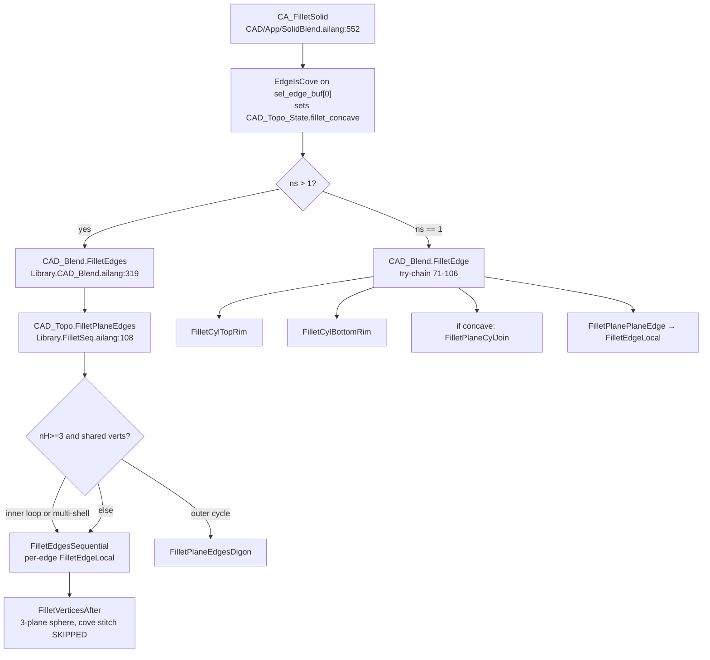
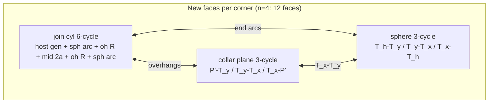
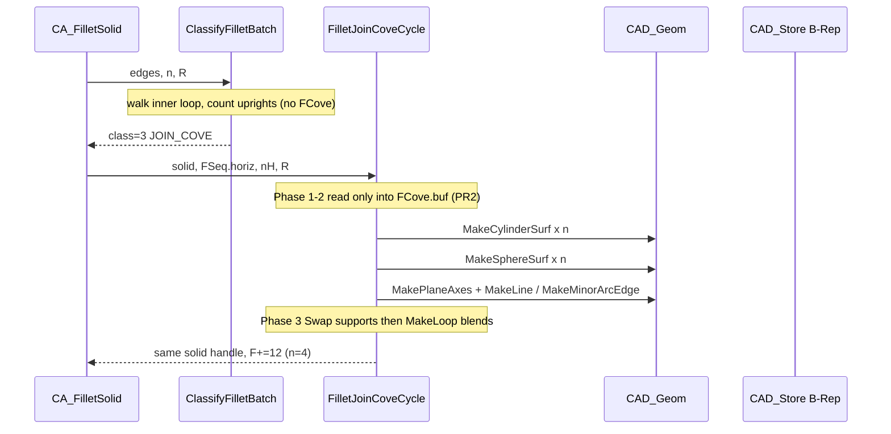

# AILang CAD — Rolling-Ball Fillet / Cove Redesign

| Field | Value |
|-------|-------|
| **Title** | Rolling-ball fillet / cove: classifier dispatch + batch join-cove |
| **Author** | (draft for review) |
| **Date** | 2026-08-23 |
| **Status** | Draft |
| **Workspace** | `/home/bob/Ailang-Self-Hosting-` |
| **Parent docs** | `docs/cad/CAD_BREP_BOOL_FILLET.md`, `docs/cad/CAD_OCC_CAPABILITY_AUDIT.md`, `docs/cad/CAD_SPLIT_NOTE.md` |
| **This task** | Design only. Do not ship another incremental fillet patch. |
| **Supersedes** | `CAD_BREP_BOOL_FILLET.md` **B8** (“junction fillet = plane–plane + Digon” on the imprint). B8 must not be used as a rollback to Digon-on-hole. |

---

## Overview

Joined-body plane–plane **cove** (rect pad glued on a rect plate, fillet the imprint loop) is broken because the kernel does not have a rolling-ball **join-cove operation**. It has a try-chain (`CAD_Blend.FilletEdge`) and a batch dispatcher (`CAD_Topo.FilletPlaneEdges`) that classify by *whether a fallback returned 0*, then mutate the solid **one edge at a time**. Commit `9399239c` (2026-08-23 17:26) diverted inner-join cycles off Digon onto that sequential path (`path=seq inner-join`). The last screenshot that looked like a continuous gutter was 12:11 the same day — Digon on the hole, a 2D cap recipe that turns the imprint into a diamond trench. After sequential: 17:47 frustum; 17:59 / 18:03 pad intact plus unstitched sphere **fins on the plate**, no gutter pipes.

The proposed design is **classify, then Branch**. Lots of fillet / cove / chamfer cases is **expected and correct** — that is why sketch → extrude/revolve B-Rep was built to emit planes, CIRCLE rims, LINE cycles, and real wall verticals. Do not collapse cases into one mega-function that mutates until something returns nonzero. Convex outer planar cycle stays Digon. Isolated convex plane–plane stays `FilletEdgeLocal`. Plane–cyl lone rim stays analytic torus rebuild. Concave inner plane–plane **cycle** becomes **one batch**: `n` join cylinders (6-cycles) + `n` vertex spheres + **`n` planar collars** (kind-1 3-cycles at `z=H+R`) that twin `T_x–T_y`. That collar is the **z=H+R section** of the outboard wall–wall cylinder (Decision 1’s third face; generators would have length 0, so we instantiate a plane, not a zero-area cylinder). Pad top stays a **simple 4-gon**. Walls stay original width `2a`. Shortened verticals remain. Tess samples analytic curves (`PATH=PARAM`, minor span in `(−π, π]`). No n-gon geometry. No silent revert to Digon-on-hole. Full-height upright cylinders are **not v1** (they force illegal wall embeddings).

---

## Background & Motivation

### Product constraints (locked)

- Kernel owns geometry/camera; Gtk is chrome (`CAD/host/cad_shell_gtk.cxx` is pick/HUD only).
- Closed sketches pad from live geometry (`CAD_Feat.ExtrudeProfile` / `CAD_Bool.GlueOnFace`). That B-Rep is the **contract** that makes the case table well-defined: planes, circles that stay circles, pads that produce LINE cycles and real wall verticals, GlueOnFace that leaves a real inner loop.
- No AABB crutches as the solid. No kind recipes for tess (`CAD_Tess.MeshSolid`: “No kind/surface recipe”).
- Analytic surfaces already exist: `CAD_Geom_Kind` plane=1, cylinder=2, sphere=3, torus=4 (`Librarys/Cad/Library.CAD_Geom.ailang` lines 21–28).
- AILang: SysV ≤6 inputs; Address-local clobber (pin state in `FixedPool`); `IfCondition ThenBlock` / `Fork` / `Branch` (integer-literal `Case` is CMP/JE). No nested functions. No top-level code in files.
- Target file size ~1500 LOC (`docs/cad/CAD_SPLIT_NOTE.md`). Fillet is already split: `Topo.Fillet` / `FilletVertex` / `FilletSeq` / `Digon2`. `FilletUnused.ailang` is parked, not imported.
- User: analytic B-Rep even if tess is coarse. Tess is sampling of analytic edges, not the geometry.

### Current call graph (verified in code)



**App (`CA_FilletSolid`, `CAD/App/SolidBlend.ailang` 593–638).** Clears `fillet_concave`, probes **one** selected edge with `CAD_Topo.EdgeIsCove`, logs `COVE void<=180` / `FILLET void>180` plus `fillet_nin`. Batch (`ns>1`) goes to `FilletEdges` and **never** hits the cyl-rim try-chain. Single edge goes to `FilletEdge`. R is clamped by `CA_FilletClampR` (0.4 × edge length, floor 0.5 mm) — that clamp still uses `SolidBounds` as a fallback, which is an extent query, not a solid.

**`EdgeIsCove` (`Librarys/Cad/Topo/Library.QueryWalk.ailang` 168–267).** Four probes at mid-edge `±0.5 N1 ±0.5 N2`. `nin ≥ 3` ⇒ cove (void ≤180°). `nin == 1` ⇒ convex fillet (void >180°). Inner-loop membership **forces cove** even when `PointInSolid` misses holes/compounds (`nin=1` lie). Sets `fillet_host_f` to the face that owns the inner loop.

**`FilletEdge` is a try-chain, not a classifier** (`Library.CAD_Blend.ailang` 71–106):

1. `FilletCylTopRim` — rebuilds a **lone** cylinder as cyl+torus. **Gates before rebuild** (`SolidCountShells>1` or `SolidCountFaces>4` or `SolidHasInnerLoop` at lines 169–171). It does **not** destroy extra faces then return 0. Kind-0 sweep cyl still uses `SolidBounds` for height (AABB smell, isolated to this recipe, lines 192–207).
2. `FilletCylBottomRim` — shells>1 / faces>4 / **kind-1 only**. Does **not** check `SolidHasInnerLoop`. Classifier must still skip glued pads (inner loop / shells), not by spreading AABB.
3. If `fillet_concave==1`: `FilletPlaneCylJoin` — inner `CIRCLE` (curve kind 2) → `MakeBossBaseFilletRing` + `CompoundAdd`. **Not a B-Rep weld.** `MakeBossBaseFilletRing` (`Librarys/Cad/Topo/Library.MakeCyl.ailang` 791) lathes an 8-seg RZ polyline — n-gon geometry, unlike `MakeCylinderTopFillet` which actually calls `CAD_Geom.MakeTorusSurf` (same file 423–485).
4. `FilletPlanePlaneEdge` → `FilletEdgeLocal`. Requires LINE (curve kind 1); circle rims fall out here if 1–3 returned 0.

**Batch `FilletPlaneEdges` (`Librarys/Cad/Topo/Library.FilletSeq.ailang` 108–258).** This file is **untracked** (split from Digon2 after `9399239c`). PR1 must `git add` it.

- `n_edges==1` → `FilletPlanePlaneEdge` (so a single circle never reaches the torus path through the batch API).
- Split horiz (`|Δz|≈0`) vs vert. Mixed 4-top+4-vertical is why (`brokenprojection.png` comment).
- If `nH≥3` and shared vertex **handles**: **Digon**, unless `EdgeIsInnerLoop` on any horiz edge (`path=seq inner-join`, sets `shared=0`) or `SolidCountShells>1` (`path=seq multi-shell`).
- Sequential: `FilletEdgesSequential` — snapshot 12-word edge sigs, `FindEdgeBySig` after each local surgery, `FilletEdgeLocal` per edge, then `FilletVerticesAfter`.

**Git break (verified).**

| Commit | Time | Inner-join cycle |
|--------|------|------------------|
| `88605ecc` 15:51 | “join cove keeps both bodies” | Digon. Comment: sequential on a closed cycle “punches holes (`Screenshot_2026-08-23_15-19-06`)”. Multi-shell only → seq. |
| `9399239c` 17:26 | “rolling-ball vertex sphere on join cove corners” | **Added `path=seq inner-join`** in `Library.Digon2.ailang` (later split to untracked `Library.FilletSeq.ailang`). Cylinders keep original span; vertex sphere **does not stitch** when `fillet_concave==1`. |

Visual timeline the user confirmed:

- **12:11** `Screenshot_2026-08-23_12-11-37` — cyl+rect pad, Fillet R=4. Last “continuous gutter”. That was **Digon on the hole** (diamond in the cap).
- **17:47** frustum — `FaceRetargetVert` on the host inner loop stretched the next gutter (`Library.Fillet.ailang` 343–347 comments).
- **17:59 / 18:03** pad intact + unstitched sphere fins on the plate, no gutter pipes — sequential cylinders on original span + `FilletVertexSphere` with cove stitch skipped (`Library.FilletVertex.ailang` 291–300).

Working controls: plain box outer rim (Digon), cylinder top rim (analytic torus rebuild via `MakeCylinderTopFillet`). Broken: **joined-body plane–plane cove** (rec-on-rec pad on face). `CAD/demo_fillet_pad_verts.ailang` is a **two-step fixture**: glue → `FilletEdges` on 4 inner LINEs → collect 4 verticals or `FAIL pad verts` → convex-fillet them → pad top `nce>=8`. After this design, **step 1 is class 3 (F')**. PR2 asserts collect after step 1 only. **Step 2 is skipped until a later PR** (`FAIL vert fillet` / nce≥8 are **not** PR2 gates). Shortened verticals are **not** ordinary outer LINEs: `P'` already sits on a collar.

### Overloaded / large functions (survey)

| File | LOC | Role |
|------|----:|------|
| `Librarys/Cad/Topo/Library.Fillet.ailang` | 373 | `MakeMinorArcEdge` (signed span slot 12); **`FilletEdgeLocal` 72–358 (~287 lines)** plane–plane 4-cycle cylinder; `FilletPlanePlaneEdge` is a 1-line wrapper. File ends with a leftover comment about `FilletVertNote`; that function lives in `FilletVertex.ailang`. |
| `Librarys/Cad/Topo/Library.FilletVertex.ailang` | 424 | `FilletVertNote` / `FilletSphereArc` / `FilletNearT`; **`FilletVertexSphere` 123–396** 3-plane sphere + stitch; `FilletVerticesAfter` walks `cnt>1` corners. |
| `Librarys/Cad/Topo/Library.FilletSeq.ailang` | 259 | `FilletEdgesSequential` + **`FilletPlaneEdges` dispatch** (horiz/vert, Digon vs seq). **Untracked** split from Digon2 after `9399239c`. |
| `Librarys/Cad/Topo/Library.Digon2.ailang` | 1382 | Digon build; **`FilletPlaneEdgesDigon` 871–end (~512 lines)** outer prism cap. Still contains cove occupancy (`S[450]`) from when Digon was used on holes. |
| `Librarys/Cad/Topo/Library.Digon.ailang` | 1112 | Digon solve (2D equal-R setback in the cap plane). |
| `Librarys/Cad/Library.CAD_Blend.ailang` | 1035 | `ComputeRollingBall` (convex-only, **unused by FilletEdge** — only `CAD/test_blend.ailang`); `FilletEdge` try-chain; cyl rim recipes; chamfer. |
| `CAD/App/SolidBlend.ailang` | 824 | `CA_FilletSolid`, `CA_FilletClampR`. |
| `Librarys/Cad/Topo/Library.QueryWalk.ailang` | 981 | `EdgeIsCove`, `EdgeOnInnerLoop`, `FaceRetargetVert`, `CoedgeSwapEdge`, `CoedgeInsertAfter`, `FindFaceWithVert`. |
| `Librarys/Cad/Topo/Library.FilletUnused.ailang` | 771 | Parked clone of an older full-rebuild `FilletPlanePlaneEdge`. **Not imported.** Do not resurrect. |

Tess (not geometry):

| Function | File | Role |
|----------|------|------|
| `MeshSolid` | `Librarys/Cad/Tess/Library.TessFace.ailang` 295 | Walk faces. Hole/planar → `MeshFaceLoopsXY`. 4-edge wall → `MeshRuledLoop`. Else `MeshLoopFanTess`. |
| `MeshFaceLoopsXY` | same 201 | Outer + holes → keyhole merge → `EarClipPoly`. Host plate after cove. |
| `MeshRuledLoop` | `Librarys/Cad/Tess/Library.TessCollect.ailang` 358 | Zip opposite rails of a 4-cycle. **Must zip the curved pair** (kind 2/3), not generators — generator-zip is a flat chamfer (comment 366–390). Cylinder gutter pipes depend on this. |
| `MeshLoopFanTess` | `Librarys/Cad/Tess/Library.TessCore.ailang` 409 | Fan; samples CIRCLE/ELLIPSE coedges. Spherical triangles (`nring=3`) land here. |
| `SampleCircleEdge` | `TessCollect.ailang` 154 | `PATH=PARAM` when slot 12 span is set: `Atan2` at `v0`, walk `span`. Else `PATH=ATAN2`. |

`MakeMinorArcEdge` (`Library.Fillet.ailang` 8–67) already stores signed minor span in `(−π, π]` on a cloned circle (slot 12). That is the contract tess needs. Do not replace it with n-gons.

### What the kernel already computes (and then throws away)

**Plane–plane cylinder (`FilletEdgeLocal` 138–229).** Unit outward normals N1, N2. `ab = R / (1 + N1·N2)`. Convex: `C = P − ab(N1+N2)`, contacts `C+R N`. Cove: `C = P + ab(N1+N2)`, contacts `C−R N`. Orthogonal: `ab=R`, `C = P ± R(N1+N2)`. Blend face = `MakeCylinderSurf` + two generators (`MakeLine`) + two `MakeMinorArcEdge`. 4-cycle loop, `ShellAppendFace`. Then **in-place surgery**: `CoedgeSwapEdge` on F1/F2; cove **skips** end-cap insert into adjacent walls (`ei=2` when concave, 273–279); `FaceRetargetVert` skipped on any face with an inner loop (343–355) because that was the 17:47 frustum.

**3-plane sphere (`FilletVertexSphere` 120–249).** `s = +R` cove / `−R` convex. Solve `Ni·(C−P) = s` via the 3×3 Gram system (`d12,d13,d23,det`). Orthogonal cove: `C = P + R(N1+N2+N3)`. Contacts `Ti = C − s Ni`. Three `FilletSphereArc` + `MakeSphereSurf`. Then stitch: retarget cylinder generators onto Ti, swap end-arcs for sphere great-circle twins. **Cove: `sh=0`, log `fillet VERTEX sphere no-stitch cove`.** Spheres are appended and left floating — the 17:59 fins.

**`ComputeRollingBall` (`Library.CAD_Blend.ailang` 25–66).** Spine dir `N1×N2`, `C = O1 − R N1 − R N2`. Convex-only, frame layout N at slots 9–11 (not `FaceGetPlane`’s 10–12 — see `CAD_BREP_BOOL_FILLET.md` §3). Dead code on the product path. **Do not resurrect in PR2.** Join-cove uses `FilletEdgeLocal`’s `ab` formula (both signs, N copied from `FaceGetPlane` 10–12).

**Digon** is a **2D equal-R setback on a planar cap**, outer loop only. Correct for a prism top rim (box / wedge / roof demos). Wrong as a 3D join cove: it setbacks the imprint in the host plane and turns the hole into a diamond trench (`hotmess.png`, comment at `FilletSeq.ailang` 187–190).

### Why sequential local surgery cannot produce a join cove

A constant-R rolling ball on a closed rectangular imprint has **coupled** ends: each cylinder must **extend** (concave) to the plane through the vertex-sphere centre ⊥ spine. `FilletEdgeLocal` spans the **original** vertices and hopes `FilletVertexSphere` will retarget later. For cove, retarget is skipped, so:

- Cylinders end at x=±a; vertex sphere sits at C=(a+R, a+R, H+R); they **do not meet** (2R gap along the spine).
- Host inner loop is not rewritten to the offset rectangle of T_h contacts.
- Next edge’s vertices have been half-mutated by `CoedgeSwapEdge` / sig rebind.
- Sphere third arc `T_w1–T_w2` has **no twin** unless a third (upright) cylinder exists. Original verticals miss the sphere (`dist(C, vertical)=R√2 > R`).

That is not a tess bug. It is missing topology.

---

## Goals & Non-Goals

### Goals (v1)

1. **Classifier then `Branch`**, not try-chain, at both `FilletEdge` and `FilletPlaneEdges`. One helper returns the class integer.
2. **Join cove is one batch geometric construction** for a concave inner plane–plane cycle: `n` join cyl (6-cycles) + `n` spheres + `n` planar collars closing `T_x–T_y`. No `FilletEdgeLocal` loop. No `FaceRetargetVert`. No full-height outboard uprights in v1.
3. Analytic surfaces only: plane (collar), cylinder (join), sphere (vertex), torus (plane–cyl). Tess samples.
4. Keep Digon for **outer prism caps**. Never Digon an inner join hole.
5. Match the canal special case on the **join edges we actually blend**, with a kind-1 equator face for the wall–wall section. Refuse Gregory, variable-R, and the illegal 2a+2R wall / pad-top 8-gon embeddings.
6. Observability: one `fillet class=` log line per apply.
7. No regression on box outer rim (Digon) or lone cylinder top/bottom rim (torus rebuild).
8. Stay inside AILang constraints and ~1500 LOC/file. New work goes in `Librarys/Cad/Topo/Library.FilletCove.ailang`, imported from the `CAD_Topo` facade.
9. Closed 2-manifold after class 3: every new edge has two coedges. Coarse nseg OK; topology not waived.

### Non-Goals (v1)

- Variable-R, G2, chordal/setback-unequal vertex blends.
- Gregory / n-sided vertex patches when the R-sphere will not fit.
- General plane–cyl join as a true B-Rep torus weld on a multi-face solid (today `CompoundAdd` of a lathe ring). Track as debt; do not block rec-on-rec.
- Cyl–cyl, plane–cone, edge–edge (not face–face) blends.
- Boolean fuse improvements beyond what `GlueOnFace` already does for a sitting pad.
- Chamfer redesign (same **family of cases**, later — not a mega-function).
- Feature-tree persistent naming of blend faces.
- AABB “pocket as solid”. `CA_FilletClampR`’s bounds fallback may stay as a **radius cap**, not a geometry path.
- Resurrecting `FilletUnused.ailang`.
- Gtk / camera / pick changes.
- Requiring the user to pick uprights with the join loop (Alternative G, deferred UX).
- Full-height outboard upright cylinders (Alternative F embedding; illegal plus-sign walls). v2 if a different wall embedding is invented.
- Pad-top 8-gon of four `2a+2R` lines (self-intersecting).
- Non-horizontal join cycles (v1 is Z-up pads; those fail class 0, not sequential).
- Convex-fillet of **shortened** pad verticals after class 3 (they meet collars at `P'`). Later batch, out of v1 join-cove. Sequential / class 7 / `FilletEdgeLocal` **fail-closed** (`reason=incident-collar`).

---

## Proposed Design

### 1. Classifier integer (the logic tree)

Pin the result in `CAD_Topo_State.fillet_class` — **append after `vmap_new`** on `FixedPool.CAD_Topo_State` in `Librarys/Cad/Topo/Library.Core.ailang` (current last fields 36–38). Never insert in the middle (`CAD_SPLIT_NOTE.md`). Integer literals so `Branch` is CMP/JE.

```text
FCLASS_NONE        = 0   fail / unsupported
FCLASS_DIGON_OUTER = 1   convex outer planar cycle, n>=3, NOT inner loop
FCLASS_LOCAL_PP    = 2   isolated plane–plane LINE edge, NOT inner
FCLASS_JOIN_COVE   = 3   inner plane–plane LINE cycle (pad-on-face imprint); requires a live trihedral upright, does not consume it
FCLASS_CYL_TOP     = 4   plane–cyl convex outer rim, lone solid, CIRCLE, z=ztop
FCLASS_CYL_BOT     = 5   plane–cyl convex outer rim, kind-1, lone solid, CIRCLE, z=oz
FCLASS_CYL_JOIN    = 6   plane–cyl concave inner CIRCLE (boss-base)
FCLASS_SEQ_VERT    = 7   leftover outer verticals after Digon, or a non-cycle outer vertical batch
```

**One helper.** `CAD_Topo.ClassifyFilletBatch(solid, edges_addr, n, r) → Integer` (4 inputs). `ClassifyFilletEdge(solid, edge, r)` is a 3-input wrapper that packs `edge` into `CAD_Topo_FSeq.e` / a 1-slot pack and calls the batch helper with `n=1`. Both dispatchers (`FilletEdge`, `FilletPlaneEdges`) **must** call this helper so a lone inner CIRCLE and four inner LINEs cannot diverge.

Classifier writes, then returns (Address locals die):

| Pool field | Written |
|------------|---------|
| `CAD_Topo_State.fillet_class` | 0..7 |
| `CAD_Topo_State.fillet_nin` | from `EdgeIsCove` re-probe (log only) |
| `CAD_Topo_FSeq.solid`, `.r` | copies |
| `CAD_Topo_FSeq.e` | pinned first / lone edge handle |
| `CAD_Topo_FSeq.horiz`, `.nH` | join-cycle or outer-horiz handles (loop-walked) |
| `CAD_Topo_FSeq.vert`, `.nV` | Case 1 leftover outer verticals **or** class 7 full classified vertical-only set (one field, two fill sites) |
| `CAD_Topo_FSeq.sigs`, `.pack` | 12-word sigs of those verticals, pinned **before** Digon |

**PR1 does not write `CAD_Topo_FCove`.** That pool is allocated in PR2. Classifier only *counts* trihedral uprights (exist / missing). PR2 re-walks into `FCove.buf`.

**Do not trust `CAD_Topo_State.fillet_concave`.** Re-run `EdgeIsInnerLoop` / `EdgeIsCove` inside the classifier. Headless demos that set the flag must still classify correctly if they forget.

**Invariant:** any inner LINE whose inner loop has `nce≥3` is class **3 or 0**, never 1 / 2 / 7. Glue duplicate-vertex handles must not drop this to class 7: **walk the inner loop**, do not use handle-equality `shared`.

#### ClassifyFilletEdge / n=1 predicates (in order, first match)

| # | Predicate | Class | reason= |
|---|-----------|------:|---------|
| 0 | solid/edge/R zero | 0 | `bad-args` |
| 1 | curve kind 2 CIRCLE, `EdgeIsInnerLoop==1` | 6 | (cyl-join recipe) |
| 2 | CIRCLE, not inner, `shells≤1`, `faces≤4`, not `SolidHasInnerLoop`, vertex z equals kind-1 `ztop` or CIRCLE frame z at cap | 4 | |
| 3 | CIRCLE, not inner, `shells≤1`, `faces≤4`, **kind-1 solid**, vertex z equals `oz` | 5 | |
| 4 | CIRCLE else | 0 | `circle-domain` |
| 5 | curve kind 1 LINE, `EdgeIsInnerLoop==1` | **0** | **`need-cycle`** |
| 6 | LINE, two plane supports, not inner | 2 | |
| 7 | else | 0 | `unsupported` |

Class 5 does **not** require `SolidHasInnerLoop==0` in live `FilletCylBottomRim`; the classifier adds “not inner” so a washer hole cannot be class 5. Kind-0 bottom rim stays class 0 (live BottomRim is kind-1 only). Height/AABB is **not** a class predicate.

#### ClassifyFilletBatch n>1 predicates (in order)

| # | Predicate | Class |
|---|-----------|------:|
| 0 | n<1 or n>12 or R=0 | 0 `bad-args` |
| 1 | **Any** selected edge is inner LINE: walk `face[1].loop[2]` containing it. If that loop’s coedges are all LINE, nce≥3, two planes each, `shells==1`, `\|Δz\|≈0` on every loop edge, and **each vertex has a live upright** (LINE, two walls, not on host — trihedral; v1 **keeps** these edges, shortened) → **3**. Pin the **full inner loop** into `FSeq.horiz`. Do **not** write FCove. Extra selected edges that are those uprights: ignore (they stay as wall sides). Extra selected host verticals: log and ignore (v1). |
| 1a | inner LINE but loop nce<3, or n=1 inner LINE | 0 `need-cycle` |
| 1b | inner LINE cycle but any `\|Δz\|≠0` | 0 `need-horizontal` (v1 Z-up only) |
| 1c | inner LINE cycle, shells>1 | 0 `need-glue` |
| 1d | inner LINE cycle, a vertex has no upright (non-trihedral) | 0 `need-upright` |
| 1e | **Never** fall through to 1/2/7 from an inner LINE | — |
| 2 | Every selected edge is inner CIRCLE | 6 |
| 3 | n=1 already handled by the n=1 table (caller still uses this helper) | 4/5/2/6/0 |
| 4 | Outer horiz LINE cycle nH≥3 (loop-walk or shared verts), not inner, shells==1 | 1. Pin nV outer verticals + sigs. |
| 5 | Remaining selected edges are outer LINE verticals, not inner | 7. Pin the **full classified set** into `FSeq.vert/nV` (not only Case-1 leftovers). |
| 6 | else | 0 |

Finding an upright at join-cycle vertex `P` (end of E_i and E_{i+1}`):

1. `f_wall_i` / `f_wall_{i+1}` from `EdgeIncidentFaces` (the non-host face of each join edge).
2. Walk edges of `f_wall_i` for a LINE whose two faces are `{f_wall_i, f_wall_{i+1}}` and that has a vertex at `P` **or** at the same xyz (`CAD_Num.IsEqual` on 3 coords — Glue can duplicate verts).
3. Missing → class 0 `need-upright`. Extrude is why they exist; classifier does not require them in the selection. v1 does **not** consume them: they remain as shortened wall sides after the join-cove rewrite.

### 2. Dispatch: Branch, not try-chain

Pattern: `CA_PollCmd` (`CAD/App/IpcDispatch.ailang` 63–88) `Branch c0 { Case 98: … }`. Copy `fillet_class` to a local before `Branch` if the parser is picky; `Branch` on a pool field is documented (`Advanced Flow Control Patterns.md`).

**Bug this snippet must not repeat:** `ArrayGet(edges_addr, 0)` after classify (Address clobber), or Digon on the **full** selection including verticals.

```ailang
Function.CAD_Topo.FilletPlaneEdges {
    Input: solid_handle: Integer
    Input: edges_addr: Address
    Input: n_edges: Integer
    Input: radius_r: Integer
    Output: Integer
    Body: {
        IfCondition EqualTo(solid_handle, 0) ThenBlock: { ReturnValue(0) }
        IfCondition EqualTo(edges_addr, 0) ThenBlock: { ReturnValue(0) }
        IfCondition LessThan(n_edges, 1) ThenBlock: { ReturnValue(0) }
        IfCondition GreaterThan(n_edges, 12) ThenBlock: { ReturnValue(0) }
        IfCondition EqualTo(CAD_Num.IsZero(radius_r, 0), 1) ThenBlock: { ReturnValue(0) }
        CAD_Topo_State.fillet_class = CAD_Topo.ClassifyFilletBatch(solid_handle, edges_addr, n_edges, radius_r)
        cls = CAD_Topo_State.fillet_class
        PrintMessage("fillet class=")
        PrintNumber(cls)
        PrintMessage(" n=")
        PrintNumber(n_edges)
        PrintMessage("\n")
        Branch cls {
            Case 1: {
                dig = CAD_Topo.FilletPlaneEdgesDigon(CAD_Topo_FSeq.solid, CAD_Topo_FSeq.horiz, CAD_Topo_FSeq.nH, CAD_Topo_FSeq.r)
                IfCondition EqualTo(dig, 0) ThenBlock: { ReturnValue(0) }
                IfCondition EqualTo(CAD_Topo_FSeq.nV, 0) ThenBlock: { ReturnValue(dig) }
                CAD_Topo_FSeq.i = 0
                WhileLoop LessThan(CAD_Topo_FSeq.i, CAD_Topo_FSeq.nV) {
                    CAD_Topo_FSeq.k = 0
                    WhileLoop LessThan(CAD_Topo_FSeq.k, 12) {
                        ArraySet(CAD_Topo_FSeq.pack, CAD_Topo_FSeq.k, ArrayGet(CAD_Topo_FSeq.sigs, Add(Multiply(CAD_Topo_FSeq.i, 12), CAD_Topo_FSeq.k)))
                        CAD_Topo_FSeq.k = Add(CAD_Topo_FSeq.k, 1)
                    }
                    ArraySet(CAD_Topo_FSeq.vert, CAD_Topo_FSeq.i, CAD_Topo.FindEdgeBySig(dig, CAD_Topo_FSeq.pack))
                    CAD_Topo_FSeq.i = Add(CAD_Topo_FSeq.i, 1)
                }
                seq = CAD_Topo.FilletEdgesSequential(dig, CAD_Topo_FSeq.vert, CAD_Topo_FSeq.nV, CAD_Topo_FSeq.r)
                IfCondition NotEqual(seq, 0) ThenBlock: { ReturnValue(seq) }
                ReturnValue(dig)
            }
            Case 2: {
                ReturnValue(CAD_Topo.FilletEdgeLocal(CAD_Topo_FSeq.solid, CAD_Topo_FSeq.e, CAD_Topo_FSeq.r))
            }
            Case 3: {
                ReturnValue(CAD_Topo.FilletJoinCoveCycle(CAD_Topo_FSeq.solid, CAD_Topo_FSeq.horiz, CAD_Topo_FSeq.nH, CAD_Topo_FSeq.r))
            }
            Case 4: {
                ReturnValue(CAD_Blend.FilletCylTopRim(CAD_Topo_FSeq.solid, CAD_Topo_FSeq.e, CAD_Topo_FSeq.r))
            }
            Case 5: {
                ReturnValue(CAD_Blend.FilletCylBottomRim(CAD_Topo_FSeq.solid, CAD_Topo_FSeq.e, CAD_Topo_FSeq.r))
            }
            Case 6: {
                ReturnValue(CAD_Blend.FilletPlaneCylJoin(CAD_Topo_FSeq.solid, CAD_Topo_FSeq.e, CAD_Topo_FSeq.r))
            }
            Case 7: {
                ReturnValue(CAD_Topo.FilletEdgesSequential(CAD_Topo_FSeq.solid, CAD_Topo_FSeq.vert, CAD_Topo_FSeq.nV, CAD_Topo_FSeq.r))
            }
            Default: {
                ReturnValue(0)
            }
        }
    }
}
```

`CAD_Blend.FilletEdge`: same helper with n=1, same `Branch`, same pool-pinned `FSeq.e`. Delete try-until-nonzero. Cyl-top does not run on a glued pad because class is not 4 (inner loop / shells), not because a rebuild returned 0.

`CAD_Blend.FilletEdges` stays a 4-input facade to `FilletPlaneEdges`.

Case 3 **never** calls sequential or Digon. If `FilletJoinCoveCycle` is not linked yet (PR1), `ReturnValue(0)` with `fillet class=3`.

### 3. Join cove — Construction F' (planar collar close)

Domain v1: equal-R, plane supports, inner LINE cycle n=3..12 (typical 4), one shell, Z-up pad. `GlueOnFace` already made a real imprint **and** extrude left real wall verticals. Orthogonal is the rec-on-rec product case; the same code uses `ab = R/(1+N1·N2)` and the 3×3 Gram sphere for non-ortho dihedrals.

**Embedding theorem (why rev 2’s 8-gon / 2a+2R walls are illegal).** Wall +Y as a rectangle in `y=a` with `x∈[-(a+R),a+R]` and wall +X as a rectangle in `x=a` with `y∈[-(a+R),a+R]` **intersect along** `(a,a,z)` **interior to both faces**. A 2-manifold edge has exactly two faces and lies on both **boundaries**. Pad-top 8-gon of four `2a+2R` wall-tops plus quarter-circles is **self-intersecting** (north and east cross at `(a,a,H+h)`). Graph Euler can still sum; the embedding is not a volume boundary. Full-height outboard upright cylinders force those expanded walls (or coplanar tabs that put a **third coedge** on the vertical). **v1 does not emit full-height upright cylinders.**

**Decision 1 intent, kept:** `T_x–T_y` has an analytic twin. That twin is the **z=H+R section** of the outboard wall–wall cylinder (spine `(a+R,a+R)`, axis Z, through C). Generators of that cylinder from the sphere equator up the pad would occupy the illegal strips, so their length is 0 in v1. Instantiate the section as a **kind-1 planar 3-cycle (collar)**, not a zero-area cylinder. Option B was “no face at all for `T_x–T_y`” — **invalid**. F' **names** the face. Option C / Alternative G still deferred.

**v1 invariant:** pad top stays a **simple 4-gon** on `[-a,a]²` at `z=H+h`. Walls stay **original width `2a`**. Shortened verticals remain on the wall **boundaries** (2-face). Join wall-gens are **split** at `x=±a` (or `y=±a`). Four **disjoint** collars at `z=H+R` — never one 8-gon in that plane. Shortened verticals are **not** a follow-on sequential fillet: `P'` is a collar vertex. PR2 gate is `demo_fillet_join_cove` **only** (stop after class 3).

#### Frozen drawings (simple polygons only)

Pad-top plane `z=H+h` — original square, **nce=4**, untouched:

```text
(-a, a) -------- (a, a)
   |                |
   |     pad top    |
   |                |
(-a,-a) -------- (a,-a)
```

Wall +Y, plane `y=a`, view in `x–z` (z up) — rectangle width `2a`, bottom at `z=H+R`:

```text
(-a, H+h) ---------------- (a, H+h)     twin pad-top north
     |                          |
     |         wall +Y          |
     |                          |
(-a, H+R) ---------------- (a, H+R)     twin join-cyl **middle** 2a
```

Sides are **shortened verticals** `(a,a,H+h)–(a,a,H+R)` and west, still shared by wall +Y and wall +X (exactly two faces). `x=a` is a **boundary**, not interior.

Host inner, plane `z=H` — **offset rectangle**, simple, nce=4:

```text
(-a-R, a+R) ---------- (a+R, a+R)      T_h corners
     |                      |
     |     host inner       |
     |                      |
(-a-R,-a-R) ---------- (a+R,-a-R)
```

Plane `z=H+R` — **four disjoint collar 3-cycles**, not one 8-gon (that 8-gon of 2a+2R lines would cross at `(a,a)` just like the pad-top bug):

```text
                    T_x (a, a+R)
                   /  \
                 arc   LINE
                 /       \
     T_y (a+R, a) ---- P' (a, a, H+R)
              NE collar only
```

Same at NW/SE/SW. They do not share edges with each other.

#### Geometry (canal special case)

Orthogonal pad half-width `a`, join at `z=H`, pad top `z=H+h`, `P=(a,a,H)`, `P'=(a,a,H+R)`:

```text
C        = P + R(N_H + N_x + N_y) = (a+R, a+R, H+R)
T_h      = C − R N_H = (a+R, a+R, H)
T_x      = C − R N_x = (a,   a+R, H+R)
T_y      = C − R N_y = (a+R, a,   H+R)
```

**Join cylinder** (host ∩ wall +Y, axis X) — **6-cycle** because the wall-side is split:

```text
ab         = R / (1 + N_H·N_Y)          # orthogonal: R
spine      = (x, a+R, H+R)              # through C at x=a+R
host gen   = (x, a+R, H)                # length 2a+2R, twin host inner
end arcs   = minor circles in planes x=±(a+R)  # twin spheres
middle     = (x, a, H+R), x∈[-a, a]     # length 2a, twin wall bottom
overhang E = (x, a, H+R), x∈[a, a+R]    # twin NE collar
overhang W = (x, a, H+R), x∈[-a-R, -a]  # twin NW collar
```

Cylinders **extend** to the plane through C ⊥ spine. The long wall-gen is **not** one edge (that would force a 2a+2R twin face). nring=6 → tess `MeshLoopFanTess` with `PATH=PARAM` on the two arcs.

**Sphere** 3-cycle: `T_h — T_y — T_x`. Twins: join-N end-arc, **collar** `T_y–T_x`, join-E end-arc.

**Collar F'** (kind 1, plane `z=H+R`) 3-cycle: `P'–T_y` (overhang), `T_y–T_x` (same CIRCLE as sphere, `MakeMinorArcEdge`), `T_x–P'`. Simple. Does not include `(a,a)` as an interior point.



#### Loop sizes after rewrite (orthogonal n=4)

| Face | nce | Edges |
|------|----:|-------|
| Host top | 4 outer + **4 inner** | inner = 4 host gens, offset rectangle |
| Pad top | **4** | **unchanged** original square |
| Wall i | **4** | original top (twin pad top), two **shortened** verticals, bottom = join **middle** 2a |
| Join cylinder i | **6** | host gen, arc, overhang, middle, overhang, arc |
| Sphere i | **3** | two join end-arcs + `T_x–T_y` |
| Collar i | **3** | two overhang LINEs + `T_x–T_y` |

#### Allowed mutators and Phase 3 order

Only: `MakeVertex`, `MakeLine`, `MakeCircle`, `MakeMinorArcEdge`, `CAD_Geom.MakeCylinderSurf`, `CAD_Geom.MakeSphereSurf`, **`CAD_Geom.MakePlaneAxes`** (collar; 3 inputs — not a `CAD_Topo` function), `MakeEdge`, `MakeCoedge`, `MakeLoop`, `MakeFace`, `CoedgeSwapEdge`, `LinkTwins`, `LinkLoopRing`, `ShellAppendFace`, unlink `edge[3]/[4]`.

Collar plane: pin origin / X / Y on `CAD_Topo_FCove.pt` and `.frame` so `Z = X × Y` is **`+N_H`**. If `N_H` is +Z, origin `P'`, X along `T_y−P'`, Y along `T_x−P'` (or orthonormalize). A flipped collar makes `RingOrientCCW` / XY tess fail closed.

**Forbidden:** `FaceRetargetVert`, `EdgeRetargetVert` as a geometry move, Digon, `FilletEdgeLocal`, `FilletVerticesAfter`, `CompoundAdd`, mutating xyz of a live vertex, `CoedgeInsertAfter` as a way to grow pad-top (pad top nce does **not** change).

Live signatures:

- `CoedgeSwapEdge(ce, edge, origin)` — **1-1 only** (host inner 4-for-4, walls 4-for-4). Already: if `edge[3]==0` then first coedge else `edge[4]` + `LinkTwins` (`QueryWalk.ailang` 714–751).
- `CoedgeInsertAfter(ce_prev, new_ce)` — two inputs; does **not** twin. **Not used** on this path.
- `MakeCoedge(edge, origin, sense)` (`Core.ailang` 341–358) does **not** write `edge[3]/[4]`. `LinkLoopRing` sets `ce[4]=loop` only.

**Registration rule (every `MakeCoedge` on this path):** copy `CoedgeSwapEdge`: if `edge[3]==0` then first coedge else `edge[4]` + `LinkTwins`. No half-registered edges.

Create **shared arcs once.** `T_x–T_y` is one `MakeMinorArcEdge` (origins after its possible v0/v1 span swap, `Fillet.ailang` 51–56); sphere and collar `MakeCoedge` that same handle. Same for join end-arcs (one edge, two coedges: join + sphere).

**Order:** create **all** new vertices/edges/surfs (including one handle per shared arc) → **all** support `CoedgeSwapEdge` (both walls onto **one** shortened-vertical handle **before** any `MakeLoop`) → **all** blend `MakeLoop`/`MakeFace` (second coedges via the registration rule) → `ShellAppendFace`.

If a future face **does** change nce: rebuild (`MakeCoedge` × nce, `LinkLoopRing`, `face[1]=new_loop`, unlink old loop). Do not swap-then-insert.

| Edge | Coedge A | Coedge B |
|------|----------|----------|
| host gen | Swap host inner | MakeLoop join |
| wall middle 2a | Swap wall | MakeLoop join |
| shortened vertical | Swap wall A | Swap wall B (same handle, before MakeLoop) |
| overhang R | MakeLoop join | MakeLoop collar |
| join end-arc | MakeLoop join | MakeLoop sphere |
| `T_x–T_y` | MakeLoop sphere | MakeLoop collar |

#### Coedge table (n=4, NE + wall +Y; rotate)

**Phase 1–2 (read-only → FCove):** cycle-walk join loop (`Digon2.ailang` 1132+ algorithm, **not** `digon_S`). Create all new geometry. **No writes to existing coedges yet.**

**Phase 3 — host inner** (`inner = host_face[1].loop[2]`). nce stays 4. `CoedgeSwapEdge` only.

| Existing coedge | New edge | Origin | Twin |
|-----------------|----------|--------|------|
| inner ce of join E_N | LINE host gen `T_h_NW–T_h_NE` | walk sense | join-cyl N host-gen ce |
| E_E, E_S, E_W | same | | |

Unused join edges: both coedges gone → `edge[3]=0`, `edge[4]=0`. Original join-corner verts `(±a,±a,H)` unreferenced; leave allocated.

**Phase 3 — wall +Y** (4-cycle: top, V_NE, bottom join, V_NW). nce stays 4. **Pad-top north is not swapped.**

| Existing coedge | New edge | Origin | Twin |
|-----------------|----------|--------|------|
| top | **keep** original pad-top north, length 2a | — | pad top (already) |
| V_NE | new LINE `(a,a,H+h)–P'_NE` | pad-top NE | wall +X’s swapped north vertical (same new edge) |
| bottom join E_N | join-cyl **middle** `(a,a,H+R)–(-a,a,H+R)` | `P'_NE` | join-cyl N middle ce |
| V_NW | new LINE west shortened | | wall −X |

Both walls that share a vertical must `CoedgeSwapEdge` onto the **same** new shortened-vertical edge (two coedges, then `LinkTwins` if swap did not). Old vertical unlinked.

**Phase 3 — pad top:** **no mutation.** nce=4, original verts, original sides.

**Phase 3 — new faces** (`MakeLoop` / `MakeFace` / `ShellAppendFace`):

| Face | Loop (nce) | Twin of each edge |
|------|------------|-------------------|
| Join cyl N | 6: host gen, arc `T_h_NE–T_y_NE`, oh E, middle, oh W, arc `T_y_NW–T_h_NW` | host inner; sphere NE; **collar NE**; wall +Y; **collar NW**; sphere NW |
| Sphere NE | 3: `T_h–T_y`, `T_y–T_x`, `T_x–T_h` | join N end; **collar NE**; join E end |
| Collar NE | 3: `P'–T_y`, `T_y–T_x`, `T_x–P'` | join N oh E; **sphere**; join E oh N |

Four join cyl + four spheres + four collars. Every new edge: `edge[3]≠0` and `edge[4]≠0` before return.

#### Clamp (kernel, PR2)

```text
pad_height    = distance from pad-top plane to host along N_H
                (FaceGetPlane on pad top vs host; orthogonal: h)
min_join_len  = min length of the n join edges
fail if R ≥ min_join_len / 2
fail if R ≥ pad_height
```

`host_remainder` waits for PR5. Demo R=8, join=20, h=20. Do not copy `CA_FilletClampR` AABB into the kernel.

#### n≠4

Same: n join 6-cycles + n spheres + n collars. Pad top stays the original n-gon. Walls stay original width. Classifier n in 3..12. Degenerate Gram `det` → 0.



### 4. Isolated convex / sequential verticals

Keep `FilletEdgeLocal` + `FilletVerticesAfter` for:

- Single **outer** plane–plane edge (class 2) whose endpoints are **not** on a class-3 collar.
- Non-cycle **outer** vertical batch (class 7), e.g. `CAD/demo_fillet_verticals.ailang` on a **plain prism** (no collars).
- Leftover outer verticals after Case 1 Digon (mixed batch).

Convex stitch in `FilletVertexSphere` **stays on**. Cove stitch stays off **in that function**; class 3 does not call it.

Inner LINE never reaches class 2 or 7.

**Shortened pad verticals after class 3 are not ordinary outer LINEs.** Bottom vertex `P'` is already on a collar 3-cycle (`N≈+Z`). Live `FilletEdgeLocal` (`Fillet.ailang` 273–334) would `FindFaceWithVert` that collar as the end-cap and `CoedgeInsertAfter` into a 3-cycle F' was not written to accept; walls have no inner loop so `FaceRetargetVert` would still run. `FilletVertNote` at `P'` from one vertical has `cnt=1` so no convex sphere — the damage is the end-cap insert.

**Fail-closed:** `FilletEdgeLocal`, `FilletEdgesSequential`, and class 7 return 0 with `reason=incident-collar` if **either endpoint** is a vertex of a planar face with `nce=3` and a CIRCLE coedge (a collar). Detect by walking faces at the vertex; do not attempt local surgery. Convex-fillet of the four shortened verticals **together with** the collars is a **later batch** (out of v1 join-cove) with its own coedge table.

PR2 does **not** run a second fillet. `demo_fillet_join_cove` stops after class 3. `demo_fillet_pad_verts` PR2 only **collects** shortened verticals after step 1; skip step 2 (`FAIL vert fillet` / pad-top nce≥8 are not PR2 gates).

### 5. Digon — outer prism caps only

`FilletPlaneEdgesDigon` is the working path for box / wedge / roof top rims (`CAD/demo_fillet_edges.ailang`, `demo_fillet_wedge.ailang`, `demo_fillet_roof.ailang`). Leave its 2D cap setback alone.

Strip the inner-loop host-cap hunt (`Digon2.ailang` 1048–1074) in PR3 once the classifier guarantees Digon never sees an inner cycle. Until then Case 1 only passes `FSeq.horiz` that the classifier already proved outer.

### 6. Plane–cyl paths

| Class | Builder | Geometry today | v1 |
|-------|---------|----------------|----|
| 4 top | `MakeCylinderTopFillet` | Analytic circles + cylinder + `MakeTorusSurf` (`Librarys/Cad/Topo/Library.MakeCyl.ailang` 423–485). Tess samples. Parent OCC audit still says “lathe poly, not torus” for plane–cyl; **top rim is already torus**. | Keep. Classifier enforces lone solid. |
| 5 bot | `MakeCylinderBottomFillet` | Kind-1; shells/faces gate; no `SolidHasInnerLoop`. | Keep. Classifier adds not-inner. |
| 6 join | `MakeBossBaseFilletRing` | **Lathe of 8-seg RZ arc** + `CompoundAdd`. | Keep as classified recipe so circle-boss cove does not fall into plane–plane. Debt: PR4 torus face weld. |

`FilletCylTopRim`’s kind-0 height via `SolidBounds` is an AABB shortcut. Classifier does not use AABB. Out of scope to fix in PR1; do not spread it.

### 7. Tess — sampling only

No tess change **if** the B-Rep is the closed loops in the drawings:

- Join cylinders: `nring=6` → `MeshLoopFanTess` + `PATH=PARAM` on the two CIRCLE coedges (not `MeshRuledLoop`, which is 4-edge only).
- Sphere: `nring=3` CIRCLE arcs → `MeshLoopFanTess` + `PATH=PARAM`.
- Collar: `nring=3`, planar `N.z≈1` → `MeshFaceLoopsXY`.
- Host plate with inner offset rectangle: `MeshFaceLoopsXY` keyhole.
- Pad top **4-gon**, planar → `MeshFaceLoopsXY` or ruled (`nring=4` and `|N.z|≥0.5` currently prefers XY when not 4-edge zip path — live `MeshSolid` sends nring=4 without inner to `MeshRuledLoop`; a square pad top is ruled 0↔2, all LINE, fine).
- Walls nring=4, all LINE, `N.z≈0` → `MeshRuledLoop`.

Coarse nseg is acceptable. **Do not waive closed topology.** PR2 asserts every **live** edge two coedges; fins are a FAIL.

### 8. File layout (1500 LOC) and `CAD_Topo_FCove`

| File | After |
|------|--------|
| `Librarys/Cad/Topo/Library.FilletSeq.ailang` | Classifier + `Branch` dispatch. **`git add` in PR1** (currently untracked). |
| **`Librarys/Cad/Topo/Library.FilletCove.ailang` (new)** | `FilletJoinCoveCycle` + cycle/upright walk. Cap ~800. |
| `Librarys/Cad/Topo/Library.Core.ailang` | Append `fillet_class`; declare `CAD_Topo_FCove` pool. |
| `Library.Fillet.ailang` | `MakeMinorArcEdge` + `FilletEdgeLocal` (convex / isolated outer). |
| `Library.FilletVertex.ailang` | Convex vertex stitch only. |
| `Library.Digon2.ailang` | Outer Digon only. |
| `Librarys/Cad/Library.CAD_Topo.ailang` | `LibraryImport.Cad.Topo.FilletCove` next to FilletSeq. |
| `Library.CAD_Blend.ailang` | `FilletEdge` classify+Branch (thin). |
| `FilletUnused.ailang` | Still parked. |

**`fillet_class` append** (after `vmap_new`):

```ailang
FixedPool.CAD_Topo_State {
    ... existing through ...
    "vmap_new":       Initialize=0, CanChange=True
    "fillet_class":   Initialize=0, CanChange=True
}
```

**`CAD_Topo_FCove` — scalars + one buf, not `digon_S`.** Digon2 880–881: 512-byte `digon_S` overrun → SEGV. FCove must not alias `CAD_Topo_State.digon_S` (and Digon `S[450]` is still the cove flag).

```ailang
FixedPool.CAD_Topo_FCove {
    "solid": Initialize=0, CanChange=True
    "r":     Initialize=0, CanChange=True
    "n":     Initialize=0, CanChange=True
    "i":     Initialize=0, CanChange=True
    "k":     Initialize=0, CanChange=True
    "ok":    Initialize=0, CanChange=True
    "host_f": Initialize=0, CanChange=True
    "pad_top_f": Initialize=0, CanChange=True
    "which": Initialize=0, CanChange=True
    "ln":    Initialize=0, CanChange=True
    "aa":    Initialize=0, CanChange=True
    "bb":    Initialize=0, CanChange=True
    "buf":   Initialize=0, CanChange=True
    "pt":    Initialize=0, CanChange=True
    "p1b":   Initialize=0, CanChange=True
    "frame": Initialize=0, CanChange=True
    "pl":    Initialize=0, CanChange=True
    "ring":  Initialize=0, CanChange=True
    "faces": Initialize=0, CanChange=True
}
```

`buf = Allocate(4096)` once (`IfCondition EqualTo(CAD_Topo_FCove.buf, 0)`). `ArrayGet/Set` qword slots; offset = `8 + index*8` in the allocator, so **max_slot must be ≤ 510** for 4096 bytes. Published map (`n≤12`):

| Slots | Stride | Contents (per i = 0..n-1) |
|------:|--------|---------------------------|
| 0..11 | join i | original join edge handle |
| 12..23 | | v0 |
| 24..35 | | v1 |
| 36..47 | | f_host |
| 48..59 | | f_wall |
| 60..71 | | upright edge handle (found) |
| 72..83 | | f_wall2 at vertex i |
| 84..95 | | n_H x |
| 96..107 | | n_H y |
| 108..119 | | n_H z |
| 120..131 | | n_W x |
| 132..143 | | n_W y |
| 144..155 | | n_W z |
| 156..167 | | dir x |
| 168..179 | | dir y |
| 180..191 | | dir z |
| 192..203 | | ab |
| 204..215 | vertex i | C x |
| 216..227 | | C y |
| 228..239 | | C z |
| 240..251 | | T_h vertex handle |
| 252..263 | | T_w1 (this wall) |
| 264..275 | | T_w2 (next wall) |
| 276..287 | | P' shortened-vertical bottom |
| 288..299 | | shortened vertical edge (new) |
| 300..311 | | join cyl surf |
| 312..323 | | host gen edge |
| 324..335 | | wall-gen **middle** 2a |
| 336..347 | | overhang 0 |
| 348..359 | | overhang 1 |
| 360..371 | | join end-arc 0 |
| 372..383 | | join end-arc 1 |
| 384..395 | | collar plane surf |
| 396..407 | | collar face handle |
| 408..419 | | sphere surf |
| 420..431 | | sphere arc a12 (T_h–T_w1) |
| 432..443 | | sphere/collar arc a23 (T_w1–T_w2) |
| 444..455 | | sphere arc a31 (T_w2–T_h) |
| 456 | | n |
| 457 | | host inner loop handle |
| 458 | | pad-top loop handle (read-only) |
| 459..470 | | wall i face |
| 471..482 | | wall i loop |

**max_slot = 482 ≤ 510.** Scratch `pt`/`frame`/`pl`/`ring`/`faces` are separate small `Allocate`s on the pool (32 / 128 / 128 / 64 / 32), not packed into `buf`. Reload `CAD_Topo_FCove.buf` from the pool after every nested call (Digon2 already reloads `digon_S` this way). Slots 60–71 still hold the **found upright LINE** (trihedral check / shorten source); PR2 fills them, PR1 does not.

---

## API / Interface Changes

No Gtk / IPC change. Same `CA_FilletSolid` → `FilletEdges` / `FilletEdge`.

| Function | Before | After |
|----------|--------|-------|
| `CAD_Blend.FilletEdge` | Try-chain 4 recipes | `ClassifyFilletBatch` n=1 + `Branch` on pool |
| `CAD_Topo.FilletPlaneEdges` | horiz/vert + Digon-unless-inner | `ClassifyFilletBatch` + `Branch` (Case 1 Digon **horiz only**) |
| `CAD_Topo.FilletJoinCoveCycle` | — | **New**, 4 inputs (`solid, horiz, nH, r`), returns solid or 0 |
| `CAD_Topo.ClassifyFilletBatch` | — | **New**, 4 inputs, 0..7; only classifier |
| `CAD_Topo.ClassifyFilletEdge` | — | **New**, 3 inputs, wrapper around batch n=1 |
| `CAD_Topo_State.fillet_class` | — | **Append** after `vmap_new` |
| `CAD_Blend.ComputeRollingBall` | Convex, unused | Leave dead. FCove uses `ab` from `FilletEdgeLocal`. |
| `CAD_Blend.AddVariableFillet` | Returns 0 | Stays 0 |

`FaceGetPlane` vs blend frame: face N at `[10..12]`, `ComputeRollingBall` N at `[9..11]`. Copy components explicitly.

---

## Data Model Changes

**Geometry records:** none. LINE / CIRCLE / PLANE / CYLINDER / SPHERE / TORUS as today.

**Topology:** same tags. Join cove `ShellAppendFace` on the existing shell. No `CompoundAdd` for plane–plane cove.

**Migration:** none. Feat type 4 replay still `CA_FilletSolid`.

### Euler — orthogonal n=4 glued sitting pad

Pin glue once in the demo (`demo_fillet_pad_verts` already prints `glue faces=`). Expected sitting-boss: host 6 + pad 4 walls + pad top = **11 faces**; V=16 (8 host + 4 imprint + 4 pad top); E=24; χ=V−E+F=3 (preserved; inner loop on host top). Do not guess “± known glue faces.”

| | Before (glue) | After class 3 (F') | Δ |
|--|---------------|--------------------|--:|
| Faces | 11 | 23 | **+12** (4 join cyl + 4 spheres + 4 collars) |
| Live vertices | 16 | 28 | +12 |
| Live edges | 24 | 48 | +24 |
| live χ = V−E+F | 3 | 3 | 0 |

**Do not use `CAD_Topo_State.vertex_count` / `edge_count` / `face_count`.** Those include orphans (`MakeVertex`/`MakeEdge` always bump, `Core.ailang` 318, 336). PR2 demo walks shells → faces → loops → coedges, unique live handles.

**Live vertices after (28):** 8 host-box + 4 pad-top (unchanged) + 4 T_h + 8 T_w + 4 P' (shortened-vertical bottoms). Original 4 join verts unlinked.

**Live edges after (48):** 12 host outer + 4 host inner gens + 4 pad-top + 4 shortened verticals + 4 wall bottoms (middle 2a) + 8 join–sphere arcs + 8 overhangs + 4 collar arcs (`T_x–T_y`).

**2E = Σ nce (live loops):** host bottom 4 + 4 host sides 16 + host top 8 + 4 walls 16 + pad top **4** + 4 join cyl 24 + 4 spheres 12 + 4 collars 12 = **96** ⇒ E=48.

**Orphans (leave allocated):** 4 join edges, 4 original full-height verticals. Unlink `edge[3]` and `edge[4]`. Pad-top edges stay live.

n-gon pad: ΔF = +3n (n join + n sph + n collar). Pad top nce stays n.

---

## Alternatives Considered

### A. Keep sequential `FilletEdgeLocal` and “just stitch the cove sphere”

**Tried** in `9399239c`. Cylinders on original span cannot meet C=P+R(N1+N2+N3). Enabling cove stitch without extending cylinders recreates 17:47. **Reject.**

### B. Revert inner-join to Digon (`88605ecc`)

2D setback of the hole (`hotmess.png`). **Reject** as product path. `CAD_BREP_BOOL_FILLET.md` B8 said “plane–plane + Digon” on the imprint — **superseded**; do not rollback to B8.

### C. Boolean gutter solid Union

Kernel Union is still `CompoundAdd`. **Reject.**

### D. Gregory / n-sided vertex

No Gregory kind. **Refuse** v1. Missing upright → class 0, not Gregory.

### E. Classifier as nested `IfCondition`

`shared=0` mutation is how `9399239c` shipped sequential inner-join. **Prefer Branch.** Cases themselves are not a smell (Key Decision 0).

### F. Full-height outboard upright cylinders — **rejected for v1 embedding**

Canal-correct (3-cyl + sphere, `T_x–T_y` twins upright bottom) but **illegal support loops**: expanded walls cross along the old vertical; pad-top 8-gon of `2a+2R` lines is self-intersecting. v2 only if a different (non-planar-wall) embedding is invented.

### F'. Planar collar at `z=H+R` (zero-height upright section) — **accepted (v1)**

Closes `T_x–T_y` with a kind-1 3-cycle. Join cyl 6-cycle (split wall-gen). Walls stay width `2a`. Pad top stays 4-gon. Shortened verticals remain as 2-face edges but are **not** a follow-on `FilletEdgeLocal` (`incident-collar`). This is Decision 1’s **intent** (analytic twin for the third sphere arc, no Gregory), not Option B (no face).

### G. Require the user to pick uprights with the join loop — **deferred**

UX only. Classifier still *requires* the trihedral upright LINE to exist (`need-upright`); v1 does not consume it.

---

## Comparison to industry kernels

| Topic | Parasolid | ACIS | OCC `BRepFilletAPI` | AILang v1 |
|-------|-----------|------|---------------------|-----------|
| Name | Blends, not “fillets” | Rolling-ball blend | `MakeFillet` | HUD “Fillet”; kernel `class=` |
| Primary | Rolling ball | Rolling ball | Edge set then vertex | Rolling ball |
| Edge blend | `PK_EDGE_set_blend_constant` | Spine line→cyl, arc→torus, point→sphere | `Add(R, edge)` | cyl / torus / sphere on **edges we blend** |
| Vertex | `PK_VERTEX_make_blend` | Sphere/torus/RB; Gregory when not | Setback at sphere∩cyl | Sphere + kind-1 collar on `T_x–T_y`. No Gregory. Full-height 3-cyl close is not v1. |
| Convex | Ball inside | Same | Same | `s=−R`, Digon / local |
| Concave | Ball outside | Same | Same | `s=+R`, batch join cove |
| Variable R | Yes | Yes | Yes | **Refuse** |
| Pad-on-plate | Canal special case on selected (or propagated) edges; 3-edge vertices get 3-cyl + sphere | Same | Same | **Match canal special case on the join edges we blend**; third sphere arc twins a planar equator face (F'), not a 2-edge unmatched arc |
| Tess | Sampling | Sampling | Sampling | `MeshRuledLoop` / fan / `PATH=PARAM` |

**We match:** analytic canal → plane / cyl / sphere / torus on the **join** edges; vertex sphere; a planar face for the wall–wall equator; tess as deflection sampling.

**We refuse (v1):** Gregory, variable R, G2, Digon-as-3D-cove, bool-union gutters, unmatched `T_x–T_y`, full-height outboard uprights that cross walls, pad-top 8-gon of long wall-tops.

OCC audit §2 still says plane–cyl is “partial (lathe poly, not torus)”. **Top rim is already `MakeTorusSurf`.** This design does not wait on that audit line.

---

## Security & Privacy Considerations

Local CAD kernel. Threats are B-Rep integrity, not confidentiality.

| Risk | Severity | Mitigation |
|------|----------|------------|
| Sequential mutation of neighbor edges | **High** | Batch compute-then-write; no `FaceRetargetVert` |
| Digon-on-hole | **High** | Inner LINE ⇒ class 3 or 0 only |
| Unmatched sphere arc / open edge | **High** | Collar twins `T_x–T_y`; PR2 asserts live `edge[3]` and `edge[4]` |
| Expanded-wall plus-sign / pad-top 8-gon | **High** | F' simple polygons only (drawings in §3) |
| `digon_S` 512-byte overrun class | **High** | `FCove.buf` Allocate(4096), max_slot=482 documented; never alias `digon_S` |
| Address-local clobber | **High** | Pool-pinned `FSeq.e` / `horiz`; reload `FCove.buf` after nested calls |
| `CompoundAdd` on plane–plane cycle | **Med** | Inner LINE → class 3, not 6 |
| R too large | **Med** | Kernel fail if `R ≥ min_join_len/2` or `R ≥ pad_height` |
| AABB as class predicate | **Med** | Forbidden |
| `FilletUnused` imported | **Low** | Keep unimported |

---

## Observability

**v1 primary line:**

```text
fillet class=<0-7> n=<n> nin=<0-4> R=<int> faces=<before>-><after>
```

| class | string |
|------:|--------|
| 0 | `none` |
| 1 | `digon-outer` |
| 2 | `local-pp` |
| 3 | `join-cove` |
| 4 | `cyl-top` |
| 5 | `cyl-bot` |
| 6 | `cyl-join` |
| 7 | `seq-vert` |

Fail: `fillet class=0 reason=` (`need-cycle` / `need-horizontal` / `need-upright` / `need-glue` / `incident-collar` / …). App: `CA_LogInt("cad_app: fillet class=", …)`.

**Limitation notices (IPC only, no HUD).** Fail-closed reasons are not a new card and not auto-expand-to-loop. App `CA_Notify` / `CA_NotifyReason` writes `/tmp/cad_app/notice.txt`. Gtk chrome already polls files; it shows that line in the status bar while the file is non-empty. `CA_NotifyClear` on a successful apply. Session log still gets the same text via `CA_Log`. Codes: 1 `need-cycle`, 2 `need-horizontal`, 3 `need-upright`, 4 `need-glue`, 5 `incident-collar`, 6 `r-too-big`, 7 not-applied, 8 need-solid, 9 need-edges.

PR1 introduces `fillet class=`. PR3 deletes leftover `path=` soup and Digon `S[450]` / inner-host hunt — not a second competing log format.

Headless class 3: `fillet class=3`, `faces=11->23` (n=4 glue=11), pad top nce=4, **no** `VERTEX sphere no-stitch cove`.

---

## Rollout Plan

**Do not** land classifier+Branch that still calls sequential for class 3.

### Feature flag

None in Gtk. PR1 Case 3 = `ReturnValue(0)`. Never Digon.

### Staged

1. Classifier logs class. Inner cycle is class 3 (fil=0 until PR2), not Digon, not seq. Box Digon class=1, cyl rim class=4, mixed_batch does not SEGV.
2. Land `FilletJoinCoveCycle` (F': 6-cycle join + sphere + collar). `demo_fillet_join_cove` green.
3. Delete Digon inner-loop hunt and `S[450]`.

### Regression gates

| Demo | PR1 | PR2+ |
|------|-----|------|
| `CAD/demo_fillet_edges.ailang` | class=1, 4 CYL | same |
| `demo_fillet_wedge` / `demo_fillet_roof` | Digon | same |
| `demo_fillet_edge` / `demo_fillet_horiz` | class=2 | same |
| `demo_fillet_verticals` | class=7 | same |
| `demo_fillet_cyl` | class=4 torus | same |
| `CAD/demo_fillet_mixed_batch.ailang` | no SEGV; 0 or solid that still meshes | same (outer rim Digon + leftover verts, not inner) |
| `CAD/demo_fillet_pad_verts.ailang` | **expected FAIL** `class=3 fil=0` (not fins) | step 1 class 3; **collect 4 shortened verticals**; **skip step 2** (`FAIL vert fillet` / nce≥8 not PR2 gates) |
| **`CAD/demo_fillet_join_cove.ailang` (new, PR2)** | n/a | **the PR2 gate.** Stop after class 3. F 11→23, live `2E=Σ nce`, pad top nce=4, 4 shortened verticals exist, every live edge two coedges, STEP 4 CYL+4 SPH. **No second fillet.** |
| `CAD/demo_bool_glue.ailang` | shells1=1 | same |

Interactive: box outer R=4; lone cyl top R=4; rec-on-rec join R=4 must not match 17:47 / 17:59 / `hotmess.png`.

### Rollback

Revert `FilletCove` import and Case 3 to `ReturnValue(0)`. **Do not** restore Digon-on-hole or B8.

---

## Open Questions

1. **Pad verticals after join cove?** **Resolved — not ordinary.** They remain as 2-face shortened LINEs. `P'` is on a collar, so sequential / class 7 / `FilletEdgeLocal` **fail-closed** (`incident-collar`). PR2 `demo_fillet_join_cove` stops after class 3. `demo_fillet_pad_verts` PR2 collect-only; step 2 skipped until a later batch that convex-fillets verticals **with** collars. Full-height uprights (Alternative F) still rejected for embedding.
2. **Isolated inner LINE (n=1)?** **Resolved:** class 0 `reason=need-cycle`. No class 2 local cove on an imprint edge. Notify via `CA_NotifyReason(1)` (`fillet: pick the whole join loop`) — IPC status bar, not a HUD expansion (`CA_FilletSolid` already rejected expand-to-incident-faces).
3. **Non-ortho / n-gon pads?** Same builder; fail on degenerate `det`. No product call needed.
4. **`ComputeRollingBall`?** Leave dead. Low priority, not blocking.
5. **Class 6 analytic torus weld?** Later (PR4). Rec-on-rec does not need it.
6. **`CA_FilletClampR` AABB?** PR5. PR2 kernel uses `min_join_len/2` and `pad_height` only. `host_remainder` waits for PR5.
7. **Multi-shell inner cycle?** **Resolved:** class 0 `need-glue`, not sequential.

---

## Key Decisions

0. **Case tables are the nature of the problem.** Lots of fillet / cove / chamfer cases is expected and correct. Do not eliminate cases in the name of generality, and do not collapse them into one mega-function that mutates until something returns nonzero. Sketch → extrude/revolve B-Rep is the contract that makes those cases well-defined. Classifier + Branch **uses** that B-Rep. Chamfer later gets the same family of cases.
1. **Classifier integer + `Branch`, not try-chain.** Dispatch on `fillet_class` 0..7. Nested If that mutates `shared=0` is how `9399239c` shipped sequential inner-join.
2. **Join cove is `FilletJoinCoveCycle`, one batch: n join 6-cycles + n spheres + n planar collars.** Compute all C/T first. Mutators: `CoedgeSwapEdge` (1-1 supports) then `MakeLoop` / `LinkTwins` / `ShellAppendFace` for new faces. No `FaceRetargetVert`, no `FilletEdgeLocal` loop, no pad-top `InsertAfter`.
3. **Digon is outer prism caps only.** Inner join hole is never Digon, including rollback. B8 superseded.
4. **Convex vs concave is which side of the faces the ball sits (`s=±R`), not a tess recipe.**
5. **Analytic special cases only (plane / cyl / sphere / torus).** Join = cyl; vertex = sphere; `T_x–T_y` = plane collar. Refuse Gregory, variable-R, n-gon gutters.
6. **Support loops are simple polygons.** Pad top stays the original 4-gon. Walls stay width `2a` with shortened verticals on the **boundary**. Host inner is an offset rectangle. Collars are four disjoint 3-cycles at `z=H+R`. Never four `2a+2R` lines on one loop. Never sequential-retarget vertices.
7. **Fail closed.** Inner LINE n=1 → `need-cycle`. Non-horizontal join cycle → `need-horizontal`. Missing upright → `need-upright`. Multi-shell → `need-glue`. No silent fallback to Digon or sequential on a join cycle.
8. **New file `Library.FilletCove.ailang`**, facade import, append-only `fillet_class`, dedicated `FCove.buf` (max_slot=482), `FilletUnused` parked. PR1 `git add Library.FilletSeq.ailang`. PR1 classifier does **not** write FCove.
9. **One log line `fillet class=`.** PR1 adds it; PR3 deletes `path=` soup. Fail-closed limitations also write `/tmp/cad_app/notice.txt` (`CA_NotifyReason`). Gtk status bar only — no HUD, no auto-expand-to-loop.
10. **Box Digon and lone-cyl torus are regression-frozen.**
11. **Alternative F' accepted (collar). Alternative F (full-height uprights) rejected for embedding. Alternative G deferred.**

---

## PR Plan

Ordered. No PR maps class 3 → Digon or sequential.

### PR1 — Classifier + Branch dispatch (no new geometry)

- **Title:** CAD: classify fillet edges then Branch (no try-chain)
- **Files:** `Librarys/Cad/Topo/Library.FilletSeq.ailang` (**`git add`** — untracked), `Librarys/Cad/Topo/Library.Core.ailang` (append `fillet_class` after `vmap_new`), `Librarys/Cad/Library.CAD_Blend.ailang` (`FilletEdge`), `Librarys/Cad/Library.CAD_Topo.ailang` (if helpers live in FilletSeq), `CAD/App/SolidBlend.ailang` (`CA_LogInt` class=), `CAD/demo_fillet_pad_verts.ailang` (print class; **do not** rewrite the vertical collect yet)
- **Deps:** none
- **Description:** One `ClassifyFilletBatch` helper. `FilletPlaneEdges` / `FilletEdge` `Branch` as in §2. Case 1 Digon **pinned horiz only**; if nV>0 rebind by sig and sequential verticals. Cases 2/4/5/6 use `CAD_Topo_FSeq.e`. Case 3 `ReturnValue(0)`. Inner LINE never class 1/2/7.
- **Gates:** box Digon / wedge / roof / cyl top / verticals / mixed_batch green. **`demo_fillet_pad_verts`: expected FAIL `class=3 fil=0`** (loud, not fins).

### PR2 — Batch join-cove builder (F': join 6-cyl + sphere + collar)

- **Title:** CAD: rolling-ball join cove (join cyl 6-cycle + sphere + planar collar)
- **Files:** **new** `Librarys/Cad/Topo/Library.FilletCove.ailang`, `Librarys/Cad/Library.CAD_Topo.ailang` (import), `Librarys/Cad/Topo/Library.Core.ailang` (`CAD_Topo_FCove` + `buf`), `Library.FilletSeq.ailang` (Case 3 call), `Library.Fillet.ailang` / `Library.FilletSeq.ailang` (`incident-collar` refuse in `FilletEdgeLocal` / sequential), **new** `CAD/demo_fillet_join_cove.ailang`, `CAD/demo_fillet_pad_verts.ailang` (step 1 + collect; **skip step 2**)
- **Deps:** PR1
- **Description:** `FilletJoinCoveCycle` as §3 F'. PR2 allocates `FCove.buf` and **re-walks**. Collar via `CAD_Geom.MakePlaneAxes` with `FCove.pt`/`frame` so Z=`X×Y` is `+N_H`. Kernel clamp `R ≥ min_join_len/2` or `R ≥ pad_height` → 0. `FilletEdgeLocal` / sequential / class 7: `incident-collar` if either endpoint is on a collar. No `FaceRetargetVert`. No tess waiver. **No second fillet in the PR2 gate.**
- **Gates (`demo_fillet_join_cove` only):** stop after class 3. `fillet class=3`; print `glue faces=` then `SolidCountFaces` 11→23; live walk `2E=Σ nce`; every live `edge[3]≠0 && edge[4]≠0`; pad top nce=4; 4 shortened verticals exist; STEP 4 CYL+4 SPH; no no-stitch log. **`demo_fillet_pad_verts`:** collect after step 1; do **not** fail on skipped step 2 / nce≥8. Do **not** use `CAD_Topo_State.*_count`. Optional live χ. Coarse nseg OK.

### PR3 — Digon inner-loop dead code + leftover `path=` soup

- **Title:** CAD: Digon never sees inner cycles
- **Files:** `Library.Digon2.ailang` (remove inner-host hunt 1048–1074 and `S[450]` cove apply), `Library.FilletSeq.ailang` / `Library.FilletVertex.ailang` (drop redundant `path=` / no-stitch lines once class= owns the signal)
- **Deps:** PR2
- **Description:** PR1 already logs `fillet class=`. This PR only deletes Digon hole-as-cap and leftover tags. Keep `FilletPlaneEdgesDigon` outer-only (`n<3` already 0).

### PR4 — Plane–cyl join analytic torus (debt)

- **Title:** CAD: plane–cyl inner join as torus face, not lathe CompoundAdd
- **Files:** `Librarys/Cad/Topo/Library.MakeCyl.ailang`, `Librarys/Cad/Library.CAD_Blend.ailang`, `CAD/demo_circle_pad_fillet.ailang` / `demo_fillet_boss.ailang`
- **Deps:** PR1
- **Description:** Mirror `MakeCylinderTopFillet`’s `MakeTorusSurf`. Do not block PR2.

### PR5 — App clamp from supports; `host_remainder`

- **Title:** CAD: join-cove R clamp from support extents
- **Files:** `CAD/App/SolidBlend.ailang` (`CA_FilletClampR` when class=3: min of pad_height, half join, optional host_remainder = min distance imprint→host outer in the host plane)
- **Deps:** PR2
- **Description:** Kernel already fail-closed on half-edge and pad_height. No AABB as geometry. Multi-shell already class 0 from PR1.

---

## References

- `Librarys/Cad/Library.CAD_Blend.ailang` — `ComputeRollingBall` (N slots 9–11), `FilletEdge` try-chain 71–106, `FilletCylTopRim` gates 169–171, BottomRim no `SolidHasInnerLoop`
- `Librarys/Cad/Topo/Library.Fillet.ailang` — `MakeMinorArcEdge`, `FilletEdgeLocal` (leftover `FilletVertNote` comment at EOF)
- `Librarys/Cad/Topo/Library.FilletVertex.ailang` — `FilletVertexSphere` (cove no-stitch 291–300)
- `Librarys/Cad/Topo/Library.FilletSeq.ailang` — untracked dispatch; `git add` PR1
- `Librarys/Cad/Topo/Library.Digon2.ailang` — `FilletPlaneEdgesDigon`; inner hunt 1048–1074; `S[450]`; cycle walk 1132+; 512-byte overrun comment 880–881
- `Librarys/Cad/Topo/Library.QueryWalk.ailang` — `EdgeIsCove`, `CoedgeSwapEdge` 714, `CoedgeInsertAfter` 754, `FaceRetargetVert`
- `Librarys/Cad/Library.CAD_Geom.ailang` — kinds 1–4
- `Librarys/Cad/Topo/Library.MakeCyl.ailang` — `MakeCylinderTopFillet` (`MakeTorusSurf` 484), `MakeBossBaseFilletRing` 791
- `Librarys/Cad/Tess/Library.TessFace.ailang` / `TessCollect.ailang` / `TessCore.ailang`
- `CAD/App/SolidBlend.ailang` — `CA_FilletSolid`, `CA_FilletClampR` 501–547
- `CAD/App/IpcDispatch.ailang` — `Branch` precedent
- `CAD/demo_fillet_pad_verts.ailang` — two-step fixture; PR2 collect-only after class 3; step 2 later
- `CAD/demo_fillet_mixed_batch.ailang` — mixed hole-verticals + outer rim (Issue 4 gate)
- `docs/cad/CAD_BREP_BOOL_FILLET.md` — B8 **superseded** (not a Digon-on-hole rollback)
- `docs/cad/CAD_OCC_CAPABILITY_AUDIT.md` — plane–cyl “partial” is stale for **top** rim
- `docs/cad/CAD_SPLIT_NOTE.md` — 1500 LOC, append-only pools
- `docs/cad/CAD_PROGRESS.md` — Digon STEP goldens
- `Programming_Manual/Basic Flow Control Guide.md` / `Advanced Flow Control Patterns.md` — Fork / Branch
- Git: `88605ecc`, `9399239c`
- Screenshots: `Screenshot_2026-08-23_12-11-37.png`, `_17-47-57.png`, `_17-59-13.png`, `_18-03-02.png`
- Parasolid: `PK_EDGE_set_blend_constant`, `PK_VERTEX_make_blend`
- ACIS: rolling-ball; Gregory when sphere/torus/RB will not fit
- OCC: `BRepFilletAPI_MakeFillet` ([modeling algorithms](https://dev.opencascade.org/doc/overview/html/occt_user_guides__modeling_algos.html))
- Canal surface: envelope of a ball with two tangent contacts; analytic degenerations cylinder, torus, sphere
