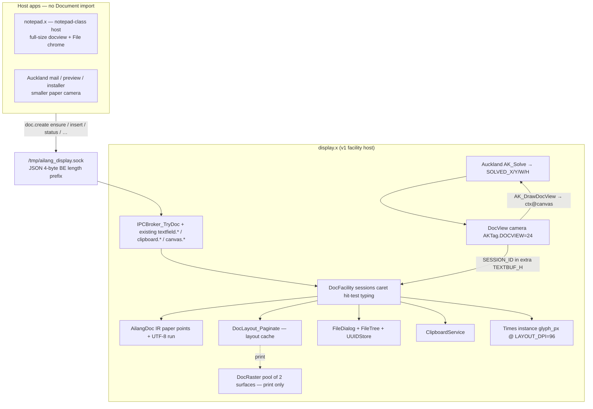
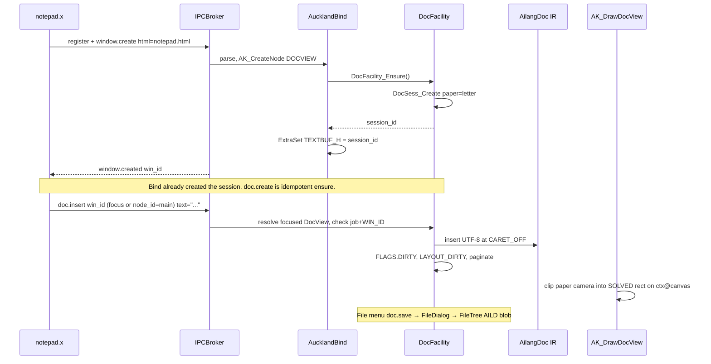
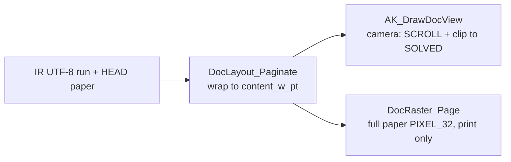
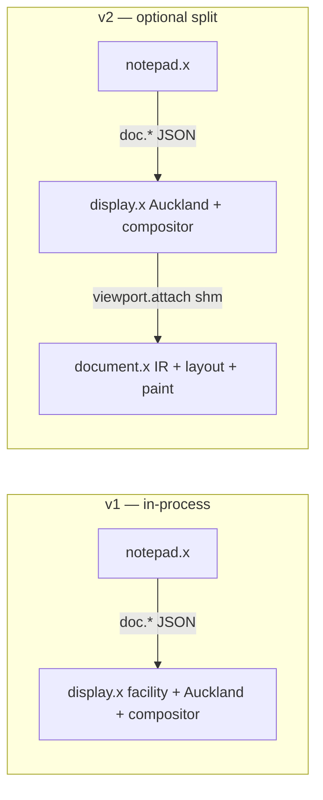

# Ailang Document Facility

**Author:** Sean Collins / 2 Paws Machine and Engineering  
**Date:** 2026-08-23  
**Status:** Draft (rev 4 — layout y in LAYOUT_DPI px; selection paint)  
**Audience:** Senior engineers on the display / Auckland / IPC stack  
**Related:** clipboard service (`docs/display/CLIPBOARD_SERVICE.md`), FileDialog, TEXTFIELD drive API, `canvas.attach`

---

## Overview

Ailang today has two incomplete halves of a document story: a **pixel document** (`Librarys/Display/Content/Library.Document.ailang` + `Library.PageSurface.ailang`) whose source of truth is a `PIXEL_32` paper canvas, and a **plain-text editor** (`<textfield>` + `TextBuffer`) that notepad, IDE, and FileDialog actually use. `docs/display/06_DESKTOP_SHELL_CONTENT.md` §9 claims `Document_Load` / `Document_Save`; those functions do not exist. Saving a document today dumps a `TextBuffer` through FileDialog into FileTree/UUIDStore. That is notepad-as-file-format, not a system document facility.

This design replaces the pixel model with an **in-house AilangDoc IR** whose coordinate system is **standard paper** (Letter / A4 / Legal / A3 / CUSTOM) in points. Editing is a **system facility** in the same class as clipboard and FileDialog: owned by the display stack, invoked on demand. Host apps never import Document/PageSurface/editor libraries. They place a `<docview>` widget — a **camera onto paper** (scroll, later zoom) — talk `doc.*` JSON on `/tmp/ailang_display.sock`, and the facility paints the visible slice of the paper page into the node's solved rectangle.

**Paper is the document.** Wrap width is the page content box (paper minus margins) in points. The widget never becomes the wrap width. A 240 px CAD notes strip shows a scrolled/clipped paper column — cramped but honest. Full editing is **notepad-class**: a standard window hosting a full-size `<docview>` plus File chrome. There is no second text editor, no TEXTFIELD overlay, no unbounded canvas for “real typing.”

v1 lives **in-process inside `display.x`** (same rationale as clipboard). The IPC API is required either way. A dedicated `document.x` is a v2 process split behind the same `doc.*` JSON, using widget-level shm (`viewport.attach`), not today's window-level `canvas.attach`.

v1 composability is **any Auckland-content window**. Chrome/terminal/Ladybird/CAD-3D that replace the whole content surface via `canvas.attach` cannot host a DocView beside their pixels until v2 `viewport.attach`.

---

## Background & Motivation

### What exists, accurately

**Document IR is currently a raster.** `Library.Document.ailang` stores 64-byte records (`DocConst.META_SIZE=64`, `MAX_DOCS=32`) with field offsets:

| Field | Offset | Meaning |
|-------|--------|---------|
| `PAPER_TYPE` | 0 | `PaperType` for new pages |
| `ORIENTATION` | 8 | `PageOrient` |
| `DPI` | 16 | DPI for all pages |
| `PAGE_LIST` | 24 | XArray of PageTable indices |
| `PAGE_COUNT` | 32 | page count |
| `CURSOR_PAGE` | 40 | write cursor page |
| `CURSOR_Y` | 48 | write cursor Y in pixels |
| `FLAGS` | 56 | `DIRTY=1`, `AUTO_PAGE=2` |

APIs that exist: `Doc_Init`, `Doc_Create`, `Doc_AddPage`, `Doc_GetPage`, `Doc_GetPageCount`, `Doc_GetCurrentPage`, `Doc_GetCurrentSurface`, `Doc_GetCursorY`, `Doc_SetCursorY`, `Doc_CheckPageBreak`, `Doc_WriteText`, `Doc_Destroy`. **There is no `Doc_Load` / `Doc_Save`.** `Doc_WriteText` creates a `TextRegion` on the current `PageSurface` and paints glyphs. The model is pixels; text cannot be re-flowed, selected as characters, or round-tripped. Allocators bump `DocTable.count` / `PageTable.count` and never recycle: `PageSurface_Destroy` zeros `SURFACE` but does not decrement `PageTable.count` (`Library.PageSurface.ailang` ~454–462).

**PageSurface is a print canvas, not the edit model.** `Library.PageSurface.ailang`: 96-byte records (`PageConst.META_SIZE=96`, `MAX_PAGES=256`, `DEFAULT_DPI=96`). Paper types: `LETTER=1`, `LEGAL=2`, `A4=3`, `A3=4`, `FREE=5`, `CUSTOM=6`. Letter @ 96 DPI is 816×1056 `PIXEL_32` ≈ **3.44 MB per page**. `Doc_Create` auto-creates the first page as a raster. `Main.ailang` currently calls `PageSurface_Init()` then `Doc_Init()` at boot (lines 71–72) even if nothing will ever edit a document. This facility keeps PageSurface for **print raster of the same paper IR**, not as the interactive surface.

**Auckland is UI, not documents.** `docs/design/auckland-spec.md` §6.1: markup is “NOT a document format. There is no text flow…” `<canvas>` is hittable with **no draw path** — apps must paint externally (`docs/display/AUCKLAND_INVENTORY.md`). TEXTFIELD is code/plain editing (IDE, grep, address bar), not paginated documents. It already calls `VFont_UseDocSize(UIScale.font_doc)` then restores `VFont_UseSize` — that is a **font-face/size choice**, not a document model. The notepad flip is IR + paper pagination, not fonts.

Treat `AUCKLAND_INVENTORY.md` hittable lists as untrusted: `AK_IsHittable` already includes `TEXTFIELD` and `INPUT` (`Library.AucklandEvent.ailang` ~60–80). `AK_EventMouseDown` already sets `ctx@focus_node = target` for any hittable node (~266–274). The old “focus only at bind” inventory note is stale; do not regress it, and do not cite it as current behavior.

**IPC + canvas is window-level.** `Librarys/Display/IPC/Library.IPCBroker.ailang` header lists `register`, `window.create/update`, `canvas.attach/present/detach`, `clipboard.set/get`. `IPCBroker_HandleCanvasAttach` takes `win_id` + `shm_path` + `w` + `h`, checks ownership via `WinView_GetJobPtr(win_id)` (job must equal `ci+1`), mmaps `PIXEL_32`, and stores the surface on **the window** (`Canvas_SetActive(win_id, 1)`). `Win_BlitAll` (`Library.WinRender.ailang` ~line 63) then **replaces the entire content surface** with that shm. That is Chrome/terminal/Ladybird whole-content replacement. CAD today is an X11-hosted buffer app (`docs/cad/CAD_APP_PLAN.md`: AOS WM is P2); it does not create an Auckland window. v1 therefore cannot put a DocView in the same window as a 3D `canvas.attach` surface.

**TEXTFIELD already shows the drive pattern.** IPC methods: `textfield.load/save/getinfo/goto/clear/insert/setbuf/newbuf`. Buffers live in `display.x` (`Librarys/Library.TextBuffer.ailang`: pool of 16, `MODIFIED@32`, `NAMED@40`, line-oriented `CURSOR_ROW`/`CURSOR_COL`, `MAX_LINES=10000`). `Applications/notepad_drive.ailang` never imports TextBuffer; it sends JSON. `NAMED` is not a boolean in practice: `FD_ApplyOpen` stores a FileTree file id via `TextBuf_SetNamed(tbh, sel)`. `textfield.load` uses raw `SystemCall(2, path, ...)` — **do not copy that** for documents. `textfield.*` does **not** check `WinView_GetJobPtr`; `doc.*` must be stricter (canvas.attach check).

**System facilities already in `display.x`.** Clipboard is display-server owned, one slot; the clipboard design (`CLIPBOARD_SERVICE.md` §3) explicitly rejected a boot-time standalone daemon for v1. FileDialog is an on-demand modal (`Library.FileDialog.ailang`) using `FileTree_ReadFile` / `CreateFile` / `UpdateFile` against Postgres `files` + UUID blobs (`OS/FileTree.ailang`, `OS/UUIDStore.ailang`, `/data/blobs/{uuid}.blob`), 524288-byte cap. File menu actions `doc.new/open/save/saveas` are already **system actions** in `EventRouter_Dispatch` (`"doc."` prefix, bytes `100 111 99 46`) and currently dump the focused window’s TextBuffer. `EventRouter_EditCmd` today: if focus is not TEXTFIELD/INPUT, it searches for a TEXTFIELD — a DocView-focused mail body would paste into To:.

**Chrome already has a dirty/named contract.** `WinChrome_LookupDocColor` (`Library.WinRender.ailang` ~726): steel `Theme.tab_doc_new=0xFF8AA0B4` = new, red `tab_doc_dirty=0xFFD94A4A` = unsaved, green `tab_doc_saved=0xFF3DDC97` = saved. It walks `AK_FindTextField` and reads TextBuf flags. Tab filename box must wire to the **focused** DocView session the same way.

**Fonts are already split.** UI chrome is Alteix (`VFont_LoadVIF("/system/fonts/AlteixSans.vif")`). Document face is Times/Liberation via `VFont_LoadFace("/system/fonts/TimesRoman.vif")` with DejaVu fallback, bound through `VFont_SetDocFace` / `VFont_UseDocSize` (`Library.SysDisplay.ailang` ~1848, `Library.Fonts.ailang` ~1003). `config/ui.cfg` user-owned keys must not be stomped (`UITheme_UserOwnsKey`: `desktop_bg`, `text_fg`, `text_light`, `menu_fg`, `tab_text`, `ak_btn_fg`, `toolbar_close_fg`, `deskbar_btn_fg`, `deskbar_win_fg`).

**CAD is a geometry kernel, not a document kernel.** `Librarys/Cad/Library.CAD_Sketch.ailang` is 2D UV profile IR (tag 10, stride 28). Later `FrameKind.SKETCH` may insert a sketch *inside* a document frame. It is not the document model.

**Vestigial window-level doc slots.** `WinViewFields` already has `DOC_HANDLE@40` and `PAGE_HANDLE@48` (`Library.WinManager.ailang`). Getters are unused outside WinManager. Those are the wrong grain: a window may host several DocViews. Do not revive them as the session table. Session ids live on the Auckland node extra **and** on the session record (`NODE_ID`).

**`AK_FindById` already exists** (`Library.Auckland.ailang` ~2166): DJB2 of the id string vs `AKF.ID_HASH`. Do not add a second one.

### Pain points

1. Raster-as-model: cannot select, reflow, save, or round-trip unknown content.
2. Notepad is a TEXTFIELD (`config/notepad.html`) driven by FileDialog TextBuffer dump — not a paper document editor.
3. `canvas.attach` is window-scoped; cannot “insert a paper camera” into an Auckland tree, and cannot compose with 3D/Chrome pixels until v2.
4. Docs lie: §9 APIs (`Document_Load/Save/RemovePage`) and “Editor widget ~1400 lines” (`Library.Editor.ailang` is a TUI nano-like editor) are not the running system.
5. Boot pays `Doc_Init`/`PageSurface_Init` even when unused; `Doc_Create` immediately allocates a 3.44 MB Letter raster. PageTable never recycles slots.
6. Host apps that wanted documents would have to import Display.Content libraries — not composable, not system-wide.

---

## Goals & Non-Goals

### Goals

- One system-wide document facility: same paper IR, fonts, save path, clipboard sidecar everywhere.
- **Paper-locked format.** Standard sizes are the IR coordinate system. Content width = page content box in points. Wrap and page-break happen on paper. `<docview>` is a camera (scroll, later zoom), never the wrap width.
- **Composable viewports, not reflow.** Any **Auckland-content** tree can place a paper camera in a rectangle. Notepad-class = full-size edit host + File chrome. Smaller embeds show a scrolled/clipped paper page, or “open in notepad” on that session.
- As-used: no session, no layout cache, no raster until something creates a DocView (HTML bind or `doc.create` ensure). Last detach may free. Apps that never embed it pay nothing material.
- Host apps talk JSON on `/tmp/ailang_display.sock`. They do **not** import Document / PageSurface / editor libraries.
- Widget paints into the solved Auckland node rect (`AKF.SOLVED_X/Y/W/H` at offsets 192/200/208/216). Host window keeps its own chrome/layout.
- AilangDoc IR is the source of truth. PageSurface is print of that IR, not the edit surface.
- Persist as a versioned tagged binary chunk file (v1: `HEAD` + one `TEXT` + `END`) through FileTree/UUIDStore. Saving pixels is print, not document.
- TEXTFIELD remains for **non-documents** (IDE, grep, address bar). DocView is documents. Do not merge them. Do not add a second editor for typing.
- Wire `doc.new/open/save/saveas` and tab-box color to the **focused** DocView session when one exists.

### Non-Goals (v1)

- LibreOffice / ODF / OOXML wrap or host helper.
- Auckland HTML as a document format.
- Reflow-to-widget-width. Paper is not a print hint.
- A TEXTFIELD overlay, widget-width notes widget, or parallel unbounded canvas for typing.
- Embedding DocView inside a window-level `canvas.attach` app (Chrome / terminal / Ladybird / CAD 3D). That is v2 `viewport.attach` (or CAD growing Auckland chrome).
- Tables, images, sketches, charts as editable frame kinds (ids reserved; unknown kinds round-trip opaque).
- Box-placement UI (drag frames around the page). v1 is typewriter: one flowing TEXT frame that paginates across paper pages.
- Dedicated `document.x` process (v2 path, same JSON).
- Offscreen `VIEW_SURF` blit (v2 shm seam). v1 paints like TEXTFIELD, directly into `ctx@canvas`.
- Rich clipboard as the paste-anywhere form (text fallback always; `ClipType.RICH` sidecar later).
- Collaborative editing, undo (later PR), comments, stylesheets, footnotes, per-run char attrs beyond HEAD defaults.
- Network/cross-machine documents.
- Growing `IPCBrokerConst.MAX_CLIENTS=8` except as a v2 note.
- FileDialog extension filters (v1 has none today; do not add as a requirement).

---

## Key Decisions

| Decision | Choice | Rationale |
|----------|--------|-----------|
| Document model | In-house AilangDoc IR. Coordinate system = standard paper in points. Not pixels, not Auckland HTML, not ODF. | User rejected LO wrap. Raster cannot round-trip. Auckland has no text flow. User locked paper sizes so wrap/page-break are not a “nebulous canvas.” |
| Wrap width | Page content box (paper minus margins) in points. Widget is a **camera**. | User: lock format to paper; rest is layout and flow. Reflow-to-`SOLVED_W` rejected. |
| Layout metrics | **`LAYOUT_DPI = 96` forever** for wrap, paginate, camera, hit-test, paint. `glyph_px = (HEAD.size_pt * 96) / 72` (12 pt → 16 px). Bind `VFont_CreateInstance(doc_face, glyph_px)` — **never** `VFont_UseDocSize(UIScale.font_doc)` for documents. HEAD.`dpi` is **print raster only**. Guest resolution must not change `page_count`. | Three DPIs (UIScale font, 96 camera, HEAD.dpi) would miss glyphs and re-paginate on resize. Paper contract is one Times instance. |
| Running layout y | **LAYOUT_DPI pixels only.** Integer divide **once** at `DocPaper_*` (`content_*_px = (pt * 96) / 72`). Cache `{off0,off1,page_idx,x_px,y_px,w_px}`. `y_px += line_h_px`; new page when `y_px + line_h_px > content_h_px`. Never `y_pt = line_h_px * 72 / 96` per line. | Times 16 px line height is often 19–20. `19*72/96=14`; `14*96/72=18` — tens of px drift per Letter page. |
| Editing host | One engine: facility writes TEXT frames on paper. Notepad-class window = full-size `<docview>` + File chrome. No second editor. | User: do not add a TEXTFIELD overlay. Composability is the viewport, not a second model. |
| v1 embed scope | Auckland-content windows only. CAD 3D / Chrome `canvas.attach` notes = v2. | `Win_BlitAll` replaces the whole content surface. CAD AOS WM is P2 (`CAD_APP_PLAN.md`). |
| Process (v1) | In-process in `display.x`. `DocFacility_Ensure()` on first bind / `doc.create`. | Clipboard already rejected a boot daemon. Fonts, Auckland, FileDialog, input, compositor are here. IPC API is still required. |
| Process (v2) | Optional `document.x` behind identical `doc.*` JSON, widget-level shm `{win_id, node_id}`. | “Over IPC” means the API; a second process is optional. `MAX_CLIENTS=8` is one more client. |
| Viewport grain | New Auckland tag `DOCVIEW` (id 24). Camera into solved node rect. | Window-level `canvas.attach` is whole-content replacement. |
| v1 paint | Direct into `ctx@canvas` at draw `sx,sy` (TEXTFIELD style). No `VIEW_SURF`. | `AK_DrawNode` TEXTFIELD already paints the canvas. Offscreen 960 KB is a v2 shm seam, not a v1 need. |
| Session storage | Node extra `AKExtra.TEXTBUF_H@120` reused as `SESSION_ID` when `tag==DOCVIEW`. Session record also stores `NODE_ID`, `WIN_ID`, `JOB`. Not `WinView.DOC_HANDLE`. | Extra table is full (`ICON_SURF@200` fills 208-byte extra). Window slots are wrong grain. |
| TEXT backing | Dedicated UTF-8 run arena owned by AilangDoc. **Never** `TextBuf_*` on a DocView extra. Caret = **byte offset**. Grapheme clustering later. | TEXTFIELD pool is 16 line-oriented slots already used by IDE/FileDialog/address bar. `NAMED@40`/`MODIFIED@32` stay TextBuf’s. |
| Frame kinds | Integer ids, TEXT=1 implemented; IMAGE/TABLE/SKETCH/CHART reserved; OBJECT=255 opaque. | Old files must not break. CAD sketch is a later insert, not the kernel. |
| v1 on-disk | `HEAD` + one `TEXT` + `END`. `PAGE`/`FRAM` reserved for box UI. Pagination is a layout cache derived from HEAD paper. | Typewriter is one flowing run. Baking per-page frames would freeze Times metrics into the file. |
| v1 text attrs | Document-level in HEAD: `size_pt` (default 12), `bold=0`, `italic=0`. No per-run attrs. | “Simple attrs” were unspecified in TEXT payload. HEAD is enough for typewriter. |
| Persist | Tagged binary chunks (`AILD`), little-endian sizes, FileTree + UUIDStore. Load cap **512 KB**, no silent grow. | No libxml, no LO. Matches FileDialog’s 524288 buffer. Pixels are print. |
| File name | `.aild`, new file `untitled.aild`. | Engineering default locked for v1. |
| Plain-text import | Wrap UTF-8 as TEXT; set `WAS_PLAIN`. Save of a `WAS_PLAIN` session is **Save As**, never overwrite. | Do not silently destroy greppable `.txt`. |
| Fonts | Document: Times at `glyph_px` @ 96 DPI (`doc_face` already loaded). Measure/hit/draw via **`VInst_*(layout_inst)`** (or `DocLayout_Bind` that sets `FontState.default_inst` then restores). **Ban** bare `VFont_GetLineHeight` / `VFont_MeasureWidth` / `VFont_PixelToCol` / `VFont_DrawString` on the document path — those read `default_inst`, which `VFont_CreateInstance` does **not** set (`Library.Fonts.ailang` ~507–518). UI chrome: Alteix via `VFont_UseSize(UIScale.font_body)`. | Else PR1 measures Alteix/`font_body` after chrome paint. `CreateInstance` dedupes; all 12 pt @ 96 docs share one inst (`InstConst.MAX=16`). |
| Paper geometry | One helper pair: `DocPaper_SizePt` + `DocPaper_ContentBox`. CUSTOM = portrait physical `(w,h)` then the **same** landscape swap as Letter. FREE/unknown = error. Named sizes ignore custom fields. v1 HTML **refuses** `paper="custom"` (named sizes only); CUSTOM comes from AILD HEAD or `DocSess_Create`. Empty doc = one blank page of that content box. | User: custom is the same solver with a new `(w,h)`, not a second path. `PageSurface_ComputeSize` (inches×100) must not be the IR source of truth. |
| TEXTFIELD vs DocView | Keep both. | IDE/grep/address bar are code/plain. Documents are paper + Times + frames. |
| Caps | Sessions 32 with **free list**. IR page cache cap 256. Live print rasters: **2 surfaces owned by DocRaster**, not `PageTable.count++`. | PageSurface never recycles indices. 256 Letter rasters ≈ 880 MB. |
| Boot | Stop paying for documents at boot. `Ensure()` idempotent (`if table.data != 0 return`). | `Main.ailang` currently inits both unconditionally. |
| Bind vs IPC | Bind creates the session (`GEN` starts at **1** so extra 0 = none). `WIN_ID`/`JOB` stamped **after** `Win_Create` / `SetJobPtr`, not at parse. `doc.create` is idempotent ensure and fills WIN/JOB if still 0. `doc.attach` is v2. Prefer **focused** DocView. | AucklandBind runs inside `AKParse_File` **before** `Win_Create` (`AppHost_Open` ~86–114); job is set after (`IPCBroker_HandleWindowCreate` ~605–613). |
| JOB==0 | Mutators allow `sess.JOB==0` only when `WinView_GetJobPtr(win_id)==0`. | Else an unstamped IPC window is a confused deputy. |
| Caret in camera | After every caret move, `DocSess_EnsureCaretVisible`: pan `SCROLL_*` so caret paper-px sits in `[SCROLL, SCROLL+SOLVED)` with one `line_h_px` pad (match TEXTFIELD ~1769–1777). | Notepad `design-h="300"` is far shorter than Letter 1056 px. |
| v1 selection | Click-caret (collapses sel), **Shift+arrow** extends `SEL_B`, **Ctrl+A**. Paint: if `SEL_A != SEL_B`, fill overlapping cached lines with `Theme.ak_selection_bg` **behind** glyphs (same camera mapping). Do **not** reuse `AK_PrepSelDraw` (row/col TextBuffer). No `DocView_Drag` in v1. | Without a draw step Shift+arrow is invisible. TEXTFIELD uses `AK_DrawSelHL` + `Theme.ak_selection_bg` (~760–799). |
| Readonly | Session `FLAGS.READONLY=4`. Enforced in `DocSess_Key`, `EventRouter_Doc`, `FD_ApplySave`. Not `AKFlags` / not extra `ROWS`. | `AKFlags` has no READONLY. Extra `ROWS` is claimed by INPUT flags and by orientation. File menu is a system `doc.*` action. |
| v1 editing UX | Typewriter: one flowing TEXT frame, auto page-break on paper. | Ships a real editor without a box-placement tool. |
| IPC dispatch | `IPCBroker_TryDoc` (mirror `IPCBroker_TryClipboard` at ~300). | `HandleMsg` cannot take 11 more `cmp_doc*` locals. |
| Compiler | Small functions; FixedPool scratch; do not rely on a local across a call unless it lives in a FixedPool. `AK_DrawNode` / `HandleMsg` get **one call** for DocView, not an inlined body. | 6-register ABI; locals/args clobbered by calls. “Trailing-call results get dropped” is overstated; the live rule is call-clobber. |

---

## Proposed Design

### Layer diagram



### Runtime sequence (notepad-class)



### 1. AilangDoc IR (source of truth)

New library: `Librarys/Display/Content/Library.AilangDoc.ailang`. This **replaces** `Library.Document.ailang` as the editable model. Keep `Library.Document.ailang` only as a thin deprecated wrapper around PageSurface write-cursor APIs until print callers migrate; do not extend it.

**Paper is the coordinate system.** Physical layout is in **points** (1/72 inch). **Edit layout, camera, hit-test, and paint share one pixel space:** `LAYOUT_DPI = 96`. `px = (pt * 96) / 72`. HEAD.`dpi` is **not** this; it is print-raster only (`DocRaster_Page(..., dpi)`). Changing guest resolution / `UIScale` must not change `page_count` for a given AILD.

**One paper solver** (used by Paginate, camera, hit-test, DocRaster — **never** `PageSurface_ComputeSize` / `PageSurface_CreateFree`):

```
DocPaper_SizePt(paper, orient, custom_w_pt, custom_h_pt, out_w, out_h) → 1 ok / 0 error
  // out-pointers, same ABI as PageSurface_ComputeSize. Callers that cannot
  // keep two addresses across a call write into FixedPool.DocPaperOut {w,h}.
  LETTER=1: 612 × 792
  LEGAL=2:  612 × 1008
  A4=3:     595 × 842
  A3=4:     842 × 1191
  CUSTOM=6: require custom_w_pt>0 and custom_h_pt>0; those values are **portrait physical size**
  FREE=5 or unknown: return 0 (never PageSurface_CreateFree)
  if orient == LANDSCAPE: swap w/h   // same swap for named sizes and CUSTOM
  named sizes ignore custom_w/h even if HEAD has them
  StoreValue(out_w, w); StoreValue(out_h, h)

DocPaper_ContentBox(w, h, mt, mr, mb, ml, out_cw, out_ch) → 1 ok / 0 error
  // margins apply to the *oriented* sheet (after swap)
  cw = w - ml - mr; ch = h - mt - mb
  if cw<1 or ch<1: return 0
```

Default margins: 72 pt each side (1 inch). Letter portrait content box: 468 × 648 pt = 624 × 864 px at 96 DPI. Letter sheet: 816 × 1056 px. A4/A3 integer points above are the IR truth; `PageSurface_ComputeSize` inches×100 (A4 `827×1169`) can be 1 px off — **do not call it**.

Empty document: still **one blank page** of that content box (`page_count=1`, empty run). Needed for PR2a empty camera.

v1 HTML markup: **named sizes only** (`letter`/`legal`/`a4`/`a3`). `paper="custom"` at bind is an error (log + fall back to Letter). CUSTOM is accepted from AILD HEAD or `DocSess_Create(CUSTOM, w_pt, h_pt)`.

**Layout instance (locked)**

```
LAYOUT_DPI = 96
glyph_px   = (HEAD.size_pt * LAYOUT_DPI) / 72     // default 12 pt → 16 px
inst       = VFont_CreateInstance(FontState.doc_face, glyph_px)
             // kept on the document/IR; rebind after size_pt change
             // CreateInstance does NOT set FontState.default_inst (~507–518)
line_h_px  = VInst_GetLineHeight(inst)
```

**`DocLayout_Bind(doc)`** — required before Paginate / Hit / Draw glyphs:

- Preferred: call `VInst_GetLineHeight(doc.layout_inst)`, `VInst_MeasureWidth(inst, …)`, `VInst_PixelToCol(inst, …)`, `VInst_DrawString(inst, …)` (`Library.Fonts.ailang` ~620–760).
- Alternative if a callee only reads `default_inst`: `FontState.default_inst = doc.layout_inst` for the duration of that function, then `VFont_UseSize(UIScale.font_body)`.

**Ban** on the document path: bare `VFont_GetLineHeight()`, `VFont_MeasureWidth`, `VFont_PixelToCol`, `VFont_DrawString`, and `VFont_UseDocSize(UIScale.font_doc)`. The globals read `default_inst` (often Alteix/`font_body` after chrome). After document paint, restore UI chrome with `VFont_UseSize(UIScale.font_body)`.

**v1 object graph (typewriter)**

```
Document
  paper_type, orientation
  custom_w_pt, custom_h_pt       // CUSTOM only; 0 on named sizes
  margin_t/r/b/l_pt              // oriented-sheet margins
  size_pt, bold, italic          // HEAD defaults; whole document
  print_dpi                      // HEAD.dpi — DocRaster only, default 96
  layout_inst                    // VFont instance at glyph_px
  text_run                       // one UTF-8 arena
  layout_cache                   // derived; not serialized
    page_count
    lines[]  {off0, off1, page_idx, x_px, y_px, w_px}
```

The in-memory **box-UI graph** (Page → Frame with `box_*_pt`) is reserved in the library so record layouts do not churn, but **v1 does not persist it**. `DocLayout_Paginate` walks the single TEXT run against `DocPaper_ContentBox(...)`.

**Frame kinds (extensible integers; on-disk for v2+)**

| Id | Name | v1 |
|----|------|----|
| 1 | TEXT | implemented as the single flowing run |
| 2 | IMAGE | reserved |
| 3 | TABLE | reserved |
| 4 | SKETCH | reserved — CAD sketch insert, not the kernel |
| 5 | CHART | reserved |
| 255 | OBJECT | opaque payload, round-trip required |

Unknown kinds **must** round-trip when they appear in a future file: persist `kind` + raw bytes; skip at layout/hit-test with a placeholder rect. v1 writers never emit them.

**TEXT backing store (locked)**

Dedicated UTF-8 run arena owned by AilangDoc, **not** `Library.TextBuffer.ailang`.

```
DocRun:
  ptr, len, cap          // bytes; Allocate/grow
  // caret/selection live on the session, not here
```

Rules:

- **Ban:** `TextBuf_InsertChar`, `TextBuf_GetNamed`, or any `TextBuf_*` with a DocView extra. Extra `TEXTBUF_H` on a DOCVIEW node is a session id, not a TextBuffer handle.
- If we want TextBuffer’s *algorithm* (insert/delete in a buffer), **clone** it into `DocRun_*`. Do not grow `TextBufConst.MAX_BUFS=16`. Do not overload `NAMED@40` / `MODIFIED@32`.
- Caret unit: **byte offset** into the UTF-8 run (`CARET_OFF`). v1 assumes ASCII/UTF-8 where one keystroke is one byte for Latin, and multi-byte UTF-8 inserts as a byte sequence but **arrow keys step one byte** (known limitation — will split a multi-byte character). Do **not** silently step codepoints in v1. Grapheme clustering is later.
- Selection: `SEL_A` / `SEL_B` byte offsets on the session (unordered until used; paint/copy sorts them). v1 sets them via click (collapse), Shift+arrow (extend `SEL_B`), Ctrl+A (whole run). No mouse-drag.

**Why not keep Document.ailang as IR.** Its `CURSOR_Y` is a pixel write head on a `PIXEL_32` surface. There is no character index, no selection, no load/save. Retrofitting IR into those 64 bytes would lie about the model.

**Caps**

- Sessions: **32** with a **free list** (reuse destroyed slots). Generation in the handle so a stale id fails closed.
- Layout page cache: **256** pages per document (hard cap; further typing refuses / does not allocate).
- Live print rasters: **2** `Surface_Create`s in `DocRasterPool`, recycled. **Never** `PageTable.count++` for the editor. `PageSurface_Init` / `Ensure` are idempotent: `if PageTable.data != 0 return 1`.

### 2. Document Facility (system service)

New libraries (split for the 6-register ABI; do not dump everything into one file):

| File | Functions |
|------|-----------|
| `Library.DocFacility.ailang` | `Ensure`, session table, free list, FLAGS |
| `Library.DocSess.ailang` | create/reset/key/insert/click/wheel, dirty, bind win/job/node |
| `Library.DocLayout.ailang` | `DocPaper_SizePt`, `DocPaper_ContentBox`, `Paginate`, wrap, `Hit`, `PAGE_GAP_PX=16` |
| `Library.DocView.ailang` | `AK_DrawDocView`, `DocView_Click`, `DocView_Key`, `DocView_Wheel`, `EnsureCaretVisible` |

**Lifecycle (as-used)**

```
DocFacility_Ensure()
  if DocSessTable.data != 0: return 1          // idempotent
  allocate session table (32 × SESSION_SIZE)
  init free list (all slots free)
  allocate IR tables + run arena bookkeeping
  // Do NOT call PageSurface_Init unless a print path needs it.
  // If a test already called PageSurface_Init, do not Allocate a second table.
  return 1

DocFacility_OnSessionZero()
  optional: free IR tables
  leave fonts alone (display.x owns those)
  do not keep print rasters

Called from:
  AucklandBind when tag == DOCVIEW
  IPCBroker_TryDoc (create/open) as ensure
Never from Main.ailang boot.
```

Remove `PageSurface_Init()` / `Doc_Init()` from `Main.ailang` lines 71–72. `dev/compiler-regression/Test.Document.ailang` keeps calling them directly. Production `Main.ailang` never `Doc_Create`s today.

**Session record (128 bytes)**

| Field | Offset | Meaning |
|-------|--------|---------|
| `DOC_ID` | 0 | IR document index |
| `FILE_ID` | 8 | FileTree id, 0 = unnamed |
| `FLAGS` | 16 | `DIRTY=1`, `NAMED=2`, `READONLY=4`, `WAS_PLAIN=8`, `LAYOUT_DIRTY=16` |
| `CARET_OFF` | 24 | byte offset into UTF-8 run |
| `SEL_A` | 32 | selection anchor (byte) |
| `SEL_B` | 40 | selection end (byte) |
| `SCROLL_X` | 48 | camera pan in **LAYOUT_DPI=96 paper pixels** |
| `SCROLL_Y` | 56 | camera pan in **LAYOUT_DPI=96 paper pixels** |
| `WIN_ID` | 64 | owning window; **0 until `DocSess_SetWin` after `Win_Create`** |
| `JOB` | 72 | `WinView_GetJobPtr`; **0 until `DocSess_SetJob` after `SetJobPtr`** |
| `NODE_ID` | 80 | Auckland node index in that window’s content ctx |
| `GEN` | 88 | generation; **starts at 1** (extra 0 = no session) |
| `PAPER` | 96 | `PaperType` copy (also in IR HEAD) |
| `ORIENT` | 104 | `PageOrient` |
| `reserved` | 112 | pad to 128 |

Handle format: `sess = index | (gen << 16)` (index 0..31, gen ≥ 1). Lookups fail if `GEN` mismatch, slot free, or `sess==0`. Extra `TEXTBUF_H` is zeroed in `AK_AllocExtra`; TEXTFIELD already uses handle 0 as a valid TextBuffer — DocView must **not**.

`NAMED` is redundant with `FILE_ID>0`; keep the bit for chrome so we do not call FileTree on every tab paint.

**Wrap / paginate / cache (the only wrap rules)**

Paper box in points from `DocPaper_*`. Convert **once** at that edge:

```
content_w_px = (content_w_pt * 96) / 72
content_h_px = (content_h_pt * 96) / 72
margin_l_px  = (margin_l_pt  * 96) / 72   // same for t/r/b
page_w_px    = (paper_w_pt   * 96) / 72
page_h_px    = (paper_h_pt   * 96) / 72
```

Running wrap/hit/paint y is **pixels only**. Never `y_pt = px * 72 / 96` per line.

1. Hard break on byte `0x0A` (`\n`). `\r` ignored. Tabs: v1 treat as a single space (no tab stops). No hyphenation.
2. Greedy wrap on U+0020 (byte `0x20`): accumulate tokens; if adding the next token would exceed `content_w_px`, **break before that space and consume it** (drop the breaking U+0020; it is not drawn and is not the first byte of the next line). Standard word-wrap.
3. Overlong token (no space, wider than `content_w_px`): split at the **last byte that still fits** (may split UTF-8 — same known v1 limit as arrows).
4. `line_h_px = VInst_GetLineHeight(doc.layout_inst)` after `DocLayout_Bind`. Not `VFont_GetLineHeight()`, not `UIScale.font_doc`, not 120% leading unless that instance already includes it.
5. `y_px = 0` is the top of the **content box** (below top margin). Advance `y_px += line_h_px`. New page when `y_px + line_h_px > content_h_px`.
6. Cache one record per visual line: `{off0, off1, page_idx, x_px, y_px, w_px}`. `x_px` is left of the content box (0 = left content edge). `y_px` is relative to that page’s content top. Empty run → one empty page, `page_count=1`, no line records (caret at off 0, content origin).
7. **`PAGE_GAP_PX = 16`** named constant, shared by paint and click.  
   `page_origin_y_px = page_idx * (page_h_px + PAGE_GAP_PX)`

**Editing (v1 typewriter)**

- Focused DocView receives keys from a **new** path: `DocView_Key`, not `AK_EventKeyNav/Edit/Ctrl` (those take a TextBuffer handle).
- Insert UTF-8 at `CARET_OFF`; set `DIRTY | LAYOUT_DIRTY`; paginate; **`DocSess_EnsureCaretVisible`**.
- Hit-test: camera mapping below (same 96 DPI pixels as paint).
- Selection: click collapses; Shift+arrow extends; Ctrl+A whole run. Copy → `Clipboard_Set` as `ClipType.TEXT`. Paste inserts bytes. No RTF. No mouse-drag in v1.
- Undo: **not in v1 PRs.**
- Readonly: `DocSess_Key` / insert / cut / paste no-op. `EventRouter_Doc` save/new no-op. `FD_ApplySave` rejects.

**`DocSess_EnsureCaretVisible(sess, sw, sh)`** (required; match TEXTFIELD ~1769–1777):

```
caret_px = DocLayout_CaretPx(sess)   // paper pixels @ 96, including page_origin_y_px
pad = line_h_px
if caret_x < SCROLL_X:           SCROLL_X = caret_x
if caret_x >= SCROLL_X + sw:     SCROLL_X = caret_x - sw + pad
if caret_y < SCROLL_Y:           SCROLL_Y = caret_y
if caret_y + line_h_px > SCROLL_Y + sh: SCROLL_Y = caret_y + line_h_px - sh
clamp SCROLL_* to document extents (same clamp as DocView_Wheel)
```

Call after insert, delete, arrow, click, paste, PageUp/Down.

**Layout vs camera vs print**



Interactive paint is **not** an 816×1056 offscreen paper surface. It draws the visible camera window of the layout cache directly into `ctx@canvas`. Print allocates a paper-sized PIXEL_32 from the **DocRaster pool of 2** at HEAD.`dpi` (not LAYOUT_DPI unless they happen to match). Guest 1152×864 / `UIScale` does **not** enter the document instance.

### 3. DocView viewport — paper camera (Auckland widget)

This is the hard new piece. Window-level `canvas.attach` is the wrong primitive. The widget is a **camera onto paper**, not a wrap-to-rect editor.

**Tag**

```
FixedPool.AKTag {
    ...
    "INPUT":      Initialize=23
    "DOCVIEW":    Initialize=24    // NEW
    "THEME":      Initialize=30
}
```

**Markup**

```html
<docview id="main" grow="1" paper="letter"/>
```

Notepad-class host (`config/notepad.html` after PR5):

```html
<window title="Untitled - Notepad" design-w="400" design-h="300" toolbar="file">
  <group layout="vbox" gap="0" padding="0">
    <docview id="main" grow="1" paper="letter"/>
  </group>
</window>
```

A smaller Auckland embed (mail body, installer readme, file preview) uses the same tag. SOLVED_W=240 still shows Letter paper clipped to 240 px; the user pans with wheel / optional H-scroll. It does **not** reflow Times to 240 px. Full editing: open that session in notepad-class (`doc` File menu or a later “Open in Notepad” action — not required for v1 if the embed is preview/`readonly`).

**Attributes** (`AKBind_ApplyDocViewAttr` — own function, keep locals under 20; bind is **tag-gated** so INPUT `ROWS` is not confused):

| Attr | Storage | Encoding |
|------|---------|----------|
| `id` | `AKF.ID_HASH` | existing DJB2; `AK_FindById` |
| `grow` | `AKF.GROW` | existing |
| `paper` | extra `VALUE@96` | `"letter"`→`PaperType.LETTER=1`, `"legal"`→2, `"a4"`→3, `"a3"`→4. Default 1. **`custom` / `free` at bind = error** (log, use Letter). |
| `orientation` | extra `ROWS@104` **only if tag==DOCVIEW** | `"portrait"`→0, `"landscape"`→1. Default 0. |
| `readonly` | **not** node flags | parsed at bind → `DocSess FLAGS.READONLY=4` |
| `width-pt` / `height-pt` | not in v1 HTML | CUSTOM only via AILD HEAD or `DocSess_Create` |

`AKFlags` is `ENABLED=1`, `HAS_BG=2`, `HAS_BORDER=4`, `HIGHLIGHT_LINE=8` — no READONLY bit. `AKInputFlags.READONLY=2` lives in extra `ROWS` for INPUT and **must not** be reused: orientation already claims `ROWS` for DocView. File menu `doc.save` is a system action and ignores paint-only intent unless EventRouter/FileDialog check session FLAGS.

**Bind** (`Library.AucklandBind.ailang`, next to TEXTFIELD auto-init ~638):

```
If tag == DOCVIEW:
  DocFacility_Ensure()
  paper = Extra VALUE (default LETTER; reject 5/6)
  orient = Extra ROWS (default PORTRAIT)
  sess = DocSess_Create(paper, orient)   // GEN starts at 1; WIN_ID=0; JOB=0
  AK_ExtraSet(ctx, node, AKExtra.TEXTBUF_H, sess)   // SESSION_ID, not a TextBuffer
  DocSess_SetNode(sess, node)
  if no focus: ctx@focus_node = node
```

`AKParse_File` runs **before** `Win_Create` (`Librarys/Library.AppHost.ailang` `AppHost_Open` ~86–114). There is no `win_idx` and job is still 0. **Do not invent them at parse.**

Stamp after window exists:

1. **`DocSess_StampWin(ctx, win_idx)`** — walk tree, every DOCVIEW `DocSess_SetWin(sess, win_idx)`. Call from `AppHost_Open` immediately after `Win_Create` succeeds (~114). Also after any in-process `Win_Create` that hosts a DocView.
2. **`DocSess_StampJob(win_idx, job)`** — walk that window’s content ctx, `DocSess_SetJob(sess, job)`. Call from `IPCBroker_HandleWindowCreate` immediately after `WinView_SetJobPtr(win_idx, ci+1)` (~613). In-process / no IPC: JOB stays 0.
3. **`doc.create` ensure** (and first `TryDoc` mutator): if `sess.WIN_ID==0` set it from the request `win_id`; if `sess.JOB==0` **and** `WinView_GetJobPtr(win_id)==ci+1`, set JOB. If JOB is still 0, only legal when `WinView_GetJobPtr(win_id)==0`.

Reuse `TEXTBUF_H@120` rather than growing the 208-byte extra. Meaning is tag-dependent. **Never** pass that extra to `TextBuf_*`.

**Draw — one call from `AK_DrawNode`**

`AK_DrawNode` already inlines TEXTFIELD (~1735–1901) and is at the locals limit. DocView adds:

```
IfCondition EqualTo(tag, AKTag.DOCVIEW) ThenBlock: {
    AK_DrawDocView(ctx, node)
}
```

That is the entire addition: one call. Body lives in `Library.DocView.ailang`. Use a FixedPool scratch (`DocDrawScr`) for clip/page indices, same idea as `AKSelDraw`.

`AK_DrawDocView(ctx, node)`:

1. `sw/sh` from `AKF.SOLVED_W/H`. If `sw<=0` or `sh<=0` (pre-solve), return — **do not allocate**.
2. Widget origin on the window canvas (parent SCROLL, if any — **not** paper pan):  
   `sx = SOLVED_X - ctx@scroll_offset_x`  
   `sy = SOLVED_Y - ctx@scroll_offset_y`  
   Paper pan is **only** `sess.SCROLL_X/Y`. v1 hosts must **not** wrap `<docview>` in `<scroll>`; camera pan does not require a parent SCROLL.
3. `sess = ExtraGet TEXTBUF_H`; validate `sess != 0` and generation.
4. If `LAYOUT_DIRTY`, `DocLayout_Paginate(sess)` then clear the bit. `DocLayout_Bind(doc)` — `VInst_*` on `layout_inst`, not `UIScale.font_doc`, not global `VFont_GetLineHeight`.
5. Fill the **widget** clip `(sx,sy,sw,sh)` with `Theme.window_bg` (chrome around the sheet). **`Theme.document_bg` does not exist.**
6. For each page `i in 0 .. page_count-1`:  
   `page_origin_y_px = i * (page_h_px + PAGE_GAP_PX)` with `PAGE_GAP_PX=16`  
   `sheet_x = sx + 0 - SCROLL_X`  
   `sheet_y = sy + page_origin_y_px - SCROLL_Y`  
   Fill the sheet rect `(sheet_x, sheet_y, page_w_px, page_h_px)` with **`Theme.page_bg`** (white Letter), clipped to the widget. When `SOLVED` ≠ 816×1056 the sheet edge is visible — that is PR2a. Do **not** fill the whole SOLVED rect with `page_bg`.
7. Glyphs: walk `lines[]` (already px):  
   `line_px_x = margin_l_px + x_px`  
   `line_px_y = page_origin_y_px + margin_t_px + y_px`  
   If the line rect intersects the camera `[SCROLL_X, SCROLL_X+sw) × [SCROLL_Y, SCROLL_Y+sh)`,  
   `draw_x = sx + line_px_x - SCROLL_X`  
   `draw_y = sy + line_px_y - SCROLL_Y`  
   then `VInst_DrawString(layout_inst, …)` the `off0..off1` slice.
7b. **Selection (behind glyphs, like TEXTFIELD `AK_DrawSelHL`):** if `SEL_A != SEL_B`, `lo = min(SEL_A,SEL_B)`, `hi = max(...)`. For each cached line with `[off0,off1)` overlapping `[lo,hi)`, fill the overlap span at the same `draw_x/draw_y` mapping with **`Theme.ak_selection_bg`**. Do **not** call `AK_PrepSelDraw` (it is row/col on a TextBuffer). Then draw glyphs (step 7) on top. No `DocView_Drag` in v1.
8. Caret: if this node is `ctx@focus_node` and not READONLY, 1 px rect at caret paper-px mapped the same way (`page_origin_y_px` included).
9. Restore `VFont_UseSize(UIScale.font_body)` so chrome is not left on Times.

**No `VIEW_SURF` in v1.** Direct paint matches TEXTFIELD and avoids 960 KB offscreen per view. v2 shm (`viewport.attach`) introduces an offscreen PIXEL_32 the size of `SOLVED_W/H` as the seam, not as a paper raster.

**Resize.** There is no viewport surface to recreate. After `AK_Solve`, `AK_Draw` already runs. Camera clip uses the new `sw/sh`. **Do not reflow.** Tiny rect → thin strip of paper; `SCROLL_X/Y` pan. Skip draw when `sw` or `sh` is 0.

**Dirty / typing path.** Typing uses **full `AK_Draw`** on the window content surface (same as `EventRouter_RedrawContent` / `IPCBroker_HandleTFInsert`), **not** `AK_DrawDirty`. `AK_DrawDirty` (~840) zeros only `scroll_offset_y`, does not re-`AK_ClipInit` like `AK_Draw`, and would paint a DocView inside `<scroll>` at the wrong origin. Pagination does not change widget size (`grow=1` rect is stable). After key/click/wheel: `AKF.DIRTY`, then `AK_Draw(ctx, content, cw, ch)`.

**Hit-test and click mapping (locked)**

Coordinate mismatch to respect (TEXTFIELD already has it):

| Path | X/Y |
|------|-----|
| `AK_PointInNode` / mouse events | **raw** `SOLVED_X/Y` |
| `AK_DrawNode` paint | `SOLVED_* - ctx@scroll_offset_*` (parent SCROLL) |

`AK_IsHittable`: add `AKTag.DOCVIEW` (~60–80). Necessary; currently missing.

`AK_EventMouseDown` already sets `ctx@focus_node = target` for hittable nodes. Add, next to `AK_TextfieldClick` (~287):

```
IfCondition EqualTo(click_tag, AKTag.DOCVIEW) ThenBlock: {
    DocView_Click(ctx, target, mx, my)
}
```

`DocView_Click` — camera mapping `(local_x, local_y, SCROLL_Y) → content_px → CARET_OFF` (no per-line point round-trip):

```
sess = ExtraGet TEXTBUF_H
sx = AK_Get(SOLVED_X)          // RAW, match AK_PointInNode / mx,my
sy = AK_Get(SOLVED_Y)
local_x = mx - sx
local_y = my - sy
if local_x < 0 or local_y < 0 or local_x >= SOLVED_W or local_y >= SOLVED_H: return

DocPaper_SizePt(..., DocPaperOut)     // out-pointers / FixedPool
page_w_px = (DocPaperOut.w * 96) / 72   // once at paper edge
page_h_px = (DocPaperOut.h * 96) / 72
stride    = page_h_px + PAGE_GAP_PX     // PAGE_GAP_PX=16 — same as paint

doc_x = local_x + sess.SCROLL_X
doc_y = local_y + sess.SCROLL_Y

page_idx = doc_y / stride
if page_idx < 0: page_idx = 0
y_in = doc_y - page_idx * stride        // == doc_y - page_origin_y_px
x_in = doc_x
if y_in >= page_h_px:  // clicked gutter — caret at last byte of that page
    snap to last byte of page_idx
else:
    content_x_px = x_in - margin_l_px
    content_y_px = y_in - margin_t_px
    CARET_OFF = DocLayout_Hit(sess, page_idx, content_x_px, content_y_px)
    // Hit walks lines[] for page_idx: pick line by y_px, then
    // VInst_PixelToCol(layout_inst, slice, content_x_px - x_px)
SEL_A = SEL_B = CARET_OFF     // click collapses; Shift+arrow extends later
DocSess_EnsureCaretVisible(sess, SOLVED_W, SOLVED_H)
full AK_Draw
```

**Tiny viewports.** If `SOLVED_W` is 240 and the page is 816 px, `local_x` maps into the left 240 px of the page (plus `SCROLL_X`). Times stays paper-sized. No min-width reflow. Notepad-class is the comfortable editor; the strip is a camera.

**Keys**

`AK_EventKey` (~1454) currently:

1. If `focus_node` tag is not TEXTFIELD/INPUT, **clears target**.
2. Falls back to `AK_FindTextField`.
3. Loads `TEXTBUF_H` as a TextBuffer and calls `AK_EventKeyNav/Edit`.

DocView **cannot** share that path. Change the dispatcher to:

```
tag = focus tag
if tag == DOCVIEW:
    DocView_Key(ctx, focus, keycode, ch, shift, ctrl)
    return
if tag not in (TEXTFIELD, INPUT):
    target = AK_FindTextField(...)   // existing fallback, IDE still works
else:
    existing TextBuf path
```

Do **not** fall back to `AK_FindTextField` when focus is DOCVIEW. `DocView_Key` handles:

- Printable, Backspace, Delete, Enter (`\n` into the run; paginate)
- Arrows: **one byte** (known UTF-8 split); Shift+arrow extends `SEL_B` and moves caret
- **Home/End = current visual line** (`off0` / `off1` of the cached line that contains `CARET_OFF`)
- **Ctrl+Home / Ctrl+End = run** (offset 0 / `run.len`)
- PageUp/Down (`SCROLL_Y` ± `SOLVED_H` and move caret)
- Ctrl+A (SEL_A=0, SEL_B=len), Ctrl+C/X/V via `Clipboard_*`
- After every caret move: `DocSess_EnsureCaretVisible` then full `AK_Draw`

READONLY: ignore mutating keys. No mouse-drag selection in v1.

**Wheel**

`AK_EventMouseWheel` (~338) only scrolls a SCROLL ancestor or a TEXTFIELD ancestor. Add, after the TEXTFIELD check:

```
dv = AK_FindDocViewAncestor(ctx, target)   // or tag==DOCVIEW on target
if dv >= 0: DocView_Wheel(ctx, dv, data)
```

`DocView_Wheel` — **same `data` sign as `AK_WheelTextfield` (~419):** `data>0` scrolls **up** (decrease `SCROLL_Y`), `data<0` scrolls down. Step is `3 * line_h_px` (px, not TEXTFIELD’s 3 **lines**). Clamp:

```
max_y = page_count * stride - SOLVED_H
if max_y < 0: max_y = 0     // sheet shorter than widget (TEXTFIELD already does this)
SCROLL_Y in [0, max_y]
```

Same for `SCROLL_X` vs `page_w_px - SOLVED_W`. Shift+wheel pans `SCROLL_X`. Then full `AK_Draw`.

**Helpers**

- `AK_FindDocView(ctx, node)` — clone of `AK_FindTextField` (~890), match `AKTag.DOCVIEW`.
- `AK_FindDocViewAncestor` — clone of `AK_FindTextfieldAncestor` (~750).
- Use existing **`AK_FindById`** (~2166) for IPC `node_id`. Do not add another.

**Programmatic create:** `AK_CreateNode(ctx, AKTag.DOCVIEW)` then the same Ensure/session attach. Auckland mail/preview can do this without a `.html` file. CAD 3D notes in the same window as `canvas.attach` wait for v2.

### 4. PageSurface / DocRaster (print of the same paper IR)

Keep `Library.PageSurface.ailang` as a paper PIXEL_32 helper if print wants its margin math, but **the editor must not** `PageSurface_Create` per page-turn.

New `Library.DocRaster.ailang` (own PR, after notepad works):

- Pool of **2** surfaces. `DocRaster_Get(w,h)` recycles by destroying pixels and `Surface_Create` in place, or keeps two Letter-sized buffers.
- Sheet size from **`DocPaper_SizePt`**, then `w_px = (paper_w_pt * print_dpi) / 72`. **Do not** call `PageSurface_ComputeSize` (A4/A3 1 px drift).
- `DocRaster_Page(sess, page_idx, dpi)` uses HEAD.`dpi` (print-only). Glyphs: `print_glyph_px = (HEAD.size_pt * dpi) / 72` — a **print** instance, not the 96 DPI edit instance, not `UIScale.font_doc`.
- Call from print / explicit thumbnail, **not** from `DocSess_Create`.
- Default print dpi 96; 300 DPI Letter ≈ 32 MB — allocate, blit, destroy. Do not cache 300 DPI.
- `PageSurface_Init` stays idempotent for old tests; DocRaster does not depend on `PageTable.count`.

`Doc_WriteText` remains the old pixel write-head; do not use it as the edit path. Deprecate when DocRaster ships.

### 5. IPC `doc.*`

Add via **`IPCBroker_TryDoc`** (same shape as `IPCBroker_TryClipboard` ~494), called from `HandleMsg` before the long `StringCompare` chain. Do not add 11 `cmp_doc*` locals to `HandleMsg`.

**v1 methods**

```
{"method":"doc.create","win_id":N,"node_id":"main"}          // idempotent ensure
{"method":"doc.open","win_id":N,"node_id":"main","file_id":F}
{"method":"doc.save","win_id":N,"session_id":S}              // FileTree id on session
{"method":"doc.saveas","win_id":N,"session_id":S}            // FileDialog
{"method":"doc.insert","win_id":N,"text":"..."}             // focused DocView if no session_id
{"method":"doc.focus","win_id":N,"node_id":"main"}
{"method":"doc.detach","win_id":N,"node_id":"main"}
{"method":"doc.status","win_id":N}
{"method":"doc.destroy","win_id":N,"session_id":S}
```

**v2 only (do not implement in PR3):** `doc.attach` (rebind session to another node).

**Resolve node / session**

1. Ownership: `WinView_GetJobPtr(win_id) == ci+1`. Else error `"not owner"` (canvas.attach pattern ~1032–1036). Stricter than `textfield.*`.
2. `node_id` present → `AK_FindById(ctx, node_id)` (already exists). Must be DOCVIEW.
3. Else **focused** node if tag==DOCVIEW.
4. Else error `"no docview"` — **do not** silently pick first-in-tree when two DocViews exist. First-in-tree is allowed only if the tree has exactly one DOCVIEW.
5. Session from extra `TEXTBUF_H` (`0` = none). `doc.create`: if extra already has a valid session, return it (`doc.created` with existing id) and **stamp WIN_ID/JOB if still 0**. If extra is empty, `DocSess_Create` (same as bind) then stamp. Bind-time create + later `doc.create` must not leak.
6. Mutating methods: `sess.WIN_ID == win_id`. Job: if `WinView_GetJobPtr(win_id)==0`, require `sess.JOB==0`; else require `sess.JOB == ci+1`. **Do not** treat `sess.JOB==0` as “in-process” when the window has an IPC job — that is a confused deputy (unstamped session). Guessing a `session_id` from another window fails.
7. `doc.open` / FileDialog open share **`DocSess_LoadBytes(sess, buf, n)`**: magic `AILD` → decode HEAD+TEXT; else wrap UTF-8 and set `WAS_PLAIN`. Do not invent a second importer in PR4.
8. READONLY sessions: insert/save/saveas/new → error `"readonly"`.
9. **`doc.detach`:** unbind only — `AK_ExtraSet(TEXTBUF_H, 0)` on that node; session slot stays allocated (other viewports / FileDialog may still hold `session_id`). Reply `doc.detached`.
10. **`doc.destroy`:** free the run + layout cache, bump `GEN`, return the slot to the free list, zero extras on **all** nodes that still point at this handle. A stale `session_id` then fails the GEN check.

**Server → client**

```
{"method":"doc.created","session_id":S,"paper":"letter"}
{"method":"doc.opened","session_id":S,"file_id":F,"pages":P}
{"method":"doc.saved","session_id":S,"file_id":F,"bytes":B}
{"method":"doc.inserted"}
{"method":"doc.status","session_id":S,"pages":P,"dirty":0|1,"named":0|1,"file_id":F,"readonly":0|1}
{"method":"doc.detached"}
{"method":"error","msg":"..."}
```

Drive test (`Applications/doc_drive.ailang`, clone of `notepad_drive.ailang`): `window.create` with `config/docview_test.html` → wait `window.created` → `doc.status` (session already exists from bind) → `doc.insert`. Do **not** require a prior `doc.create`; if sent, it is ensure.

FileDialog-driven save from the menu is a **system** action (`EventRouter` `"doc."`) and does not require the app to send `doc.save`. IPC save exists for headless drivers.

**v1 in-process:** handlers call `DocSess_*` directly. No shm.

**v2:** same JSON. `viewport.attach` is a **new** method keyed by `(win_id, node_id)`. Do not teach `canvas.attach` a `node_id` — Chrome/CAD rely on whole-window replace.

**Apps must not import editor libraries.** `Applications/notepad_ipc.ailang` stays a thin client. Typing works because the HTML contains `<docview>`.

### 6. Persist (Postgres home, UUID blobs for pictures)

Documents do **not** dump into the `files` VFS table. Names, paper, frames, captions, and UTF-8 runs live in Postgres. Binary pictures (BMP/JPG/PNG) are UUID blobs at `/data/blobs/{uuid}.blob`; a `document_assets` row stores the original filename, mime, byte length, and uuid. `pgcrypto` can wrap text columns or blob files later without changing the IR.

```
documents          id, name, paper, orientation, paper_w_pt, paper_h_pt,
                   margins, size_pt, bold, italic, print_dpi, owner, timestamps
document_frames    id, document_id, kind (TEXT=1 IMAGE=2 …), page_idx, z_order,
                   box_x/y/w/h_pt  — picture-book boxes; typewriter uses one TEXT frame
document_runs      id, frame_id, seq, text, size_pt, bold, italic, color
document_assets    id, document_id, frame_id, name, mime, blob_uuid, byte_len, pix_w/h
```

`DocStore_EnsureTables` is called from `SysDisplay_InitDB`. `DocStore_Save` inserts a document + TEXT frame + run. `DocStore_AttachAsset` writes the blob, then an IMAGE frame + asset row pointing at `name` + `blob_uuid`. A caption is another TEXT frame with a box under the image.

In-memory IR (paper + UTF-8 run + layout cache) is still the editor’s source of truth. Pagination is **not** stored.

---

### 6b. Optional AILD tagged export (not the save path)

**v1 export schema** (typewriter), if we ever need a single-file interchange:

```
Offset 0: magic "AILD" (4 ASCII bytes, file order A I L D)
       4: version u16 LE (= 1)
       6: flags u16 LE
       8: chunk stream until END
```

Each chunk:

```
tag:  4 ASCII bytes in **file order** (byte 0 = first letter).
      HEAD = 48 45 41 44. Do not store a host u32 that byteswaps the letters.
size: u32 little-endian (Ailang integers are LE). Payload length, not including 8-byte header.
payload: size bytes
```

| Tag | v1 | Payload |
|-----|----|---------|
| `HEAD` | required | `paper u32 LE`, `orient u32 LE`, `dpi u32 LE` (**print raster only**; layout ignores it), `mt,mr,mb,ml pt u32 LE`, `size_pt u32 LE`, `bold u32 LE`, `italic u32 LE`, `paper_w_pt u32 LE`, `paper_h_pt u32 LE` (CUSTOM portrait physical size; **ignored unless paper=6**) |
| `TEXT` | required | raw UTF-8 bytes (`size` = byte length) |
| `PAGE` | reserved | skip on read (box UI later) |
| `FRAM` | reserved | skip on read |
| `BLOB` | skip | unknown / OBJECT |
| `END ` | required | size 0 (bytes `45 4E 44 20`) |

Reader: skip unknown tags using `size`. v1 writer emits `HEAD`, `TEXT`, `END` only. Pagination is **not** in the file; `DocLayout_Paginate` rebuilds from HEAD paper + TEXT.

Load: total file bytes **> 524288 → error**, no silent grow. Chunk `size` that would exceed remaining bytes → error. Matches FileDialog’s 524288 buffer.

**FileTree.** `FileDialog_DocSave` today: `TextBuf_GetAllText` → `FileTree_UpdateFile` / `CreateFile(parent, "untitled.txt", ...)`. Retarget: serialize AILD into a 524288 buffer; new name `untitled.aild`. No extension filter in v1.

**Plain import.** One function: `DocSess_LoadBytes`. Magic ≠ `AILD` → wrap bytes as TEXT, `WAS_PLAIN=8`. Used by `doc.open` (PR3) **and** `FD_ApplyOpen` (PR4). **Save** on a `WAS_PLAIN` session is Save As (new blob, new name). Overwrite would destroy greppable text.

**Print export** is a different verb (DocRaster). Never confuse with Save.

### Host app usage (composability)

**Notepad-class** is the editing host, not a second model: `notepad.x` + `toolbar="file"` + full-size `<docview>`. File menu already emits `doc.new/open/save/saveas`. Tab box colors follow the focused session.

**Auckland embeds** (mail body, installer readme, file preview): same tag, smaller camera. Facility is one; viewports are many. Two DocViews in one window are two sessions (To: stays TEXTFIELD; body is DocView). EditCmd / chrome / FileDialog use **focus tag**.

**Not v1:** CAD notes beside a 3D `canvas.attach` surface. Options later: (a) CAD AOS shell grows Auckland chrome + DocView, 3D viewport becomes widget-level; (b) `viewport.attach` so both widgets paint into rects. Until then, “open in notepad” is the CAD notes story.

**TEXTFIELD stays** in `config/ide.html`, grep, address bar (`WinToolbar`). Mixing in one Auckland tree is supported.

### Session ↔ chrome

`WinChrome_LookupDocColor` (~726) must use **focus**, not first TEXTFIELD:

```
ctx = WinView_GetContentCtx(idx)
focus = AK_GetFocusNode(ctx)
if focus tag == DOCVIEW:
  sess = ExtraGet TEXTBUF_H
  if READONLY: (still show dirty/saved if any)
  if DocSess_GetDirty: return tab_doc_dirty
  if FILE_ID > 0: return tab_doc_saved
  return tab_doc_new
if focus tag == TEXTFIELD or INPUT: existing TextBuf path
else: if exactly one DOCVIEW in tree, use it; else existing AK_FindTextField path
```

`EventRouter_Doc`:

- Resolve caller via **focus tag** (`FD_CallerDocSess` else `FD_CallerTbh`). Never `AK_FindTextField` first while a DocView is focused.
- `doc.new`: if focused DocView and not READONLY → `DocSess_Reset`, title “Untitled”; else TextBuf_Clear (IDE).
- `doc.open/save/saveas`: FileDialog; READONLY → no-op + log.
- `EventRouter_EditCmd`: if focus DOCVIEW → DocSess cut/copy/paste/select-all; **do not** fall back to TEXTFIELD.

Title split (`WinChrome_TitleSplit`) unchanged: `"filename - App"`.

Do not add document colors to `UITheme_UserOwnsKey` unless the user put them in `ui.cfg`.

### Where the facility process lives

**v1 (locked engineering): in-process in `display.x`.**

Clipboard design §3: a standalone daemon “adds process/plumbing cost for no near-term benefit.” Documents need Times metrics, Auckland solved rects, FileDialog, input, compositor — all here. Apps still only use IPC + HTML widget. “Over IPC” is the `doc.*` API for host binaries; the widget path is in-process, same as TEXTFIELD.

**As-used:** `Ensure()` on first DocView bind / first `doc.create`; zero sessions at boot; tear down when session count hits 0 if cheap. Do **not** keep a 3.44 MB raster around at zero sessions.

**v2 path: `document.x`.** One more IPC client (`MAX_CLIENTS=8` — treat bump as a v2 prerequisite). Widget-level shm (`viewport.attach`). Same `doc.*` JSON. Split only if `display.x` cannot bear layout CPU.



---

## API / Interface Changes

### Auckland

| Site | Change |
|------|--------|
| `AKTag` | add `DOCVIEW=24` |
| `AKBind_TagNameToAKTag2` | map `"docview"` |
| `AKBind_ApplyDocViewAttr` | new; paper/orientation/readonly; locals-safe |
| `AKBind` post-create | Ensure + `DocSess_Create` + extra SESSION_ID |
| `AK_DrawNode` | **one call** `AK_DrawDocView(ctx, node)` |
| `AK_IsHittable` | DOCVIEW = 1 |
| `AK_EventMouseDown` | `DocView_Click` beside `AK_TextfieldClick` (no `DocView_Drag` in v1) |
| `AK_EventMouseWheel` | `DocView_Wheel` beside `AK_WheelTextfield`; same `data>0` = up |
| `AK_EventKey` | branch DOCVIEW → `DocView_Key` **before** TEXTFIELD fallback |
| `AppHost_Open` | after `Win_Create`: `DocSess_StampWin(ctx, win_idx)` |
| `IPCBroker_HandleWindowCreate` | after `SetJobPtr`: `DocSess_StampJob(win_idx, ci+1)` |
| `AK_FindDocView` / `Ancestor` | new clones |
| `AK_FindById` | **already exists** (~2166); IPC uses it |

### IPCBroker

`IPCBroker_TryDoc` from `HandleMsg` (mirror clipboard ~300). v1: create (ensure), open, save, saveas, insert, focus, detach, status, destroy. Bind session to `(win_id, job)`.

### EventRouter / FileDialog / WinRender

| Function | Today | After |
|----------|-------|-------|
| `EventRouter_Doc` | `FileDialog_Doc*` on TextBuffer | focused DocView if tag==DOCVIEW and not READONLY |
| `EventRouter_EditCmd` | if not TF/INPUT → `AK_FindTextField` | DOCVIEW first; never steal To: |
| `FD_CallerTbh` | first TEXTFIELD | `FD_CallerDocSess` on focus, else TEXTFIELD |
| `FD_ApplyOpen/Save` | TextBuf | `DocSess_LoadBytes` / `SaveAild`; WAS_PLAIN → Save As |
| `WinChrome_LookupDocColor` | first TextBuf | focused DocView then TextBuf |
| `Main.ailang` | `PageSurface_Init(); Doc_Init();` | remove; Ensure on demand |

### New libraries / function budget

- `Library.AilangDoc.ailang` — IR HEAD + UTF-8 run + AILD codec + `DocSess_LoadBytes` (or on DocSess)
- `Library.DocFacility.ailang` — Ensure, table, free list (`GEN` from 1)
- `Library.DocSess.ailang` — CRUD, flags, `SetWin`/`SetJob`/`Stamp*`, `EnsureCaretVisible`, `LoadBytes`
- `Library.DocLayout.ailang` — `DocPaper_*` (out-pointers / `DocPaperOut`), `DocLayout_Bind` + `VInst_*`, wrap in px, paginate, hit, `PAGE_GAP_PX`
- `Library.DocView.ailang` — Draw/Click/Key/Wheel
- `Library.DocRaster.ailang` — print pool via `DocPaper_SizePt` (**later PR**)
- `Library.AppHost.ailang` — `DocSess_StampWin` after `Win_Create`

Ban adding more than a call + a couple of locals inside `AK_DrawNode` / `IPCBroker_HandleMsg`. Paint scratch in FixedPool (`DocDrawScr`). Do not rely on a local across a call unless it is in a FixedPool (call-clobber; 6-register ABI). AucklandBind already splits tag maps “to keep locals under 20.”

### Host HTML / apps

- `config/docview_test.html` + `Applications/doc_drive.ailang` (PR2a launcher; clone `notepad_drive.ailang`).
- `config/notepad.html`: TEXTFIELD → docview (PR5). IDE/grep unchanged.
- `Applications/notepad_drive.ailang`: `textfield.insert` → `doc.insert` (PR5).
- `Applications/notepad_ipc.ailang`: HTML change is sufficient for typing.

---

## Data Model Changes

### IR tables (in-process, FixedPool)

Document HEAD + UTF-8 run + layout cache. Integer fields, XArray for page-break cache, content in an arena. Free list on sessions. No structs beyond FixedPool offsets.

### On-disk

AILD v1 = HEAD + TEXT + END as UUID blob. Postgres `files` row unchanged (`type='file'`, `blob_uuid`, `blob_size`). No new PG table. No `files.kind` column required.

### Migration

- No existing AilangDoc files (Document never saved).
- Existing notepad files are plain UTF-8. Open-as-document: wrap, `WAS_PLAIN`, Save As.
- PageSurface rasters were never files.

### Caps / storage (guest 1152×864 QEMU)

| Object | Size | When allocated |
|--------|------|----------------|
| Session table 32×128 | 4 KB | Ensure() once |
| IR + UTF-8 for ~4k-word letter | tens of KB | typing / open |
| Layout cache | tens of KB | first paginate |
| Interactive paint | **0 extra surfaces** (direct) | — |
| Letter raster 96 DPI | 3.44 MB | print only, pool of 2 |
| Letter raster 300 DPI | ~32 MB | print only, then free |
| 256 Letter rasters @ 96 | ~880 MB | **forbidden** |

Working set target: **≪ 1 MB** per interactive DocView (IR + cache). Typing uses **full `AK_Draw`** on the content surface (not `AK_DrawDirty`). Display loop already `AK_Draw` then `Win_BlitAll`. Guest vsync is ~16.6 ms (`SysDisplay` nanosleep 16666666). **Frame-time budget:** `DocLayout_Paginate` on a 4k-word Letter must finish well under one frame; pathological paste paginates once via `LAYOUT_DIRTY`. No `paginate_us`. Counters: `layout_runs`, `session_count`, `aild_load_fail`. `page_count` is independent of guest resolution.

---

## Alternatives Considered

### 1. Wrap LibreOffice / ODF via host helper

**Rejected by user.** ODF gives tables/styles/compatibility. Cost: second runtime, libxml or LO, filter bugs, foreign window instead of an Auckland rect. Guest cannot host soffice. **Do not revisit.**

### 2. Auckland HTML as document format

**Rejected by spec.** §6.1: no text flow. Would grow Auckland into a web engine. Non-goal.

### 3. CAD sketch as the whole document

Geometry IR, not UTF-8 flow. **Later:** `FrameKind.SKETCH=4`. Kernel stays paper + text.

### 4. Keep TextBuffer-only forever; Document/PageSurface stay print-only

Today’s notepad. Cannot paginate on paper, cannot be a system facility. Acceptable for IDE; not for documents.

### 5. Each app imports `Library.Document` and paints itself

Not composable, not system-wide. Opposite of clipboard.

### 6. Reuse window-level `canvas.attach`; notepad becomes a full-window canvas app

Cannot sit in an Auckland tree. `Win_BlitAll` replaces the content surface. Opposite of insert-a-camera.

### 7. Boot-time `document.x` daemon always running

Contradicts as-used. Clipboard rejected this. v2 split is on-demand, not init(1).

### 8. Reflow-to-widget-width vs paper camera

**Paper camera wins (user lock).** Reflow-to-`SOLVED_W` makes `paper="letter"` a print attribute and a 240 px strip a different wrap than notepad — two documents, not one facility. Scale-to-fit-width makes Times unreadably small in a strip. Camera + notepad-class host keeps one format. A cramped strip is honest; “open in notepad” is the comfortable path.

### 9. Offscreen `VIEW_SURF` blit vs TEXTFIELD-style direct paint

**Direct paint for v1.** Offscreen PIXEL_32 the size of the widget (960 KB notepad / 384 KB strip) is only justified as a v2 shm seam (`viewport.attach`). TEXTFIELD already paints `ctx@canvas` at `sx,sy`. `AK_DrawNode` cannot inline another blit path.

### 10. Reuse `AKTag.CANVAS=19` and give it a draw path

Rejected. CANVAS has no draw path today and is not paginated IR. Chrome already means “app pixels.” New tag.

### 11. Mix `UIScale.font_doc` into document wrap (12 px on guest vs 16 px @ 96 DPI)

**Rejected.** Pagination would change with `scr_h`. Camera hit-test at 96 DPI would miss glyphs. HEAD.`dpi` stays print-only.

### 12. Proposed: system facility + paper camera widget + `doc.*` IPC, v1 in-process, HEAD+TEXT on disk, LAYOUT_DPI=96

**Accepted.**

---

## Security & Privacy Considerations

| Threat | Severity | Mitigation |
|--------|----------|------------|
| Cross-window `doc.insert` / `doc.save` | High | `WinView_GetJobPtr(win_id) == ci+1` **and** `sess.WIN_ID == win_id` **and** (`sess.JOB == ci+1`, or both job pointers 0). `JOB==0` is legal only when the window has no IPC owner. Stamp WIN/JOB after `Win_Create`/`SetJobPtr`. Do not copy `textfield.*`. |
| Path traversal on save | Medium | FileTree ids only. Do not copy `textfield.load`’s `open(path)`. |
| Session-id guessing | High | Session bound to `(win_id, job)` at bind/ensure. |
| Clipboard exfil | Medium | Same unscoped v1 slot (`CLIPBOARD_SERVICE.md` §6). No second clipboard. |
| AILD zip-bomb | Medium | **Hard cap 512 KB** on load; error; no grow. Chunk size bounded by remaining bytes. |
| Opaque OBJECT / SKETCH | Low | Uninterpreted bytes. No `CallIndirect`. |
| Readonly installer preview | Medium | `FLAGS.READONLY` blocks `DocSess_Key`, `EventRouter_Doc` new/save/saveas, `FD_ApplySave`. File menu is a system `doc.*` action — widget-only ignore is not enough. |
| `ui.cfg` stomp | Low | Do not write theme keys. `UITheme_UserOwnsKey` unchanged. |

Auth: facility runs as display.x. FileTree rows are whatever `SysDisplay_GetDBConn` can see.

---

## Observability

**Logging.**

- `[DocFacility] ensure ok` / `session N created` / `session N destroy` / `ensure idempotent`
- `[AilangDoc] load ver=1 bytes=N` / `load fail cap` / `was_plain`
- `[IPCBroker] doc.insert win= N len= L` / `not owner` / `readonly`
- Keep `[Document]` / `[PageSurface]` for the old rasterizer only.

**Counters (print, no dashboard, no fake `paginate_us`).**

- `session_count`, `ensure_calls`, `layout_runs`, `aild_load_fail`, `raster_live`.

**Tests.**

- PR1: `dev/compiler-regression/Test.AilangDoc.ailang` — init **`VFont_Init` + `VFont_LoadFace` Times (DejaVu fallback)**, `DocLayout_Bind` **12 pt @ `LAYOUT_DPI=96`**, `paper=LETTER`, default 72 pt margins. Fixture: **one** UTF-8 run of the token `"word "` repeated with **no `\\n`** until wrap+paginate asserts **`page_count==4` and visual `line_count > 4`** (proves greedy wrap, not only hard breaks). `DocLayout_Hit(page 3, content_x_px, content_y_px)` returns an offset in that page’s byte range. HEAD+TEXT+END round-trip; skip unknown chunk; wrap-plain sets `WAS_PLAIN`. No GUI/Auckland. Guest `UIScale` must not be consulted.
- PR2b: same layout test plus insert/backspace then re-paginate page count.
- PR3: `doc_drive.ailang` waits for `window.created`, then `doc.status` (bind session), then `doc.insert`. Idempotent `doc.create` returns the same id.
- Chrome color: dirty after insert, green after save — still manual on guest; PR4 can print FLAGS from a drive `doc.status`.
- Rollback: reverting `notepad.html` to TEXTFIELD does **not** convert AILD blobs. IDE/TEXTFIELD will show binary garbage if pointed at AILD; v1 FileDialog has no extension filter — **document that**. Do not grep AILD in the IDE. Open AILD only via DocView wrap/load.

---

## Rollout Plan

**Feature flag.** Notepad HTML switch is the user-visible flag. Until `config/notepad.html` uses `<docview>`, the facility can land unused (as-used).

**Staged:** IR → empty camera widget + launcher → typewriter → IPC → FileDialog/chrome → notepad HTML → print raster → v2 shm / CAD canvas embed.

**Rollback.** Revert notepad.html to TEXTFIELD. Facility code can remain (zero sessions). AILD blobs stay AILD; WAS_PLAIN Save As means existing `.txt` files were not overwritten.

**Boot.** Removing `Doc_Init`/`PageSurface_Init` from `Main.ailang` lands with Ensure() (PR2a). Tests keep calling Init; Ensure is idempotent if they already did.

---

## Risks

| Risk | Severity | Mitigation |
|------|----------|------------|
| `display.x` already large | Medium | Split files as budgeted. v2 split if frame time suffers. |
| Guest RAM: accidental paper rasters | High | Never `PageSurface_Create` from session create. DocRaster pool of 2. Direct paint. |
| PageTable bump-only allocator | High | Do not use it for the editor. Free list on sessions. |
| Compiler call-clobber / ~20 locals | High | One call from `AK_DrawNode`/`HandleMsg`. FixedPool scratch. Clone TEXTFIELD split pattern. |
| Click coord mismatch draw vs hit | Medium | Click uses **raw SOLVED_*** like `AK_PointInNode`. Widget origin subtracts parent `scroll_offset_*`. Paper pan is session `SCROLL_*` only. |
| Three DPIs / UIScale pagination | High | `LAYOUT_DPI=96` for edit; HEAD.`dpi` print-only; never `UIScale.font_doc`. |
| Unstamped JOB==0 | High | Stamp after `Win_Create`/`SetJobPtr`; JOB==0 mutators only if window job is 0. |
| Two editors in one window | Medium | Focus tag everywhere. No `AK_FindTextField` first. |
| Tiny camera is “unusable” | Low (accepted) | Honest paper strip; notepad-class is the editor. Not a wrap-width bug. |
| `MAX_CLIENTS=8` | Low in v1 | Only v2 `document.x`. |
| Silent `.txt` → AILD | Medium | `WAS_PLAIN` → Save As. Locked. |
| Inventory docs stale | Low | Trust source: hittable includes TEXTFIELD; `AK_FindById` exists. |

---

## Open Questions

Locked for v1 (no longer blocking PR2): paper camera; typewriter; in-process facility; `.aild`; Save As on `WAS_PLAIN`; no second editor; Auckland-content composability only.

Still product, **not** required to start PR1/PR2:

1. **CAD sketch embed: inline blob vs sibling FileTree UUID.** Default: sibling UUID. Decide before kind 4. v1 does not implement it.
2. **Human type name** (“Ailang Document” vs “Ailang Letter”) — cosmetic; files are `.aild`.
3. **v2 process split trigger** — only if display.x frame time needs it; not a v1 fork.

---

## References

- `Librarys/Display/Content/Library.Document.ailang` — 64-byte pixel documents, no load/save, bump allocator
- `Librarys/Display/Content/Library.PageSurface.ailang` — paper PIXEL_32, `MAX_PAGES=256`, Destroy does not recycle
- `Librarys/Display/IPC/Library.IPCBroker.ailang` — `/tmp/ailang_display.sock`, `HandleCanvasAttach`, `TryClipboard`, `HandleTF*` (no job check)
- `Librarys/Display/UI/Library.Auckland.ailang` — `AKTag`, `AKF.SOLVED_*`, `AK_DrawNode`, `AK_FindById` ~2166, `AKFlags` / `AKInputFlags`, `AKSelDraw`
- `Librarys/Display/UI/Library.AucklandBind.ailang` — tag map split for locals<20, TEXTFIELD auto TextBuf
- `Librarys/Display/UI/Library.AucklandEvent.ailang` — `AK_IsHittable`, `AK_EventMouseDown` focus, `AK_EventKey` TF-only, `AK_EventMouseWheel`, `AK_PointInNode` raw SOLVED, `AK_DrawDirty`
- `Librarys/Display/System/Library.EventRouter.ailang` — `doc.` system prefix, EditCmd TEXTFIELD fallback
- `Librarys/Display/UI/Library.FileDialog.ailang` — `FD_CallerTbh`, 524288 cap
- `Librarys/Display/Window/Library.WinRender.ailang` — `WinChrome_LookupDocColor`, canvas override blit
- `Librarys/Display/Window/Library.WinManager.ailang` — `Canvas_*` per window, vestigial `DOC_HANDLE@40`
- `Librarys/Library.TextBuffer.ailang` — pool 16, line-oriented, `NAMED@40` FileTree id
- `Librarys/Library.AppHost.ailang` — `AppHost_Open`: parse then `Win_Create` (~86–114); stamp WIN after create
- `Librarys/Display/Render/Library.Fonts.ailang` — `VFont_UseDocSize`
- `Librarys/Display/System/Library.SysDisplay.ailang` — Alteix UI, TimesRoman doc face, ~16.6 ms tick
- `Librarys/Display/Theme/Library.UITheme.ailang` — `UITheme_UserOwnsKey`, `tab_doc_*`
- `OS/FileTree.ailang` / `OS/UUIDStore.ailang` — blobs
- `Librarys/Cad/Library.CAD_Sketch.ailang` — geometry IR
- `docs/cad/CAD_APP_PLAN.md` — X11 host now; AOS WM P2
- `docs/display/CLIPBOARD_SERVICE.md` — in-process facility, rejected boot daemon
- `docs/display/AUCKLAND_INVENTORY.md` — canvas no draw path; **hittable list untrusted**
- `docs/display/06_DESKTOP_SHELL_CONTENT.md` §9 — **do not treat as API truth**
- `docs/design/auckland-spec.md` §6.1 — markup is not a document format
- `config/notepad.html` — current TEXTFIELD notepad
- `Applications/notepad_ipc.ailang`, `Applications/notepad_drive.ailang`
- `Main.ailang` — eager Init (to remove)
- `dev/compiler-regression/Test.Document.ailang`

---

## PR Plan

Incremental, independently reviewable. No tables, sketches, box UI, `document.x`, or CAD-3D embed in these PRs. PR2 is split so it compiles under the 6-register ABI.

### PR 1 — AilangDoc IR + AILD codec + headless layout

- **Title:** `doc: add AilangDoc IR, AILD HEAD+TEXT codec, paper paginate`
- **Files:** `Librarys/Display/Content/Library.AilangDoc.ailang`; `Librarys/Display/Content/Library.DocLayout.ailang` (paginate + hit, no Auckland); `dev/compiler-regression/Test.AilangDoc.ailang`.
- **Depends on:** none.
- **Changes:** HEAD fields, `DocPaper_SizePt(..., out_w, out_h)` / `ContentBox` / `DocPaperOut`, UTF-8 `DocRun_*`, serialize `HEAD+TEXT+END`. Wrap in **LAYOUT_DPI px**: hard `\\n`, greedy spaces **consumed**, overlong split at last fitting byte; cache `{x_px,y_px,w_px}`; new page when `y_px+line_h_px > content_h_px`. `DocLayout_Bind` + `VInst_*`. Test: VFont+Times, 12 pt @ 96, Letter, **one run of `"word "` with no `\\n`**, **`page_count==4` and `line_count>4`**, Hit on page 3 in px. No Auckland, no `TextBuf_*`, no `UIScale.font_doc`, no per-line `*72/96`.

### PR 2a — DocView tag, empty paper camera, Ensure, test launcher

- **Title:** `doc: DOCVIEW tag paints a paper camera; as-used Ensure`
- **Files:** `Library.DocFacility.ailang` (new); `Library.DocSess.ailang` (new; create/reset/flags/free list, `GEN≥1`, StampWin/Job); `Library.Auckland.ailang` (`AKTag.DOCVIEW`, one-call `AK_DrawDocView`); `Library.DocView.ailang` (new; `window_bg` widget + `page_bg` sheet at `page_origin_y_px`); `Library.AucklandBind.ailang`; `Library.AucklandEvent.ailang` (hittable + FindDocView); `Library.AppHost.ailang` (StampWin after `Win_Create`); `Library.IPCBroker.ailang` (StampJob after `SetJobPtr`); `Main.ailang` (remove eager Inits); `config/docview_test.html`; `Applications/doc_drive.ailang`.
- **Depends on:** PR 1.
- **Changes:** Idempotent `Ensure()`. Bind creates session (WIN/JOB 0). Empty Letter **sheet** in the camera (`Theme.page_bg` 816×1056 @ 96, not full SOLVED fill); widget chrome `Theme.window_bg`. Do not flip notepad.html. No typing yet.

### PR 2b — Typewriter input / layout / wheel / click

- **Title:** `doc: typewriter caret, keys, wheel, paper hit-test`
- **Files:** `Library.DocSess.ailang`; `Library.DocLayout.ailang`; `Library.DocView.ailang`; `Library.AucklandEvent.ailang` (`DocView_Click` / `Key` / `Wheel` branches; **do not** reuse `AK_EventKeyNav` TextBuffer path).
- **Depends on:** PR 2a.
- **Changes:** Insert/backspace/enter, caret, **EnsureCaretVisible**, Shift+arrow + Ctrl+A + **selection fill `Theme.ak_selection_bg`** (no drag, no `AK_PrepSelDraw`), Home/End = visual line, Ctrl+Home/End = run, camera mapping in **px**, wheel (`data>0` = up, `3 * line_h_px`, `max<0 → 0`), `LAYOUT_DIRTY`, full `AK_Draw`. Readonly no-op. No FileDialog. No undo.

### PR 3 — IPC `doc.*` via TryDoc

- **Title:** `doc: IPCBroker_TryDoc create/insert/status/open/detach`
- **Files:** `Library.IPCBroker.ailang`; `Applications/doc_drive.ailang` (status + insert after bind).
- **Depends on:** PR 2b.
- **Changes:** `IPCBroker_TryDoc`. v1 methods: create (ensure + stamp WIN/JOB), insert, status, **detach (unbind extra only)**, **destroy (free slot + GEN bump)**, open via **`DocSess_LoadBytes`**, focus. Job check: `JOB==0` only if window job is 0. Prefer focused DocView. Drive: `window.created` → `doc.status` → `doc.insert`; second `doc.create` returns same id. Keep `textfield.*`. No `doc.attach`.

### PR 4 — FileDialog, chrome, EventRouter retarget

- **Title:** `doc: FileDialog and tab chrome speak DocSession`
- **Files:** `Library.FileDialog.ailang`; `Library.EventRouter.ailang`; `Library.WinRender.ailang`.
- **Depends on:** PR 2b (PR 3 optional for drive-save).
- **Changes:** Focus tag, not `AK_FindTextField` first. `WAS_PLAIN` → Save As. READONLY blocks save/new. Dirty/named → steel/red/green. Clipboard on DocView via existing `Clipboard_Set/Get`. 512 KB cap, no grow.

### PR 5 — Flip notepad (HTML + drive only)

- **Title:** `doc: notepad.html hosts DocView`
- **Files:** `config/notepad.html`; `Applications/notepad_drive.ailang`.
- **Depends on:** PR 4.
- **Changes:** `<docview id="main" grow="1" paper="letter"/>`. Drive uses `doc.insert`. IDE/grep untouched. **No** DocRaster, **no** `Doc_WriteText` deprecation in this PR.

### PR 6 — DocRaster print of the same paper IR

- **Title:** `doc: DocRaster pool-of-2 print path`
- **Files:** `Library.DocRaster.ailang` (new); optional deprecation comments on `Doc_WriteText`.
- **Depends on:** PR 1 (layout) + PR 5 if wired to a Print menu; can land after PR 2b for a test harness.
- **Changes:** Recycled surfaces, not `PageTable.count++`. Size from `DocPaper_SizePt` + HEAD.`dpi`. Print/preview only.

### PR 7 — (later) widget-level shm / `document.x` / CAD canvas compose

- **Title:** `doc: viewport.attach and optional document.x`
- **Files:** `Library.IPCBroker.ailang` (`viewport.attach/present/detach`); optional `document.x`; table keyed by `(win_id, node_id)`; possibly `MAX_CLIENTS` bump.
- **Depends on:** PR 5; evidence display.x needs the split **or** CAD/Chrome need a DocView beside shm pixels.
- **Changes:** Same `doc.*` JSON. Offscreen `VIEW_SURF` appears here as the shm seam. Do not break window-level `canvas.attach`. CAD notes in a 3D window wait for this (or CAD Auckland chrome).

### PR 8 — (later) reserved frame kinds + undo

- **Title:** `doc: IMAGE/TABLE/SKETCH frames; undo ring`
- **Depends on:** PR 5; Open Question 1 (sketch UUID vs blob).
- **Changes:** v1 files remain valid (`HEAD+TEXT`). `PAGE`/`FRAM` chunks may start to be written. Undo is this PR or its own — not PR5.
