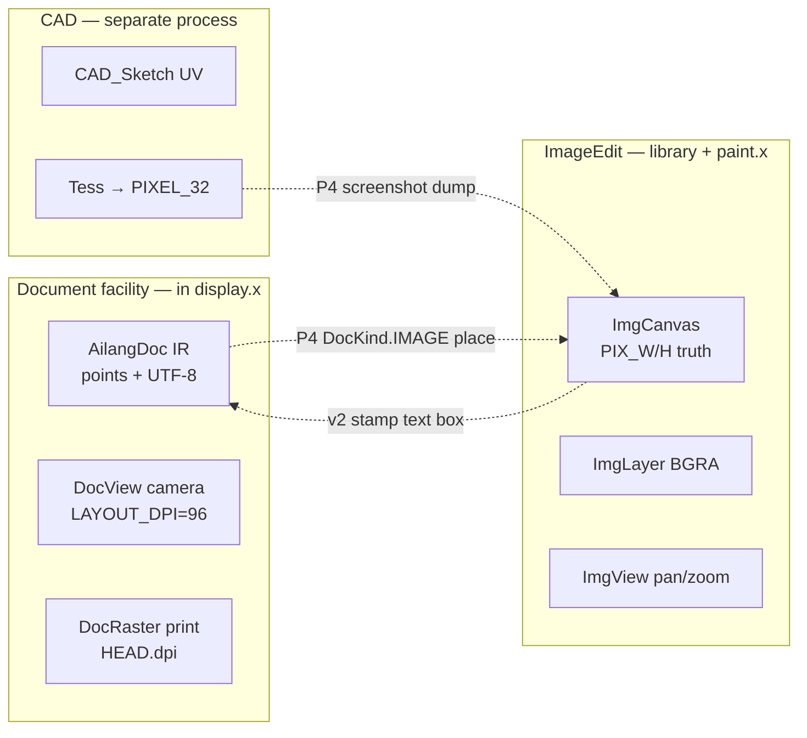
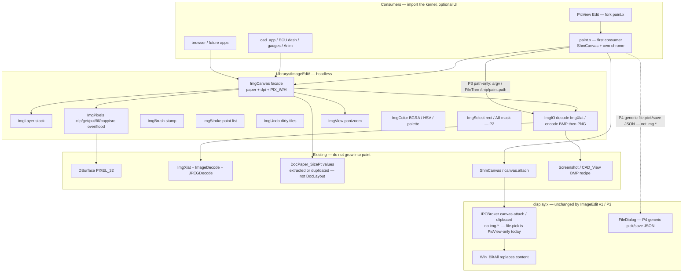
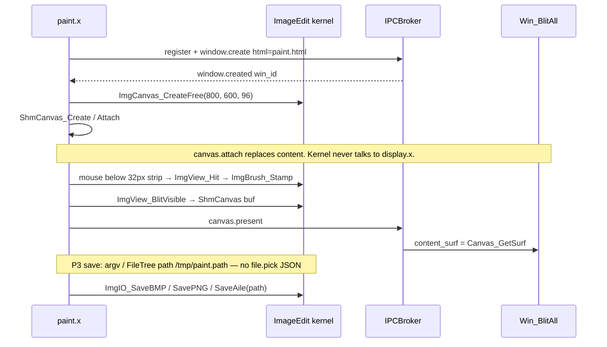
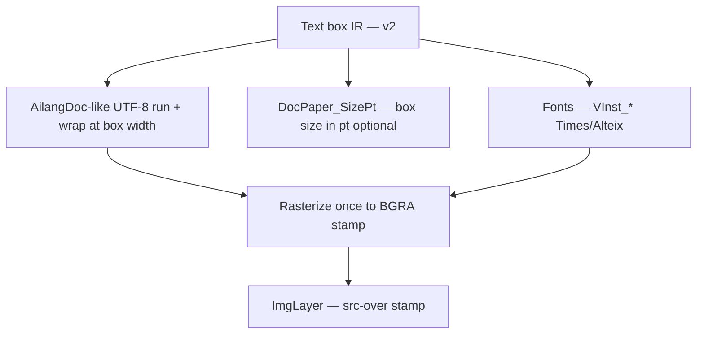

# Ailang ImageEdit — native raster kernel + paint program

**Author:** Sean Collins / 2 Paws Machine and Engineering  
**Date:** 2026-09-05  
**Status:** Draft (rev 4 — split path-read caps; P0 SizePt writes ImgCnvOut)  
**Audience:** Senior engineers on the display / CAD / library stack  
**Related:** `docs/display/DOCUMENT_FACILITY.md` (paper IR, in-process facility — **the contrast**), `docs/display/PLACE_HUD.md` (Image frame on paper is a later PlaceHUD consumer), `docs/cad/CAD_SPLIT_NOTE.md` (file-size / facade), `docs/cad/CAD_APP_PLAN.md` (headless BMP, separate process), `INTRODUCTION.md` (no C, no libc, raw syscalls)

---

## Overview

Ailang can *show* still images (PicView + `ImgXlat` JPEG/PNG → BGRA) and *capture* the framebuffer (Screenshot / CAD `SaveFBToBMP` as 24-bit BMP). It cannot *edit* them. There is no PNG/JPEG encoder. `DDrawPixel` is fill/rect/line/put. `PageSurface` is a print canvas that never recycles slots. The document facility already learned that a `PIXEL_32` paper is the wrong edit model for text — and the inverse is true here: for a paint program, **the raster is the document**.

This design adds a **native Ailang raster kernel** under `Librarys/ImageEdit/` plus a **separate-process paint program** (`paint.x`) that is the first consumer, not the owner. The kernel is headless: tests write BMP. The program talks `canvas.attach` like Chrome / Ladybird / `picview_ipc`. Image edit is **not** a display-server facility. `display.x` does not grow `img.*` JSON, ImageEdit session tables, or boot-time init.

Paper sizes (Letter / Legal / A4 / A3 / FREE / CUSTOM + orientation + DPI) are **size metadata** shared with documents via `DocPaper_SizePt`. Pixels are the source of truth. Changing DPI without resample changes print size, not the file.

---

## Background & Motivation

### What exists, accurately

**Still-image decode is a translator, not an editor.** `Librarys/Display/Content/Library.ImgXlat.ailang` (~185 LOC): `ImgXlat_Identify` (JPEG SOI `FF D8`, PNG `\x89PNG`), `ImgXlat_Translate` → `IMG_DecodeJPEG` / `IMG_DecodePNG`, `ImgXlat_Blit` nearest-neighbor scale into a `DSurface` or raw BGRA buffer. Header comment: *“Wuffs-style packages plug in later.”* Output is canonical BGRA.

**PNG inflate already exists.** `Librarys/Browser/Library.ImageDecode.ailang` (~1049 LOC): IHDR/IDAT/PLTE/tRNS, `DEF_Inflate` (BTYPE 0 stored / 1 fixed Huffman / 2 dynamic), `PNG__Defilter`, BGRA out. Cap: **width or height > 4096 → fail**. Slot pool `IMGConst.MAX_IMG=16`, `IMG__AllocSlot` wraps `next` and **does not free** previous pixels. Color types 0/2/3/4/6. `IMG_MapBytes` uses `Allocate` ≤64 KB else `mmap` (syscall 9, anonymous).

**JPEG decode exists.** `Librarys/Browser/Library.JPEGDecode.ailang` (~1176 LOC): `IMG_DecodeJPEG`, SOF0 baseline. `JPG__ParseSOF0` (~309) stores width/height with **no cap**. Pixel `Allocate(w * h * 4)` happens at ~1144 **before** `IMG__AllocSlot`. DCT constants scaled by 4096 are not a dim cap. A 16 MiB JPEG can still declare huge SOF0 dimensions. PNG refuses >4096 **before** pixel alloc (~921–924). ImageEdit must **peek IHDR/SOF0 and refuse oversize before `ImgXlat_Translate`**. Prefer also a small JPEGDecode PR that fails SOF0 >4096 before Allocate (decoder fix, not display.x). Post-decode `IMG_GetWidth` does **not** mitigate zip-bombs.

**PicView is a viewer.** Two implementations:

| Path | Role |
|------|------|
| `Librarys/Display/UI/Library.PicView.ailang` (~127 LOC) | In-process: `FileTree_ReadFile` 2 MB cap, `ImgXlat_Translate`, `ImgXlat_Blit` into `WinMgr_GetContent`. Scale-to-window, dark fill `0xFF060912`. |
| `Applications/picview_ipc.ailang` (~266 LOC) | Standalone process: register + `window.create` `config/picview.html`, `ShmCanvas_Attach`, decode **in the client**. Display.x never sees the decoder. FileDialog viewer mode writes `/tmp/picview.path` and pushes `pv.reload`. |

Neither paints, undoes, or saves. `config/picview.html` is `<window toolbar="file">` plus `group id="pv_body"` dark fill — not a paint surface. **Edit launches the paint program; PicView stays a viewer.**

**Encode: BMP/PPM only.** `Librarys/Display/System/Library.Screenshot.ailang` (~432 LOC): 24-bit BMP (BITMAPINFOHEADER, bottom-up BGR, 4-byte row pad) to `/tmp/screenshot.bmp`, plus PPM P6. `CAD_View.SaveFBToBMP` is the same 24-bit BMP recipe against a headless FB (**function at line 437** of `Librarys/Cad/Library.CAD_View.ailang`, file ~1344 LOC). **No PNG encoder. No JPEG encoder.** ImageEdit P0 reuses this BMP layout against a `DSurface`, not the framebuffer.

**Surfaces are BGRA PIXEL_32.** `Library.DSurface.ailang` (~194 LOC): `Surface_Create(format, w, h)`, pitch = `w * 4`, `SurfaceConst.MAX_WIDTH=7680`, `MAX_HEIGHT=4320` (8K). `Surface_Destroy` frees data. `DDrawPixel` (~178 LOC): `Draw_Pix_FillRect` / `Rect` / `HLine` / `VLine` / `Pixel` — **opaque dword writes, no blend**. `Surface_BlitAlpha` (`Library.SurfaceBlit.ailang` ~616 LOC) is integer src-over on non-premultiplied BGRA (`out = (src*sa + dst*(255-sa))/255`). ImageEdit sits **on DSurface**. Do not grow `DDrawPixel` into a paint program.

**ShmCanvas is the IPC pixel pipe.** `Librarys/Library.ShmCanvas.ailang` (~334 LOC): `/dev/shm/ailang_canvas_<win_id>`, mmap, pitch = `w*4`, BGRA. `ShmCanvas_Attach` sends `canvas.attach`. Server `IPCBroker_HandleCanvasAttach` (`Library.IPCBroker.ailang` ~1043): job must equal `ci+1`, mmap PIXEL_32, `Canvas_SetActive(win_id, 1)`. `Win_BlitAll` (`Library.WinRender.ailang` ~63) **replaces the entire content surface** with that shm. Auckland `<canvas>` has **no draw path** (`AUCKLAND_INVENTORY.md`). `viewport.attach` is document v2, not ImageEdit v1.

**Document paper is points, not pixels.** `Library.AilangDoc.ailang`: `DocPaper` ids match `PaperType` (`LETTER=1 … CUSTOM=6`), `DocKind.IMAGE=2` reserved, `LAYOUT_DPI=96`, `MARGIN_PT=72`. `DocPaper_SizePt` (`Library.DocLayout.ailang` ~48): Letter 612×792, Legal 612×1008, A4 595×842, A3 842×1191, CUSTOM = portrait physical then the **same** landscape swap. **`DocPaper_SizePt` fails FREE** (`w` stays 0 → return 0; `Test.AilangDoc` asserts `FREE rejected`). **`DocSess` remaps FREE (and CUSTOM) → LETTER** (`Library.DocSess.ailang` ~145–149) — it does not error. ImageEdit `CreateFree` is first-class and **never calls SizePt**. `PageSurface_ComputeSize` is inches×100 and drifts 1–2 px on A4/A3 at 300 DPI — **not the IR source of truth**. Document facility: paper is the document; pixels are print/camera. ImageEdit inverts that: pixels are the document; paper is size metadata.

**`file.pick` is not a generic path result.** `IPCBroker` `file.pick` (~338–349) does **not** reply on the socket. It `EventRouter_Push("pv.pick", …)` → `FileDialog_ViewerOpen` (`MODE_VIEWER` only). Viewer apply writes `/tmp/picview.path` (blob path `/data/blobs/<uuid>.blob`) and pushes `pv.reload`. There is no `file.save` IPC. `FileDialogConst.MODE_SAVE` exists, but only `FileDialog_DocSave` / `DocSaveAs` (document facility). Paint P3 cannot “wire to whatever `file.pick` returns.” P3 open/save is **path-only**. Generic FileDialog IPC is P4 and is still not an ImageEdit facility.

**PageSurface is the anti-pattern to copy.** 96-byte records, `MAX_PAGES=256`, `PageTable.count++`, `PageSurface_Destroy` zeros `SURFACE` but **does not decrement count or recycle** (`Library.PageSurface.ailang` ~454–462). Letter @ 96 DPI = 816×1056 PIXEL_32 ≈ 3.28 MiB. Document facility already refuses this as the edit model. ImageEdit must recycle slots with a free list.

**CAD is a geometry kernel.** `Library.CAD_Sketch.ailang`: 2D UV profile IR, tag 10, stride 28. Pixels are tessellation. The app is a **separate process** (`cad_app.x`); kernel never opens a window; headless BMP is the CI path (`CAD_APP_PLAN.md`). ImageEdit is not sketch.

**SVG / Anim / StyleRaster are rasterizers, not an edit model.** `Library.SVG.ailang` parses SVG → VIF edges → PIXEL_32. `Library.Anim.ailang` is sprite sheets (raster-once, place-forever). `StyleRaster_LoadFile` TVG/VIF/SVG → surface. Useful as *importers* later (stamp a vector), not as the paint document.

**Clipboard already reserved IMAGE.** `ClipType.IMAGE=2` in `Library.TextBuffer.ailang`. `CLIPBOARD_SERVICE.md` deferred image payloads. That is a **P4 seam**, not a reason to host ImageEdit in `display.x`.

**OS rule.** `INTRODUCTION.md`: no C libraries, no libc, compiler emits raw syscalls. FOSS is acceptable only as **algorithm ports** (Porter-Duff, stamp brushes, uncompressed PNG write). Not ImageMagick / GEGL / Cairo / Skia / GIMP, not linking `.so`.

**Compiler grain.** 6-register ABI; locals/args clobbered by calls. Small functions. FixedPool scratch for anything that must survive a call. Files under ~1500 LOC (`CAD_SPLIT_NOTE.md`). One facade import. `AK_DrawNode` / `HandleMsg` get **one call**, not an inlined body — ImageEdit never enters those functions in v1, but the library still obeys the same ABI (scratch pools for blend/stamp/flood/IO).

### Pain points

1. Cannot create, paint, undo, or save a raster in Ailang.
2. Decode exists; encode does not (except BMP/PPM of the *framebuffer*).
3. PicView is view-only; FileDialog `MODE_VIEWER` launches it. No Edit.
4. `PageSurface` looks like a canvas and is the wrong model (no recycle, margins, count++).
5. Document facility is in-process in `display.x`. Copying that pattern for paint would tax boot, couple RAM to the compositor, and fight `canvas.attach` (whole-window replace).
6. `IMGConst.MAX_IMG=16` wrap-around leaks decoder buffers if handles are held.

---

## Goals & Non-Goals

### Goals

- Native Ailang raster kernel any future developer can `LibraryImport.ImageEdit.ImgCanvas` and start from (CAD screenshot dump, ECU dash bake, PicView Edit, browser, gauges, animation sheets).
- Paint **program** (`paint.x`) as the first consumer: separate process, own chrome, `ShmCanvas` / `canvas.attach`.
- Paper-type contract shared with documents (`DocPaper_SizePt`) so a Letter canvas is the same physical sheet a DocView would print. **FREE is first-class.** `DocPaper_SizePt` fails FREE; DocSess remaps FREE→LETTER. ImageEdit `CreateFree` never calls SizePt.
- Pixels are the source of truth. DPI is metadata. `.aile` tagged binary is the native layered file. PNG/JPEG/BMP are export.
- v1 paints: canvas + one layer; brush stamp (size / opacity / hardness / spacing); eraser dest-out; flood; rect; thick line; undo tiles; load PNG/JPEG; save BMP then uncompressed PNG; pan/zoom camera.
- Headless tests write BMP. No display.x tax at boot.
- Recycle canvas/layer slots. Never `PageTable.count++` forever.

### Non-Goals (v1)

- ImageEdit as an OS facility inside `display.x` (`img.*` JSON, boot `Ensure`, session table in the compositor).
- Growing `DDrawPixel` / `PageSurface` / `Library.Document.ailang` into a paint program.
- Linking ImageMagick, GEGL, Cairo, Skia, GIMP, libpng, libjpeg, or any `.so`.
- SVG / CAD sketch as the edit model.
- Text boxes, typewriter flow, fonts-in-the-paint-loop (v2; seam specified below).
- Layers beyond a length-1 list, blend-mode UI, selection marching ants (P2).
- JPEG encode, filtered/compressed PNG, 16-bit/float color, CMYK, ICC.
- `viewport.attach` widget-level shm (document v2). Paint owns the whole content surface.
- Clipboard image, DocKind.IMAGE place, screenshot→canvas, PicView Edit button, **generic FileDialog `file.pick`/`file.save` result JSON** (P4 seams; still not a facility; still not `img.*`).
- Collaborative editing, filters gallery, transform tool, clone stamp, liquify.

---

## Key Decisions

| Decision | Choice | Rationale |
|----------|--------|-----------|
| Process | **Program, not facility.** `paint.x` is a client like CAD / Chrome / `picview_ipc`. Library is headless. | User locked 2026-09-05. Document facility is in-process because typing, fonts, FileDialog, and Auckland live in `display.x`. Paint does not. Boot must not allocate 32 MB Letter rasters. |
| Library vs app | `Librarys/ImageEdit/` is a reusable kernel. `paint.x` is the first consumer, not the only one. | CAD screenshots, ECU dash, PicView Edit, browser, gauges, Anim sheets import the kernel without running the paint UI. |
| Source of truth | Raster (+ optional last-stroke list). Paper/DPI are metadata. | Inverse of AilangDoc (IR in points, pixels = print). Do not use PageSurface as the edit model — document already learned this. |
| Paper | Same ids as `DocPaper` / `PaperType`. Named/CUSTOM: `PHYS_*` from `DocPaperOut`; `PIX_* = (pt * dpi) / 72`. FREE: caller PIX, `PHYS = (pix * 72) / dpi`. `CreateFree` never calls SizePt. CUSTOM = portrait physical + same landscape swap. From-file → `paper=FREE`. | One solver **values**. `PageSurface_ComputeSize` (inches×100) drifts on A4/A3. `DocPaper_SizePt` fails FREE; DocSess remaps FREE→LETTER. Photos have no named sheet. A4 @ 96: PIX 793×1122 **and** PHYS 595×842 (reverse `(pix*72)/dpi` is 594×841 — do not store that). |
| Margins | None. Paint canvas = the full pixel rectangle. | Margins are a document content-box idea. A stamp at (0,0) is a corner pixel. |
| Color | BGRA 8-bit non-premultiplied. Matches fb0, `DSurface`, `ShmCanvas`, `ImgXlat`, `Surface_BlitAlpha`. | One format end-to-end. Convert on PNG encode (RGBA) and BMP encode (BGR). |
| DPI | Metadata. Range **1..600** (`0` on create → 96). Change without resample = print-size change: PIX stay, `PHYS = (pix * 72) / dpi`, named paper **becomes FREE**. Stay-Letter at a new DPI is P2 resample. | Reverse `(pix*72)/dpi` loses 1 pt on A4/A3 @ 96. Named create stores DocPaperOut PHYS (A4 595×842) and PIX `(pt*dpi)/72`. SetDpi cannot keep Letter without new PIX. |
| Blend | Port Porter-Duff src-over / dest-out as Ailang, same integer formula as `Surface_BlitAlpha`. | FOSS = algorithm. Do not call into Cairo. |
| Encode | BMP first (existing 24-bit recipe). Then uncompressed PNG: filter 0 + DEFLATE stored blocks. JPEG encode later. | `DEF_Inflate` already handles BTYPE 0. No Huffman writer in-tree. |
| Decode | `PeekDim` **first** on every load (BMP included). JPEG peek is a marker length-walker (stop at SOS/EOI). Then BMP reader or `ImgXlat_Translate` and **copy pixels out**. Path-read caps: JPEG/PNG **16 MiB**, BMP/`.aile` **64 MiB**. Do not hold decoder handles. | JPEG allocates `w*h*4` before any cap. A 30000² BMP header must not Allocate before PeekDim. MAX_DIM 24-bit BMP ≈ 50 MiB — 16 MiB would fail a legal round-trip. |
| Dim cap | v1 `MAX_DIM=4096` (match `IMG_DecodePNG`). Hard stop is `SurfaceConst` 7680×4320. Prefer JPEGDecode SOF0 cap before Allocate (decoder PR). ImageEdit peeks either way. | PNG decoder already refuses >4096. JPEG does not. A3 @ 300 DPI is 3508×4962 — refuse, drop DPI, or CUSTOM. Overflow: fail if `pt > (MAX_DIM * 72) / dpi` **before** `pt * dpi`. |
| Slots | Free list. `MAX_CANVAS=8`. Layer pool `MAX_LAYER_SLOTS=32` global (v1 uses 1 per canvas). Recycle on destroy. | PageSurface never recycles; 256 Letter rasters ≈ 880 MB. Per-canvas `MAX_LAYER=16` would starve 8 canvases × 2 P2 layers if it were a global 16. |
| Undo | Dirty-tile snapshots (64×64), not full-layer copies. Stroke IR for last-stroke undo. | Letter @ 300 ≈ 32 MiB/layer. A brush stroke dirties a handful of 16 KiB tiles. |
| View | Recycled **view pool**: `REC_SIZE=80`, `OX` **and** `OY`. `Create` sets both 0. Hit **and** Blit use the same widget rect (Blit at `OY*pitch+OX*4`). `ImgHit` for coords, not `ImgCnvOut`. Canvas `VIEW` optional. | 64-byte record had no OY; blit at (0,0) would overwrite the 32 px strip. |
| App chrome | Own pixels on `canvas.attach`. P3: **32 px top strip** (5 tools, 2 wells, zoom text); mouse in strip does not stamp. P3 File IO is **path-only** (`argv`, FileTree/raw path, or `/tmp/paint.path`). FileDialog generic IPC is **P4**, not `img.*`. | `Win_BlitAll` replaces content. `<canvas>` has no draw path. `file.pick` today only opens PicView `MODE_VIEWER` and writes `/tmp/picview.path` — no JSON path result, no save. |
| Native file | `.aile` tagged binary (`AILE` magic), `HEAD` + `LAYR`* + optional `STRK` + `END`. | Mirror AILD. PNG/JPEG/BMP cannot store layers + paper + DPI honestly. |
| Text / documents | **v2.** Seam: stamp a raster of a DocView-like box. Do not import the document facility into the paint process in v1. | User parked this. Fonts + DocPaper reuse is the recommended default; “how much of the document family” is an open v2 question. |
| FOSS | Algorithm ports only. | Ailang OS compiles to raw syscalls. No libc, no `.so`. |
| Files | `Librarys/ImageEdit/Library.Img*.ailang`, each <1500 LOC, one facade `ImgCanvas`. Paper solver: prefer extract `Library.DocPaper.ailang` (ids + SizePt + ContentBox + Out, **no Fonts**). P0 duplicates **ids + SizePt** in ImgCanvas. **Do not** `LibraryImport` DocLayout **or AilangDoc** (both pull Fonts). | CAD split. Ailang imports inline the file. `AilangDoc.ailang` line 7 is `LibraryImport.Display.Render.Fonts`. |
| `.aile` v1 load | Fail closed if `HEAD.layer_n != 1`. | v1 is one layer. Do not silently drop extra LAYR chunks. Flatten is a FLAG'd later choice, not the default. |

---

## Three kernels, three truths

| Domain | Source of truth | Coordinates | Pixels are |
|--------|-----------------|-------------|------------|
| **Document** | AilangDoc IR | Paper in points (`DocPaper_SizePt`). Edit/camera at `LAYOUT_DPI=96`. | Print / camera only (`DocRaster`) |
| **CAD** | Geometry / sketch UV | Model units / plane UV | Tessellation of the solid |
| **ImageEdit** | Raster (+ optional stroke list) | Canvas pixels. Paper + DPI = size metadata | **The document** |

Do not mix them. A CAD screenshot *becomes* an ImageEdit canvas (pixels copied). A DocKind.IMAGE frame *places* a raster on paper (P4). A sketch is not a bitmap.



---

## Proposed Design

### Layer diagram



### Runtime sequence (paint.x)



Contrast with DOCUMENT_FACILITY: notepad never imports AilangDoc; it sends `doc.*` JSON and the facility paints inside `display.x`. Paint **does** import the kernel; display.x never hears `img.*`.

---

### 1. Library layout

```
Librarys/ImageEdit/
  Library.ImgCanvas.ailang    facade + canvas record (paper + dpi + pixel size)
  Library.ImgLayer.ailang     stack, opacity, visibility, blend mode
  Library.ImgPixels.ailang    clip, get/put, fill, copy, src-over, flood
  Library.ImgBrush.ailang     stamp, size, hardness, spacing, eraser
  Library.ImgStroke.ailang    point list + pressure → stamp along path
  Library.ImgSelect.ailang    rect / mask (A8)          — P2
  Library.ImgUndo.ailang      dirty-tile snapshots
  Library.ImgIO.ailang        decode via ImgXlat; encode BMP then PNG; .aile
  Library.ImgView.ailang      pan/zoom camera (pixel space)
  Library.ImgColor.ailang     pack BGRA, HSV, palette, fg/bg
```

**Facade rule.** Callers import **one** module:

```
LibraryImport.ImageEdit.ImgCanvas
```

`Library.ImgCanvas.ailang` `LibraryImport`s the siblings, `DSurface`, and **paper values** — not `DocLayout`. Same pattern as `LibraryImport.Cad.CAD_Sketch` pulling Join/Trim/Profile. Keep each file under ~1500 LOC. If `ImgPixels` grows a flood-fill + blend body, split `ImgBlend` / `ImgFlood` behind the same facade — do not make callers import them.

**Paper solver (do not inline Fonts).** `Library.DocLayout.ailang` (~591 LOC) `LibraryImport`s Fonts + AilangDoc (which also imports Fonts). Headless `Test.ImgCanvas` must not compile wrap/paginate/hit to multiply points by DPI.

Prefer extract, Display/Content only (not Main / IPCBroker):

```
Librarys/Display/Content/Library.DocPaper.ailang
  DocPaper ids (LETTER…CUSTOM, PORTRAIT/LANDSCAPE)
  DocPaperOut {w,h,cw,ch}
  DocPaper_SizePt
  DocPaper_ContentBox
```

Both `DocLayout` and `ImgCanvas` import that tiny file. Move SizePt/ContentBox/Out out of DocLayout; AilangDoc keeps or re-exports ids so existing `DocPaper.LETTER` callers still resolve (one definition — delete the duplicate pool from AilangDoc when the extract lands).

**P0 (locked, no Fonts):** do **not** `LibraryImport` DocLayout **or AilangDoc**. Duplicate **ids + SizePt** in `Library.ImgCanvas.ailang`:

```
FixedPool.ImgPaper {
    "LETTER": Initialize=1
    "LEGAL":  Initialize=2
    "A4":     Initialize=3
    "A3":     Initialize=4
    "FREE":   Initialize=5
    "CUSTOM": Initialize=6
    "PORTRAIT":  Initialize=0
    "LANDSCAPE": Initialize=1
}
ImgPaper_SizePt(...)  // ~40 lines, writes ImgCnvOut.phys_w/h; FREE/unknown → 0
```

Tests use `ImgPaper.LETTER` / `ImgPaper.A4` (or numeric 1 / 3), **not** `DocPaper.*`. Lockstep vectors with `Test.AilangDoc` (Letter 612×792, Legal 612×1008, A4 595×842, A3 842×1191, CUSTOM portrait then landscape swap). Document solver still **rejects FREE**; ImageEdit FREE is first-class and never calls SizePt. Delete the duplicate when the extract lands. Extract remains the preferred path.

**Do not** put ImageEdit under `Librarys/Display/`. Display owns compositor, Auckland, document facility. ImageEdit is a peer of `Librarys/Cad/` and `Librarys/Browser/`. The DocPaper extract stays in Display/Content because documents own the ids.

---

### 2. Canvas record (source of truth = PIX_W/H)

Record layout (128 bytes, 8-byte fields — same grain as AilangDoc / PageField). Indices recycled via free list.

| Field | Offset | Meaning |
|-------|--------|---------|
| `PAPER` | 0 | `DocPaper` / `PaperType` id. FREE=5 legal here. |
| `ORIENT` | 8 | `DocPaper.PORTRAIT=0` / `LANDSCAPE=1` |
| `DPI` | 16 | 1..600. Create: `0` → 96. |
| `PIX_W` | 24 | **raster source of truth** |
| `PIX_H` | 32 | **raster source of truth** |
| `PHYS_W_PT` | 40 | named/CUSTOM: solver PHYS (P0 `ImgCnvOut.phys_w`; after extract `DocPaperOut.w`). FREE: `(PIX_W * 72) / DPI` |
| `PHYS_H_PT` | 48 | named/CUSTOM: solver PHYS (P0 `ImgCnvOut.phys_h`; after extract `DocPaperOut.h`). FREE: `(PIX_H * 72) / DPI` |
| `BG` | 56 | BGRA clear color (default `0xFFFFFFFF` opaque white) |
| `LAYERS` | 64 | pointer to `MAX_LAYER_PER × 8` handle array (always allocated) |
| `LAYER_N` | 72 | count (v1: 1) |
| `ACTIVE` | 80 | active layer **index** into that array (0 in v1) |
| `DIRTY` | 88 | 1 = pixels changed since last view blit / save |
| `FLAGS` | 96 | `NAMED=1`, `FROM_FILE=2`, `HAS_STROKE=4` |
| `UNDO` | 104 | pointer to `ImgUndoRec` (0 until first `ImgUndo_Begin`) |
| `VIEW` | 112 | optional `ImgView` handle; **0 = caller owns the view** |
| `GEN` | 120 | generation; handle = `index \| (gen << 16)`, gen starts at 1 |

```
FixedPool.ImgCnvConst {
    "REC_SIZE":        Initialize=128
    "MAX_CANVAS":      Initialize=8
    "MAX_DIM":         Initialize=4096
    "DEF_DPI":         Initialize=96
    "MIN_DPI":         Initialize=1
    "MAX_DPI":         Initialize=600
    "MAX_LAYER_PER":   Initialize=16
}

FixedPool.ImgCnvFlag {
    "NAMED":     Initialize=1
    "FROM_FILE": Initialize=2
    "HAS_STROKE": Initialize=4
}

FixedPool.ImgCnvTable {
    "data":      Initialize=0, CanChange=True   // MAX_CANVAS * REC_SIZE
    "free_head": Initialize=-1, CanChange=True  // index, -1 = empty
    "used":      Initialize=0, CanChange=True
    "next":      Initialize=0, CanChange=True   // MAX_CANVAS integers, free-list links
}

FixedPool.ImgCnvOut {
    "pix_w":    Initialize=0, CanChange=True
    "pix_h":    Initialize=0, CanChange=True
    "phys_w":   Initialize=0, CanChange=True
    "phys_h":   Initialize=0, CanChange=True
}

FixedPool.ImgHit {
    "cx": Initialize=0, CanChange=True
    "cy": Initialize=0, CanChange=True
    "ok": Initialize=0, CanChange=True
}
```

`ImgCnvOut` is **size-solver only**. Hit coords go in `ImgHit`. Do not write `cx,cy` into `pix_w/h` — a leftover `PxFromPaper` in the same pool is a 6-register ABI bug.

`ImgCanvas_Init` is the **process Ensure** (facade, one call). Idempotent: `if ImgCnvTable.data != 0 return 1`. It brings up **every sibling table the facade owns**, not only the canvas pool:

```
ImgCanvas_Init:
  if ImgCnvTable.data != 0: return 1
  alloc canvas data + next; chain free list; used = 0
  ImgLayer_Init()     // 32-slot layer pool — CreatePaper needs a layer
  ImgView_Init()      // no-op stub until PR 4 files exist; then view pool
  ImgFlood_Init()     // P1: Allocate MAX_ENT * 32 scratch; P0 may be empty
  return 1
```

Sibling `ImgLayer_Init` / `ImgView_Init` / `ImgFlood_Init` **may exist** but are called **only from this facade**. Tests, `paint.x`, CAD, ECU call `ImgCanvas_Init` once. **Never from `Main.ailang`.** P0 ships canvas + layer init; later PRs extend the same function — do not add a second process Init.

Alloc: pop `free_head`, `used++`, `GEN = old_GEN+1` (skip 0). Free: `Surface_Destroy` layers, `Deallocate` LAYERS array and UNDO, `next[idx] = free_head`, `free_head = idx`, `used--`, bump GEN. Handle lookup fails on gen mismatch, free slot, or 0. Extra/session 0 = none (same trap as DocView vs TextBuffer handle 0).

**PR 1 recycle test:** create, remember `idx = handle & 0xFFFF`, destroy, create again, assert same `idx` and **different** GEN. `used` never exceeds live canvases; destroying does not leave `used` high.

**PHYS (locked).** Two rules, not one reverse formula:

| Paper | PHYS_* | PIX_* |
|-------|--------|-------|
| LETTER / LEGAL / A4 / A3 / CUSTOM | **store solver PHYS** after SizePt (P0: `ImgCnvOut.phys_*`; after extract: `DocPaperOut`) | `(phys_pt * dpi) / 72` |
| FREE | `(PIX_* * 72) / DPI` only | caller |

A4 portrait @ 96: PHYS **595×842**, PIX **793×1122**. Reverse `(793 * 72) / 96 = 594` — **do not write 594**. Print/export named paper uses PHYS, then `(pt * dpi) / 72` again (same as DocRaster).

**`ImgCanvas_Set` allowed fields:** `BG`, `FLAGS` (OR/clear `FROM_FILE` / `HAS_STROKE` only; `NAMED` follows paper), `ACTIVE` (must be `< LAYER_N`), `DIRTY` (internal; tests may clear). **Illegal:** `PIX_*`, `PHYS_*`, `PAPER`, `ORIENT`, `LAYERS`, `LAYER_N`, `GEN`, `UNDO`, `VIEW` (VIEW via `ImgCanvas_SetView` / 0). Illegal Set returns 0 and does not write.

**Size setters:**

- `ImgCanvas_SetDpi(cnv, dpi)` — `dpi` in 1..600 else fail. No resample. PIX stay. `PHYS = (PIX * 72) / dpi`. If `PAPER != FREE`: set `PAPER = FREE`, clear `FLAGS.NAMED` (the sheet is no longer Letter — keeping DocPaper PHYS would imply new PIX, which is resample). To stay Letter at a new DPI: P2 `ImgCanvas_Resample` to `(PHYS * dpi) / 72` **before** clearing paper.
- `ImgCanvas_Resample(cnv, new_w, new_h)` — P2; changes PIX_*; optional keep paper (recompute PIX from stored PHYS + DPI) or become FREE.

---

### 3. Create paths

All paths go through one size solver. **Never** `PageSurface_ComputeSize` / `PageSurface_Create` / `PageSurface_CreateFree`.

```
ImgCanvas_PxFromPaper(paper, orient, dpi, custom_w_pt, custom_h_pt) → 1 ok / 0 error
  writes ImgCnvOut {pix_w, pix_h, phys_w_pt, phys_h_pt}
```

Scratch is `FixedPool.ImgCnvOut` — out-pointers die across calls (6-register ABI), same reason as `DocPaperOut`.

**Named paper** (`LETTER/LEGAL/A4/A3`):

P0 (no DocLayout / AilangDoc):

```
ok = ImgPaper_SizePt(paper, orient, 0, 0)          // writes ImgCnvOut.phys_w/h
if ok == 0: fail
if dpi == 0: dpi = 96
if dpi < 1 or dpi > 600: fail
phys_w = ImgCnvOut.phys_w
phys_h = ImgCnvOut.phys_h
// overflow before multiply: pt > 0 && pt > (MAX_DIM * 72) / dpi → fail
if phys_w > (4096 * 72) / dpi: fail
if phys_h > (4096 * 72) / dpi: fail
pix_w = (phys_w * dpi) / 72
pix_h = (phys_h * dpi) / 72
store PHYS_* = phys_*, PIX_* = pix_*, FLAGS.NAMED
```

After the `Library.DocPaper.ailang` extract: same math with `DocPaper_SizePt` / `DocPaperOut.w/h` (identical values). P0 tests never mention `DocPaperOut`.

Named sizes ignore custom fields.

**CUSTOM:** P0 `ImgPaper_SizePt(CUSTOM, orient, custom_w_pt, custom_h_pt)` — portrait physical then landscape swap; PHYS from `ImgCnvOut`. After extract: `DocPaper_SizePt` / `DocPaperOut`. Same overflow check. FLAGS.NAMED.

**FREE:** **never call SizePt.** Caller supplies `pix_w`, `pix_h`, `dpi` (`0` → 96, else 1..600). `PHYS_* = (pix * 72) / dpi`. Photos and screenshots live here. `DocPaper_SizePt` fails FREE; DocSess remaps FREE→LETTER — neither applies to this path.

**From file:** `ImgIO_LoadPath` / `LoadBytes` → peek dims → BMP or ImgXlat → copy BGRA into layer 0 → `paper=FREE`, `dpi=96` (pHYs / JFIF density is P2). `FLAGS.FROM_FILE`. PHYS from PIX.

**Caps on create:**

```
if dpi != 0 and (dpi < 1 or dpi > 600): fail
if pix_w < 1 or pix_h < 1: fail
if pix_w > ImgCnvConst.MAX_DIM or pix_h > ImgCnvConst.MAX_DIM: fail
if pix_w > SurfaceConst.MAX_WIDTH or pix_h > SurfaceConst.MAX_HEIGHT: fail
```

Refuse. Do not silently clamp (a clamped Letter is not Letter). Caller drops DPI or picks FREE/CUSTOM. A3 @ 300: `1191 > (4096 * 72) / 300 = 983` → fail **before** `1191 * 300`.

**Background fill.** Create fills layer 0 with `BG` (opaque white default). Alpha 0 BG is legal (transparent canvas); view paints a checkerboard **only in the camera**, never into the raster.

---

### 4. Memory math

Formula: `bytes = pix_w * pix_h * 4` with `pix = (pt * dpi) / 72` integer divide.

`DocPaper_SizePt` (the IR truth):

| Paper | pt portrait | 96 DPI px | 96 DPI BGRA | 300 DPI px | 300 DPI BGRA |
|-------|-------------|-----------|-------------|------------|--------------|
| Letter | 612×792 | 816×1056 | 3,444,224 (3.28 MiB) | 2550×3300 | 33,660,000 (32.10 MiB) |
| Legal | 612×1008 | 816×1344 | 4,386,816 (4.18 MiB) | 2550×4200 | 42,840,000 (40.86 MiB) |
| A4 | 595×842 | 793×1122 | 3,555,144 (3.39 MiB) | 2479×3508 | 34,785,328 (33.18 MiB) |
| A3 | 842×1191 | 1122×1588 | 7,126,944 (6.80 MiB) | 3508×4962 | 69,626,784 (66.40 MiB) |

Letter @ 300 DPI ≈ **32 MB/layer** — the number the user locked. That is **one** layer, uncompressed BGRA, no undo.

A3 @ 300 DPI height 4962 **exceeds v1 `MAX_DIM=4096`**. Create fails. Workarounds: 200 DPI (2338×3308), FREE at 4096 on the long edge, or P2 raise cap toward `SurfaceConst` 7680×4320 (126.6 MiB/layer — not a v1 default).

**PageSurface_ComputeSize drift** (why we do not call it): A4 inches×100 = 827×1169. At 300 DPI → 2481×3507 vs DocPaper 2479×3508. Two pixels off on a “standard” sheet. ImageEdit prints/exports named paper from stored PHYS (DocPaper points), then `(pt * dpi) / 72`.

**PR 1 paper asserts (lockstep with `Test.AilangDoc` vectors):**

| Create | PIX_W×PIX_H | PHYS_W×PHYS_H |
|--------|-------------|---------------|
| Letter portrait 96 | 816×1056 | 612×792 |
| Letter portrait 300 | 2550×3300 | 612×792 |
| A4 portrait 96 | **793×1122** | **595×842** (not 594×841) |
| CreateFree 640×480 96 | 640×480 | 480×360 |

**Working-set budgets (v1, one layer):**

| Canvas | Raster | Undo cap (see §8) | View shm (paint window 640×480) | Total order |
|--------|--------|-------------------|----------------------------------|-------------|
| Letter @ 96 | 3.3 MiB | ≤ 8 MiB | 1.2 MiB | ~13 MiB |
| Letter @ 300 | 32.1 MiB | ≤ 8 MiB | 1.2 MiB | ~42 MiB |
| 4096×4096 FREE | 64.0 MiB | ≤ 8 MiB | 1.2 MiB | ~74 MiB |

`MAX_CANVAS=8` is a slot cap, not a promise of 8×64 MiB. `ImgCanvas_Create` fails if `Allocate` / `Surface_Create` fails. Paint.x v1 keeps **one** canvas.

`IMGConst.MAX_IMG=16` decoder slots are **not** ImageEdit layers. Copy out, drop the handle (there is no `IMG_Free` today — accept wrap-around on the decoder pool; our copy is the live buffer).

---

### 5. Layers (`ImgLayer`)

v1: canvas has a layer list of **length 1**. The record and stack exist so P2 does not churn offsets.

**Global pool** (not `MAX_LAYER=16` total across all canvases):

```
FixedPool.ImgLayerConst {
    "REC_SIZE":  Initialize=96
    "MAX_SLOT":  Initialize=32    // 8 canvases × 4 layers; v1 uses 1 per canvas
}

FixedPool.ImgLayerOff {
    "SURF":    Initialize=0     // DSurface PIXEL_32
    "W":       Initialize=8
    "H":       Initialize=16
    "OX":      Initialize=24    // 0 in v1
    "OY":      Initialize=32
    "OPACITY": Initialize=40    // 0..255, default 255
    "VISIBLE": Initialize=48    // 1/0
    "BLEND":   Initialize=56    // ImgBlend.SRC_OVER=0; DEST_OUT=1 is stamp-only
    "NAME":    Initialize=64    // ptr or 0
    "GEN":     Initialize=72
    "CANVAS":  Initialize=80    // owning canvas handle
    "pad":     Initialize=88
}

FixedPool.ImgLayerTable {
    "data":      Initialize=0, CanChange=True
    "free_head": Initialize=-1, CanChange=True
    "used":      Initialize=0, CanChange=True
    "next":      Initialize=0, CanChange=True   // MAX_SLOT integers
}

FixedPool.ImgBlend {
    "SRC_OVER": Initialize=0
    "DEST_OUT": Initialize=1    // eraser stamp, not a v1 layer mode
}
```

Canvas `LAYERS` is always `Allocate(MAX_LAYER_PER * 8)` of layer handles. v1: `[0] = new layer`, `LAYER_N = 1`. P2: push more handles into that array (cap 16 per canvas). 8×2 P2 layers = 16 slots of 32 — fits.

`W`/`H` must equal canvas PIX_* in v1. Handle = `index | (gen << 16)`, gen starts at 1.

Composite:

```
v1: view blits layer 0 (opacity 255, src-over onto view checkerboard or BG)
P2: bottom → top, skip !VISIBLE, layer opacity multiplies stamp alpha
```

Destroy layer: `Surface_Destroy(SURF)`, push index on `ImgLayerTable` free list, bump GEN. Destroy canvas: destroy all `LAYER_N` layers, `Deallocate(LAYERS, MAX_LAYER_PER*8)`. **Do not** leave pixels in `PageTable`.

---

### 6. Pixels (`ImgPixels`)

All pixel ops take a **surface + clip rect**, not a canvas, so CAD/ECU can pass any PIXEL_32. Canvas wrappers pin clip to the active layer.

Scratch: `FixedPool.ImgPix` — clip, ptr, pitch, color, x, y, and flood temps. Flatten expressions (SurfaceBlit already does this for the ABI).

```
FixedPool.ImgPix {
    "surf":  Initialize=0, CanChange=True
    "clipx": Initialize=0, CanChange=True
    "clipy": Initialize=0, CanChange=True
    "clipw": Initialize=0, CanChange=True
    "cliph": Initialize=0, CanChange=True
    "ptr":   Initialize=0, CanChange=True
    "pitch": Initialize=0, CanChange=True
    "color": Initialize=0, CanChange=True
    "x":     Initialize=0, CanChange=True
    "y":     Initialize=0, CanChange=True
}
```

| Function | Behavior |
|----------|----------|
| `ImgPixels_Clip(surf, x, y, w, h)` | intersect with `[0,W)×[0,H)` |
| `ImgPixels_Get` / `Put` | BGRA dword; Put is opaque |
| `ImgPixels_Fill` | opaque fill, clipped; reuse `Draw_Pix_FillRect` |
| `ImgPixels_Copy` | memcpy rows if no overlap, else memmove-safe via temp row |
| `ImgPixels_SrcOver(dst, src, dx, dy)` | port of `Surface_BlitAlpha` formula; may *call* it when src is a surface |
| `ImgPixels_SrcOverRect` | same, subrect |
| `ImgPixels_DestOut` | eraser: `da' = da * (255-sa) / 255`; RGB unchanged if `da'>0`, else 0 |
| `ImgPixels_Flood(surf, x, y, new_color)` | scanline flood, **exact** BGRA match v1 (tolerance P2) |

**Src-over (non-premultiplied, match `Surface_BlitAlpha` ~110–126):**

```
inv = 255 - sa
out_b = (sb * sa + db * inv) / 255
out_g = (sg * sa + dg * inv) / 255
out_r = (sr * sa + dr * inv) / 255
out_a = (sa * 255 + da * inv) / 255
```

Skip `sa==0`. Direct write `sa==255`.

**Flood:** scanline, explicit stack, **no recursion**. Cap 4096 entries, fail closed if exceeded. Mark dirty tiles for undo **before** writing.

```
FixedPool.ImgFloodOff {
    "Y":  Initialize=0
    "X0": Initialize=8
    "X1": Initialize=16
    "DY": Initialize=24    // +1 or -1
}
FixedPool.ImgFloodConst {
    "ENT_SIZE": Initialize=32
    "MAX_ENT":  Initialize=4096
}
```

`ImgPixels_Flood(surf, x, y, new_color)`: Allocate `MAX_ENT * ENT_SIZE` (or a process-lifetime scratch from `ImgCanvas_Init`). Push seed span `{y, x0, x1, dy=1}` and `{y, x0, x1, dy=-1}` after filling the seed row. Exact BGRA match v1. If `used == MAX_ENT` on push: stop, return 0 (partial fill is visible — caller undoes).

**Rect / thick line (P1, live in ImgPixels or thin wrappers):**

- `ImgPixels_FillRect` — already Fill.
- `ImgPixels_StrokeRect(x,y,w,h,thickness,color)` — four FillRects.
- `ImgPixels_ThickLine(x0,y0,x1,y1,thickness,color)` — stamp a disk of radius `thickness/2` along a Bresenham/DDA with spacing 1, **or** Fill a bounding box for axis-aligned. Prefer stamp so joins match the brush.

Clip every write. No drawing outside PIX_*.

---

### 7. Brush, stroke, eraser (P1)

**Stamp.** Circular kernel, not a bitmap dab in v1 (P2 can cache a stamp surface).

```
FixedPool.ImgBrush {
    "size":      Initialize=16     // diameter px, 1..256
    "opacity":   Initialize=255    // 0..255
    "hardness":  Initialize=192    // 0 = full soft, 255 = hard edge
    "spacing":   Initialize=25     // percent of size, min 1 px
    "eraser":    Initialize=0      // 1 = dest-out
    "color":     Initialize=0xFF000000  // BGRA; default opaque black
}
```

**Integer / squared distance (locked).** Do not call `SquareRoot` in the inner loop. Temps live in `FixedPool.ImgBrush` / `ImgPix`.

Inside-circle and spacing:

```
r = size / 2
r2 = r * r
dist2 = dx * dx + dy * dy          // dx, dy integer from center or last stamp
space_px = max(1, (size * spacing) / 100)
space2 = space_px * space_px

outside: dist2 >= r2               // a = 0
spacing: stamp when dist2 >= space2
```

Hardness ramp needs a linear `d`. v1: **one integer isqrt per pixel** that is inside the circle and not in the hard core (`dist2 > inner*inner`), stored in `ImgPix.d`. Hard core and outside skip isqrt. Soft edge is a linear ramp (cosine later):

```
inner = (r * hardness) / 255
if dist2 >= r2: a = 0
else if hardness == 255 or dist2 <= inner * inner: a = 255
else:
    d = ImgISqrt(dist2)            // once, result in ImgPix
    a = 255 * (r - d) / (r - inner)
a = (a * opacity) / 255
```

`ImgISqrt` is a small integer Newton / binary-search helper in ImgBrush (or IntMath if already present). Not a float.

`ImgBrush_Stamp(surf, x, y)` — center at canvas pixel `(x,y)`, src-over or dest-out per `eraser`. Dirty the tiles under the stamp AABB.

**Spacing.** `ImgStroke_AddPoint` stamps when `dist2 >= space2`. First point always stamps.

**Stroke IR (v1, last stroke only):**

```
ImgStroke:
  n, cap
  pts[]  {x:i32, y:i32, pressure:u8}   // 12-byte records, pad to 16
  brush snapshot (size, opacity, hardness, spacing, eraser, color)
```

Pressure v1: stored, **ignored** at stamp (multiply opacity later). The list exists so (a) last-stroke undo can replay inverse via tiles, (b) v2 vector overlay / smooth. Cap `MAX_STROKE_PTS=4096`. New stroke on mouse-down; mouse-up commits tiles to undo and keeps the list until the next down.

Eraser is dest-out with the same stamp alpha, not “paint BG color”. Transparent canvases stay transparent.

---

### 8. Undo tiles

**Do not snapshot full layers.** Letter @ 300 is 32 MiB per step.

**Tile size: 64×64.** 64×64×4 = **16,384 bytes**. Power of two (`tx = x >> 6`). A 16–32 px brush dirties 1–4 tiles. 128×128 (64 KiB) over-copies small dabs; 32×32 multiplies list overhead on flood fills. 64 is the v1 lock; measure before changing.

Do **not** embed `bytes[16384]` in a table row. Packed blob per step:

```
FixedPool.ImgUndoConst {
    "TILE":       Initialize=64
    "TILE_BYTES": Initialize=16384
    "PACK_SIZE":  Initialize=16392    // tx u32 + ty u32 + 16384
    "MAX_STEPS":  Initialize=32
    "MAX_BYTES":  Initialize=8388608  // 8 MiB
    "STEP_SIZE":  Initialize=32
    "REC_SIZE":   Initialize=64
}

FixedPool.ImgUndoStepOff {            // 32-byte header
    "LAYER":   Initialize=0           // layer handle
    "N":       Initialize=8           // tile count
    "BYTES":   Initialize=16          // N * PACK_SIZE
    "PAYLOAD": Initialize=24          // Allocate'd packed tiles, or 0
}

FixedPool.ImgUndoOff {                // 64-byte per-canvas rec (canvas.UNDO ptr)
    "STEPS":  Initialize=0            // ptr to MAX_STEPS * STEP_SIZE
    "COUNT":  Initialize=8            // live undo steps
    "HEAD":   Initialize=16           // ring index of next commit
    "BYTES":  Initialize=24           // sum of step BYTES
    "DIRTY":  Initialize=32           // bitfield ptr
    "DTW":    Initialize=40           // tile columns
    "DTH":    Initialize=48           // tile rows
    "REDO":   Initialize=56           // redo depth from HEAD
}
```

Dirty bitfield: `Allocate((DTW * DTH + 7) / 8)` on first `ImgUndo_Begin`. `DTW = (PIX_W + 63) >> 6`, `DTH = (PIX_H + 63) >> 6`. Letter @ 300: 40×52 = 2080 bits ≈ 260 bytes. `ImgUndo_Bytes()` returns `ImgUndoOff.BYTES`.

Before a mutating op, `ImgUndo_Begin(cnv)` zeros the bitfield (alloc rec + STEPS + DIRTY on first call). Each pixel write `ImgUndo_Mark(cnv, x, y)` ORs bit `(ty * DTW + tx)`. `ImgUndo_Commit` walks set bits, `Allocate(N * PACK_SIZE)`, copies each tile from the layer, pushes a step, adds to `BYTES`.

**Caps:**

| Cap | Value | Why |
|-----|-------|-----|
| Tile | 64×64 | see above |
| Steps | 32 | enough for a paint session |
| Total undo RAM | **8 MiB** (~512 tiles) | flood-fill of Letter @ 300 would otherwise equal a full-layer copy × N |
| If commit would exceed | drop oldest steps (`Deallocate` PAYLOAD, subtract BYTES) until it fits; if a *single* step > 8 MiB (full 4096²), store one AABB copy (`N=0`, `PAYLOAD` = full layer snapshot, `BYTES = PIX_W*PIX_H*4`) and drop older steps | honesty over silent no-op |

Redo: reverse stack, same tiles (swap current ↔ stored). v1: undo only is acceptable if redo slips; implement both — the tile payload is symmetric.

Last-stroke IR is **not** a second undo system. Tiles are authoritative. Stroke list is for replay/overlay.

```
ImgUndo_Begin(cnv) → 1
ImgUndo_Mark(cnv, x, y)
ImgUndo_Commit(cnv) → 1
ImgUndo_Undo(cnv) → 1/0
ImgUndo_Redo(cnv) → 1/0
ImgUndo_Bytes(cnv) → Integer
```

---

### 9. Selection (P2)

Parked, record reserved:

- Rect select: integer AABB in canvas pixels.
- Mask: A8 surface, same PIX_* (or tiled).
- Ops clip stamp/flood to mask.
- PlaceHUD rubber-band (`docs/display/PLACE_HUD.md`) is a **P4/document** consumer for placing an image *on paper*, not the paint marquee. Paint.x may draw its own band in shm.

v1 has no marching ants. Flood/brush operate on the full layer.

---

### 10. Color (`ImgColor`)

```
ImgColor_PackBGRA(b, g, r, a) → dword     // matches fb0 / DPix_PutPixel
ImgColor_Unpack(c, &b, &g, &r, &a)
ImgColor_HSVToBGRA(h, s, v, a)            // h 0..255 or 0..359 — pick 0..255 v1
ImgColor_BGRAToHSV
```

Palette: 16-entry `FixedPool.ImgPalette` (fg, bg, plus 14). Swap fg/bg. Default fg opaque black `0xFF000000`, bg opaque white `0xFFFFFFFF`.

Do not invent a second packed format. `0xAARRGGBB` appears in SVG named colors — **convert at the SVG import boundary**, never inside the kernel.

---

### 11. ImgView — pan / zoom / mouse → canvas pixels

DocView maps mouse to paper pixels at 1:1 `LAYOUT_DPI` (`DOCUMENT_FACILITY.md` hit-test):

```
local_x = mx - SOLVED_X          // raw, match AK_PointInNode
local_y = my - SOLVED_Y
doc_x   = local_x + SCROLL_X
doc_y   = local_y + SCROLL_Y
```

ImageEdit adds **zoom**. Camera lives in canvas pixels.

**Recycled view pool** (not a process-global scratch mixed with a handle):

```
FixedPool.ImgViewConst {
    "REC_SIZE": Initialize=80    // 9×8 + pad; OX and OY are separate fields
    "MAX_VIEW": Initialize=8
}

FixedPool.ImgViewOff {
    "CAM_X":  Initialize=0     // canvas pixel at view (0,0)
    "CAM_Y":  Initialize=8
    "ZOOM_N": Initialize=16    // displayed = canvas * zoom_n / zoom_d
    "ZOOM_D": Initialize=24
    "VW":     Initialize=32    // view width in window pixels
    "VH":     Initialize=40
    "OX":     Initialize=48    // widget origin X in dest/shm
    "OY":     Initialize=56    // widget origin Y in dest/shm (P3: 32)
    "GEN":    Initialize=64
    "pad":    Initialize=72
}

FixedPool.ImgViewTable {
    "data":      Initialize=0, CanChange=True
    "free_head": Initialize=-1, CanChange=True
    "used":      Initialize=0, CanChange=True
    "next":      Initialize=0, CanChange=True
}
```

Do **not** pack origin into `OX` alone. `OY` is a real field.

```
ImgView_Create(vw, vh) → handle / -1
  // zoom 1/1, cam 0,0, OX=0, OY=0, GEN starts at 1
ImgView_Destroy(view)
ImgView_SetOrigin(view, ox, oy)          // paint.x after shm size: SetOrigin(0, 32)
ImgView_Hit(view, mx, my) → ImgHit.ok; cx,cy in ImgHit
ImgView_Blit(view, cnv, dst_ptr, dst_pitch, dst_w, dst_h)
```

Canvas `VIEW` is **optional**: 0 = the caller owns the handle (paint.x default — store it on `FixedPool.PaintState.view`). Non-zero = a default camera for kernel tests that blit without an app. Do not treat `FixedPool.ImgViewOff` as a singleton.

Integer ratios only. Presets: 1/4, 1/2, 1/1, 2/1, 4/1, 8/1 (25% … 800%). Wheel steps the preset table. No float. (SVG `FP_SCALE=256` is available if we need 8.8 later; v1 does not.)

**Mouse → canvas (locked):**

```
ImgView_Hit(view, mx, my) → ImgHit.ok (1/0); canvas pixel in ImgHit.cx / ImgHit.cy

  rec = view pool lookup (gen check)
  local_x = mx - rec.OX
  local_y = my - rec.OY
  if local_x < 0 or local_y < 0 or local_x >= rec.VW or local_y >= rec.VH:
      ImgHit.ok = 0; return 0
  ImgHit.cx = rec.CAM_X + (local_x * rec.ZOOM_D) / rec.ZOOM_N
  ImgHit.cy = rec.CAM_Y + (local_y * rec.ZOOM_D) / rec.ZOOM_N
  ImgHit.ok = 1
```

`ImgHit` is the only Hit out-scratch. **Do not** write `cx,cy` into `ImgCnvOut.pix_w/h`.

P3 paint.x: after shm is sized, `ImgView_SetOrigin(view, 0, 32)`, `VH = shm_h - 32` (see §14). Mouse in the 32 px strip is not a Hit (`my < rec.OY`).

At 100%, `zoom_n=zoom_d=1`, this **is** the DocView formula with `SCROLL_*` renamed `cam_*`. Negative cam is legal (letterboxed). Clamp stamp to canvas in `ImgPixels_Clip`, not in Hit — a miss is “outside the widget”, not “outside the raster”.

**View → dest blit (same widget rect as Hit):**

`ImgView_Blit` writes **`VW×VH` pixels** into `dst` at byte offset:

```
base = dst_ptr + rec.OY * dst_pitch + rec.OX * 4
```

Clip: if `OX < 0` or `OY < 0` or `OX+VW > dst_w` or `OY+VH > dst_h`, clip the dest rectangle (do not write outside dest; do not write into the 32 px strip when `OY=32`). **Do not** blit `VH` rows starting at dest `(0,0)` — that overwrites the tool strip.

Visible canvas rect (source):

```
src_x = rec.CAM_X
src_y = rec.CAM_Y
src_w = (rec.VW * rec.ZOOM_D) / rec.ZOOM_N
src_h = (rec.VH * rec.ZOOM_D) / rec.ZOOM_N
```

Nearest-neighbor into that dest rect. **Reuse the `ImgXlat_Blit` algorithm** (`Library.ImgXlat.ailang` ~165–182) with `dx=OX`, `dy=OY`, `dw=VW`, `dh=VH`:

```
sy = (y - dy) * sh / dh
sx = (x - dx) * sw / dw
dst[y,x] = src[sy,sx]
```

Do not resample the layer in place. Checkerboard for `alpha<255` is a **view** decoration (8×8, Theme-dark / Theme-light or `0xFF808080` / `0xFFC0C0C0`). Composite: checkerboard → layer 0 src-over → optional last-stamp preview. Paint.x draws the 32 px strip **after** Blit, or Blit with `OY=32` so the strip is never in the dest rect.

Pan: LMB on pan tool or Space+drag: `cam += dmouse * zoom_d / zoom_n`. Wheel: zoom around cursor (adjust `cam` so the canvas pixel under the cursor stays put):

```
ImgView_Hit(mx, my)            // ImgHit.cx/cy before zoom change
zoom_n, zoom_d = next preset
local_x = mx - rec.OX
local_y = my - rec.OY
cam_x = ImgHit.cx - (local_x * zoom_d) / zoom_n
cam_y = ImgHit.cy - (local_y * zoom_d) / zoom_n
```

Fit-to-window: `zoom_n/zoom_d` = largest preset that fits `PIX_*` in `vw×vh`, else 1/N constructed as `vw/PIX_W` reduced — v1 may only use the preset table and letterbox.

---

### 12. IO (`ImgIO`)

#### Decode

**Peek before Translate.** Post-decode `IMG_GetWidth` does not stop JPEG from `Allocate(w*h*4)` at `JPEGDecode.ailang` ~1144.

```
ImgIO_PeekDim(buf, n) → 1 and ImgCnvOut.pix_w/h, else 0
  // size-solver scratch only — not Hit coords
  if n >= 26 and buf[0]==66 and buf[1]==77:          // 'B' 'M'
      w = abs(i32 LE at 18); h = abs(i32 LE at 22)  // BITMAPINFOHEADER
  else if n >= 24 and PNG signature:
      // IHDR payload starts at offset 16: w u32 BE, h u32 BE
      // same bytes ImageDecode matches: length 13, type 73 72 68 82
  else if n >= 2 and buf[0]==0xFF and buf[1]==0xD8:
      w,h = ImgIO_PeekJPEG(buf, n)                  // length-walker, below
  else: fail
  if w < 1 or h < 1 or w > MAX_DIM or h > MAX_DIM: fail
  ImgCnvOut.pix_w = w; ImgCnvOut.pix_h = h
```

**JPEG peek is a marker walker, not a byte scan for `FF C0`.** Entropy after SOS can contain `FF C0` and would false-hit. Mirror `IMG_DecodeJPEG`’s header walk (`Library.JPEGDecode.ailang` ~1009–1038), ~40 lines next to PeekDim — not a decoder:

```
ImgIO_PeekJPEG(buf, n) → w,h or fail
  pos = 2   // after SOI
  while pos + 1 < n:
      if buf[pos] != 0xFF: pos++; continue          // skip pad
      marker = buf[pos+1]
      if marker == 0xFF: pos++; continue            // fill FF
      if marker == 0xD9: fail                       // EOI, no SOF0
      if marker == 0xDA: fail                       // SOS — stop, do not scan entropy
      if marker >= 0xD0 and marker <= 0xD7:         // RST, no length
          pos += 2; continue
      if marker == 0xD8: pos += 2; continue         // stray SOI
      if pos + 4 > n: fail
      seglen = u16 BE at pos+2                      // includes the 2 length bytes
      if seglen < 2 or pos + 2 + seglen > n: fail
      if marker == 0xC0:                            // SOF0 baseline
          // payload after length: precision, height u16 BE, width u16 BE
          // same layout as JPG__ParseSOF0 ~314–315
          if seglen < 7: fail
          h = u16 BE at pos+5
          w = u16 BE at pos+7
          return w, h
      pos += 2 + seglen                             // skip APPn/COM/DQT/DHT/DRI/…
  fail
```

Do **not** search the whole buffer for `0xFF 0xC0`. Stop at SOS/EOI. RST have no length.

Prefer also a JPEGDecode PR: `JPG__ParseSOF0` returns fail if width or height >4096 **before** the pixel Allocate (~1144). That is a decoder fix, not ImageEdit-in-display.x. ImageEdit peeks either way.

```
ImgIO_LoadBytes(buf, n) → canvas handle / -1
  if ImgIO_PeekDim(buf, n) == 0: fail               // ALL formats, including BM
  if buf[0]==66 and buf[1]==77:
      return ImgIO_LoadBMPBytes(buf, n)             // flatten-opaque; dim already checked
  h = ImgXlat_Translate(buf, n)
  if h < 0: fail
  w = IMG_GetWidth(h); ht = IMG_GetHeight(h)
  pix = IMG_GetPixels(h)
  cnv = ImgCanvas_CreateFree(w, ht, 96)
  MemoryCopy layer0 from pix (pitch = w*4)
  // do not retain h
```

BMP **read** in P0: minimal 24-bit uncompressed BITMAPINFOHEADER reader (bottom-up BGR → BGRA **opaque A=255**). Needed for the P0 round-trip without PNG. 32-bit BMP BI_BITFIELDS later. Reject compressed DIB.

```
ImgIO_LoadBMPBytes(buf, n) → handle / -1
  if ImgIO_PeekDim(buf, n) == 0: fail               // refuse w/h outside 1..MAX_DIM
  // only THEN Allocate(w*h*4) / CreateFree
  // a 30000×30000 header on a tiny file must not explode

ImgIO_LoadBMP(path) / ImgIO_LoadPath(path):
  open + read with a **split file cap** (below)
  fail closed if file larger; no silent truncate
  then LoadBMPBytes / LoadBytes
```

**Path-read caps (split — do not use 16 MiB for BMP):**

| Kind | Cap | Why |
|------|-----|-----|
| JPEG / PNG | **16 MiB** (`16777216`) | Compressed; 4096² BGRA is 64 MiB uncompressed, 16 MiB compressed is plenty |
| BMP / `.aile` | **64 MiB** (`67108864`) | Uncompressed. 24-bit MAX_DIM BMP is `54 + MAX_DIM * ((MAX_DIM * 3 + 3) & ~3)` = 54 + 4096×12288 = **50,331,602** bytes. CreateFree(4096,4096)+SaveBMP must LoadBMP. `.aile` LAYR is already 64 MiB. |

`LoadPath` picks the cap from magic (`BM` / `AILE` → 64 MiB, else 16 MiB) **before** reading past the cap. PeekDim + `1..MAX_DIM` remains the zip-bomb check for a tiny file with a huge header. Fail closed; no silent truncate.

**BMP is flatten-opaque.** Encode drops A; decode writes A=255. A transparent canvas round-trips as opaque RGB (black if RGB were 0). P0 tests use white BG + opaque fill. Alpha round-trip is PNG / `.aile` only.

JPEG/PNG path uses existing decoders after peek. **Read the whole file** up to the 16 MiB cap. `picview_ipc.PV_LoadFile` currently `Allocate(65536)` — that is a bug for real photos. ImageEdit maps via `IMG_MapBytes` / `open+read`.

#### Encode BMP (P0)

Port the Screenshot / CAD recipe against a surface, not `/dev/fb0`:

- 24-bit, `BI_RGB=0`, bottom-up, row stride padded to 4.
- Source BGRA → dest BGR (**drop A; flatten-opaque**). Alpha is not in BMP.
- Header 54 bytes: `'B''M'`, `bfOffBits=54`, `biSize=40`, `biBitCount=24`.
- `SystemCall(2, path, 577, 420)` = `O_WRONLY|O_CREAT|O_TRUNC`, mode 0644 — same as Screenshot.
- Helpers `ImgIO_WriteLE16` / `WriteLE32` (do not call `SS_*` — that library pulls Framebuffer).

Headless tests write `/tmp/imgcanvas_test.bmp` (or a path argument).

#### Encode uncompressed PNG (P2)

Goal: a PNG that `IMG_DecodePNG` already inflates. **No Huffman writer.**

**Scanline format:** 8-bit RGBA (`color_type=6`), **filter 0** (None) on every row.

```
raw_row = [0] + RGBA * width
raw     = concat(raw_row × height)
```

Convert BGRA → RGBA while writing the row (`R=src[2], G=src[1], B=src[0], A=src[3]`).

**zlib wrapper (RFC 1950) around DEFLATE stored blocks (RFC 1951 BTYPE=0):**

`DEF_Inflate` in ImageDecode is called as `DEF_Inflate(idat+2, idat_len-2, …)` — it expects raw DEFLATE after the 2-byte zlib header, and **already implements stored blocks** (`Library.ImageDecode.ailang` ~516–531: BFINAL 1 bit, BTYPE 2 bits, align, LEN, skip NLEN, `MemoryCopy` LEN bytes).

Writer:

```
CMF = 0x78          // CM=8 deflate, CINFO=7 32K window
FLG = 0x01          // FLEVEL=0, FDICT=0, FCHECK so (CMF*256+FLG) % 31 == 0
                    // 0x78 0x01 is a valid header (120*256+1 = 30721 = 31*991)
```

Then one or more stored blocks:

```
max payload per block = 65535
for each chunk of `raw` (the filtered scanlines):
    bfinal = 1 on last chunk else 0
    write bits: bfinal | (BTYPE=00 << 1), then byte-align
    LEN  = u16 LE
    NLEN = LEN xor 0xFFFF
    data
```

Pack whole scanlines into a block; do not split a scanline across blocks (keeps the writer dumb). A 4096-wide RGBA row is 1+16384 = 16385 bytes < 65535, so **one row per block is always legal**; packing multiple rows is a size win and still simple.

**Adler-32** (RFC 1950) of the *uncompressed* `raw` (not the stored-block framing). **Does not exist in-tree** (`Checksum.CRC32IEEE` is PNG chunk CRC, not Adler). Implement `ImgIO_Adler32` in ImgIO:

```
A = 1; B = 0; MOD = 65521
for each byte: A = (A + b) % 65521; B = (B + A) % 65521
// delay % : inner loop 5552 bytes (NMAX) then reduce, as RFC suggests
s32 = (B << 16) | A
```

Append Adler as 4 bytes **big-endian** after the DEFLATE stream.

**PNG chunks (decimal type bytes — same as `Library.ImageDecode.ailang` ~872–908):**

| Chunk | Length (payload) | Type bytes | ASCII |
|-------|------------------|------------|-------|
| signature | — | 137 80 78 71 13 10 26 10 | PNG |
| IHDR | **13** | **73 72 68 82** | `IHDR` |
| IDAT | zlib stream len | 73 68 65 84 | `IDAT` |
| IEND | 0 | 73 69 78 68 | `IEND` |

IHDR payload (13 bytes): `w u32 BE`, `h u32 BE`, `bit_depth=8`, `color_type=6`, `comp=0`, `filter=0`, `interlace=0`. Do not write type as `13 72 68 82` — `13` is the length, `73` is `'I'`. These are the same bytes `IMG_DecodePNG` matches.

CRC of **type+payload** (not length): `Checksum.CRC32IEEE(buf, start, end)` is init `0xFFFFFFFF`, poly `0xEDB88320`, xor-out `0xFFFFFFFF` — PNG/IEEE. **Inclusive `end`** in that function (`WhileLoop LessEqual(i, end)`). Pass `end = start + len - 1`.

pHYs chunk (pixels per meter from DPI) is optional P2 metadata: `ppm = (dpi * 10000) / 254`. Decoder may ignore.

#### Native `.aile` (P2 write, P0 may stub)

Mirror AILD (`DOCUMENT_FACILITY.md` §6b):

```
Offset 0: magic "AILE" (41 49 4C 45)
       4: version u16 LE = 1
       6: flags u16 LE
       8: chunk stream until END
```

Each chunk: 4 ASCII tag in **file order** + u32 LE size + payload. Skip unknown tags.

| Tag | v1 | Payload |
|-----|----|---------|
| `HEAD` | required | `paper u32`, `orient u32`, `dpi u32`, `pix_w u32`, `pix_h u32`, `bg u32`, `layer_n u32`, `active u32` |
| `LAYR` | required × N | `opacity u32`, `visible u32`, `blend u32`, `ox u32`, `oy u32`, `w u32`, `h u32`, then `w*h*4` BGRA (or later zlib). v1 N=1, ox=oy=0, w/h = canvas. **Loader: if `HEAD.layer_n != 1`, fail closed.** Do not silently drop extra LAYR. Flatten-visible is a later FLAG, not v1. |
| `STRK` | optional | last stroke: brush snapshot + `n` + points |
| `END ` | required | size 0 (`45 4E 44 20`) |

Load cap: **uncompressed rasters already bounded by MAX_DIM**. File bytes cap **64 MiB** (one 4096² layer). Fail closed.

PNG/JPEG/BMP **export flatten** the visible composite. Save `.aile` to keep layers. Opening PNG does not invent a second layer.

**v1 load of `.aile`:** `ImgIO_LoadAile` used by paint.x / P0–P5 tests **fails closed if `HEAD.layer_n != 1`**. PR 6 kernel tests may load N via the layer APIs; paint.x P3 still fails a 4-layer file (one-layer UI). Do not flatten unless a later FLAG is explicit.

**File names:** `untitled.aile`. Export `untitled.png` / `.bmp`. FileDialog has no extension filter today (`DOCUMENT_FACILITY.md`) — do not add one as an ImageEdit requirement.

---

### 13. Compiler constraints (obey, do not rediscover)

Copied from DOCUMENT_FACILITY Key Decisions / § files, applied to this tree:

- **6-register ABI.** Do not rely on a local across a call unless it lives in a FixedPool. Blend inner loops already flatten temps (`t`, `t1`, `t2` in SurfaceBlit). Stamp/flood/PNG writers do the same.
- **Small functions.** `ImgBrush_Stamp` is not a 200-line nest; coverage → put pixel → dirty tile are separate.
- **FixedPool scratch:** `ImgCnvOut` (size solver only), `ImgHit` (mouse → canvas), `ImgPix`, `ImgEdBlit` (do not reuse ImgXlat `ImgBlit` if imported into the same process as PicView).
- **Files < ~1500 LOC.** Facade imports. CAD already split this way.
- **No boot init in `Main.ailang`.** `ImgCanvas_Init` is the process Ensure (canvas + layer + view + flood scratch). Sibling `*_Init` are facade-internal.
- **One call** if anyone later paints a thumbnail in Auckland: `AK_DrawNode` gets `ImgView_DrawThumb(...)`, not an inlined blit.

Ailang imports **inline the file**. A 3 kLOC `ImgPixels` becomes everyone’s compile. Split early.

---

### 14. Paint program (`paint.x`, P3)

**Not a system service.** Pattern: `Applications/picview_ipc.ailang` / `Applications/chrome_ipc.ailang` / CAD app.

```
Applications/paint_ipc.ailang  →  paint.x
config/paint.html              →  window chrome shell (File menu only is enough)
```

Boot:

1. `Arena_Init`, `ImgCanvas_Init`, `IMG_Init`.
2. Connect `/tmp/ailang_display.sock`.
3. `register` `service=paint`.
4. `window.create` title `Paint`, html `config/paint.html`.
5. `ShmCanvas_Create` / `Attach` (native cursor: `ShmCanvas_AttachCaptureNative` so the OS cursor stays; mouse events still arrive).
6. Create default canvas: Letter portrait 96 DPI (3.3 MiB) **or** FREE 640×480 — recommend **FREE 800×600 @ 96** for the blank new file (cheap), File→New Paper for named sizes.
7. Loop: `Socket.RecvMsg` → input.mouse / input.key / input.action / window.closed / resize.

**Input.** Like Chrome: mouse coords are content-relative once `canvas.attach` is active. Map through `ImgView_Hit` (origin under the strip). Tools: brush, eraser, flood, rect, pan. Keys: `[` `]` size, `b` brush, `e` eraser, `g` flood, `r` rect, `h` pan, `Ctrl+Z` undo, `+`/`-` zoom.

**Chrome (locked P3).** 32 px **top strip** painted into shm. `Win_BlitAll` ~63 replaces **content** only; window header/toolbar still blit.

```
y = 0..31: strip
  5 tool hit-rects, left → right, 32×32: brush, eraser, flood, rect, pan
    x = 0, 32, 64, 96, 128
  2 color wells 16×16 at x=168 and x=188, y=8: fg, bg (click swaps or sets)
  zoom text at x=216: DrawString of "100%" / "200%" …
y >= 32: pixel view. After shm size: ImgView_SetOrigin(0, 32); VW=shm_w; VH=shm_h-32
```

`ImgView_Blit` writes the raster at dest `(0,32)` size `VW×VH` — **not** at `(0,0)`. Mouse `my < 32`: hit-test tools/wells; **do not stamp**. Mouse `my >= 32`: `ImgView_Hit`. First paint.x may ship keys-only for tools if the strip paint slips; the 32 px reserved band and Hit/Blit origin stay.

Do not wait for Auckland to grow `<canvas>` draw. File menu can stay Auckland toolbar (`toolbar="file"`). Use actions `paint.open` / `paint.save` / `paint.new` — **not** `doc.*`. `toolbar="file"` emitting `doc.open` is **not** intercepted by `EventRouter_Doc` for IPC windows (Priority 2 routes to the client first unless `menu:`); the app may map `doc.open` → paint-open for this job. Safest: `paint.html` `action="paint.open"`. Display.x must not open an AilangDoc.

**P3 File IO is path-only.** `IPCBroker` `file.pick` (~338–349) does not return a path: it pushes `pv.pick` → `FileDialog_ViewerOpen` → `/tmp/picview.path` + `pv.reload`. There is no `file.save`. P3 therefore:

| Mechanism | Use |
|-----------|-----|
| `argv` | `paint.x /path/to/file.png` |
| FileTree / raw path | `ImgIO_LoadPath` / `SaveBMP` / `SavePNG` / `SaveAile` |
| `/tmp/paint.path` | documented PicView clone: parent writes a path, paint reads it. **Do not reuse `/tmp/picview.path`.** Collision and symlink: trusted-tmp, **same PicView weakness** (`SYS_OPEN` flags 0). No `O_NOFOLLOW` in-tree; do not invent it. |

`paint.open` without argv: if `/tmp/paint.path` exists, load it; else start blank. `paint.save` writes the last path or `/tmp/untitled.bmp` (then PNG/`.aile` once PR 5 exists).

**FileDialog generic IPC is P4.** If added, it is `file.pick` / `file.save` **result JSON on the socket** (path or FileTree id), reusable by PicView/CAD/paint. **Not** `img.*`. **Not** an ImageEdit facility. Not required for P3.

**Resize.** Recreate shm (`ShmCanvas_Create` after Destroy, re-`Attach`) like Chrome ~1672. Camera `vw/vh` change; raster does **not**. Keep the 32 px strip.

**Tests do not run paint.x.** Kernel tests write BMP. Clone `Test.AilangDoc.ailang` `TR_Fail` / `TR_CheckEqual` helpers (not `Test.Document.ailang`).

**No `img.*` in IPCBroker.** No `ImgCanvas_Init` in `Main.ailang`. If a future thumbnail widget needs pixels in-process, it **imports the library** or the app presents shm. That is still not a facility. Installer `services` insert (`OS/Installer.ailang`, picview row ~484) is fine and is **not** a facility.

---

### 15. Relationship to PicView

| | PicView | Paint |
|--|---------|-------|
| Job | View one still | Edit a raster |
| Process | `picview.x` (`picview_ipc`) | `paint.x` |
| Decode | ImgXlat in the client | ImgXlat → copy into ImgCanvas |
| Encode | none | BMP / PNG / .aile |
| display.x | window + shm blit | window + shm blit |
| FileDialog | `MODE_VIEWER`, `/tmp/picview.path` | P3 path-only (`argv` / `/tmp/paint.path`). Do **not** reuse `picview.path`. Generic pick/save JSON is P4. |

**Edit launches the program.** P4: PicView File menu or a button `pv.edit` fork/execs `paint.x` with the same path (or a new `/tmp/paint.path`). PicView does not grow a brush. In-process `Library.PicView.ailang` stays a scale-to-window helper; do not conflate it with the IPC app.

---

### 16. Relationship to CAD

CAD kernel stays geometry. ImageEdit is not sketch, not a substitute for `CAD_View.RenderSolidToBMP`.

Seams (consumers, not ownership):

- **Headless dump:** `CAD_View.SaveFBToBMP` already writes a BMP. P4: `ImgIO_LoadBytes` that BMP into a FREE canvas (or a helper `ImgCanvas_FromBGRA(ptr,w,h,dpi)` so CAD skips the BMP round-trip).
- **In-app screenshot overlay:** CAD imports `ImgCanvas` and stamps a raster HUD — still CAD’s process.
- **DocKind.SKETCH vs IMAGE:** document frames. Sketch is CAD IR; IMAGE is a placed raster. Different kinds (`AilangDoc` `DocKind.IMAGE=2`, `SKETCH=4`).

Do not tessellate into ImageEdit as the CAD model.

---

### 17. v2 seam — text boxes / document family

**Not designed as an implementation in v1.** Parked on purpose.

**Where a later text box sits:**



A text box is **not** a DocView widget inside `canvas.attach` (impossible until `viewport.attach`). It is a rectangle in **canvas pixels** whose pixels come from a font rasterizer.

**Recommended default (v2):** reuse **Fonts + DocPaper + a stamped raster of a DocView-like box**. Measure/wrap with `VInst_*` at a chosen px size (`glyph_px = (size_pt * canvas_dpi) / 72` or a UI 96). Draw into a temporary PIXEL_32 the size of the box, then `ImgPixels_SrcOver` onto the active layer (or a dedicated text layer in P2). Editing the text rebuilds the stamp.

**Do not** in v1 or as the v2 default: import `DocSess` / `DocFacility` / Auckland DOCVIEW / `doc.*` JSON into `paint.x`. That pulls the in-process facility, session table, and FileDialog document path into a shm client.

**Open question (v2):** how much of the document family to take — typewriter pagination vs a single box; HEAD attrs vs per-run; whether `.aile` stores the UTF-8 run (`TEXT` chunk) or only the flattened stamp. Recommendation: **store the run** (editable) plus a cached stamp (the raster remains source of truth for pixels; the run is a live object that can regenerate the stamp). If the cache is stale, pixels still display.

PlaceHUD (`PLACE_HUD.md`) Image consumer places a **frame on paper** in the document facility, not a text box in paint.

---

### 18. P4 OS seams (optional, still not a facility)

These are **program/library consumers**. They do not move ImageEdit into `display.x`.

| Seam | What | Who owns it |
|------|------|-------------|
| PicView Edit | Fork `paint.x` with path (or write `/tmp/paint.path`) | PicView app + paint.x |
| Generic FileDialog IPC | `file.pick` / `file.save` result JSON on the socket | IPCBroker; **not** `img.*`; not an ImageEdit facility |
| Screenshot → canvas | `Screenshot_Save` bytes → `ImgIO_LoadBMP` or grab draw buffer via a helper | paint.x or a tiny `grab.x` |
| Clipboard IMAGE | `ClipType.IMAGE=2` already reserved; payload BGRA+w+h or PNG | ClipboardService in display.x; paint.x `clipboard.set/get` |
| DocKind.IMAGE place | Document facility stamps a raster into a FRAM on paper | DocView / PlaceHUD; may `LibraryImport` ImgPixels or just blit BGRA |
| CAD dump | `ImgCanvas_FromBGRA` | CAD process |

Clipboard image IPC should reuse shm like `CLIPBOARD_SERVICE.md` already sketched — that work lives in the clipboard design, not here.

---

### 19. Phases

| Phase | Ships | Out |
|-------|-------|-----|
| **P0** | Canvas contract, one layer, pixels fill/get/put/copy, paper named/FREE/CUSTOM, BMP write + read, headless test writes BMP | Brush, undo, PNG, app |
| **P1** | Brush/eraser/stroke/flood/rect/thick line, undo tiles, ImgView pan/zoom | Layers UI, PNG write, paint.x |
| **P2** | Layer stack + opacity + src-over composite, selection **rect record** (clipping stamps is a follow-up), uncompressed PNG write, `.aile` HEAD+LAYR (`layer_n != 1` fail closed), `LoadBytes` BMP then JPEG/PNG | App chrome |
| **P3** | `paint.x` + `config/paint.html` + 32 px strip + **path-only** new/open/save | Facility JSON; FileDialog IPC |
| **P4** | Optional OS seams above, including generic `file.pick`/`file.save` JSON | Facility-in-display.x; `img.*` |
| **v2** | Text boxes / document-family import per §17 | — |

P0 load PNG/JPEG is **allowed** (ImgXlat exists) but the **acceptance test is BMP round-trip** so CI does not depend on PNG encode.

---

## API / Interface Changes

**No display.x API in v1 / P3.** No `img.*`. No `Main.ailang` init. No Auckland tag. FileDialog result JSON is P4 and generic.

**New library API (P0 minimum):**

```
ImgCanvas_Init() → 1
ImgCanvas_CreatePaper(paper, orient, dpi) → handle / -1
ImgCanvas_CreateCustom(w_pt, h_pt, orient, dpi) → handle / -1
ImgCanvas_CreateFree(pix_w, pix_h, dpi) → handle / -1
ImgCanvas_Destroy(handle)
ImgCanvas_Get(handle, field) → Integer
ImgCanvas_Set(handle, field, val) → 1/0   // BG, FLAGS subset, ACTIVE, DIRTY only
ImgCanvas_SetDpi(handle, dpi) → 1/0       // 1..600; PIX stay; becomes FREE
ImgCanvas_SetView(handle, view) → 1/0     // 0 = none
ImgCanvas_ActiveSurf(handle) → DSurface   // layer 0 in v1

ImgLayer_GetSurf(layer) → DSurface

ImgPixels_Clip(surf, x, y, w, h)
ImgPixels_Get(surf, x, y) → BGRA
ImgPixels_Put(surf, x, y, color)
ImgPixels_Fill(surf, x, y, w, h, color)
ImgPixels_Copy(dst, src, dx, dy)

ImgIO_PeekDim(buf, n) → 1/0              // P0: BMP branch; P2: PNG/JPEG too
ImgIO_SaveBMP(handle, path) → 1/0
ImgIO_LoadBMP(path) → handle / -1        // 64 MiB file cap, PeekDim, then pixels
ImgIO_LoadBMPBytes(buf, n) → handle / -1 // PeekDim before w*h Allocate
```

**P1 adds:**

```
ImgPixels_SrcOver(dst, src, dx, dy)
ImgPixels_SrcOverRect(...)
ImgPixels_DestOut(...)
ImgPixels_Flood(surf, x, y, color) → 1/0
ImgPixels_StrokeRect / ThickLine
ImgBrush_Stamp(surf, x, y)
ImgStroke_Begin / AddPoint / End
ImgUndo_Begin / Mark / Commit / Undo / Redo / Bytes
ImgView_Create(vw, vh) → handle          // OX=0, OY=0
ImgView_Destroy / SetOrigin(ox, oy)
ImgView_Hit(view, mx, my) → ImgHit.ok    // cx,cy in ImgHit, not ImgCnvOut
ImgView_Blit(view, cnv, dst, pitch, dw, dh)  // dest origin OX,OY size VW×VH
ImgColor_PackBGRA / Unpack / HSVToBGRA
```

**P2 adds:** `ImgIO_LoadBytes` (PeekDim first, then BM or ImgXlat), JPEG/PNG PeekDim branches, `ImgIO_SavePNG`, `ImgIO_SaveAile` / `LoadAile` (fail if `layer_n != 1`), `ImgSelect_*` rect record, extra layers.

**P3 app** uses ShmCanvas as today. Actions `paint.new` / `paint.open` / `paint.save` / `paint.saveas`. Open/save = path-only.

---

## Data Model Changes

**No Postgres schema in v1.** P3 saves to a filesystem path (`argv` / `/tmp/paint.path` / last path). FileTree UUID blobs wait for P4 FileDialog. Optional later: `files` row unchanged (`type='file'`). Do not add `files.kind`.

**In-memory:** ImageEdit tables are process-private Allocate’d pools. Destroy recycles.

**On disk:** BMP/PNG/JPEG/`.aile` as specified. Opening a PNG does not write `.aile` until Save As.

**Migration:** none. There is no previous ImageEdit file.

---

## Alternatives Considered

### 1. Facility-in-`display.x` (reject)

Mirror DOCUMENT_FACILITY: `ImgFacility_Ensure` at first bind, `img.*` JSON, sessions in the compositor, Auckland `<imgview>`.

**Why it works for documents:** typing, Times instance, FileDialog, clipboard, and the widget tree already live in `display.x`. Host apps must not import the IR. Composability is a camera in an Auckland rect.

**Why it fails for paint:**

- Raster RAM (32 MiB Letter @ 300, 64 MiB 4K) would sit in the compositor. A crashed brush takes down the desktop.
- `canvas.attach` **replaces** the content surface. A paint widget in Auckland cannot coexist with a full-window shm without `viewport.attach` (document v2).
- User locked: program + library, not a facility. Boot must not pay ImageEdit.
- PicView is already a **client** decoder. Paint follows PicView, not DocView.

### 2. Wrap FOSS (ImageMagick / GEGL / Cairo / Skia / GIMP) (reject)

**Why people want it:** filters, PNG write, color management overnight.

**Why it is illegal here:** `INTRODUCTION.md` — no C libraries, no libc, no `.so`. Ailang OS is raw syscalls. Wrapping GEGL is a Linux desktop app, not this OS. FOSS **algorithms** (Porter-Duff, PNG stored, stamp coverage) we port.

### 3. SVG as the model (reject)

`Library.SVG.ailang` already rasterizes. A “paint” that stores paths is Illustrator, not Photoshop, and we already have CAD sketch + SVG. Brush stamps, flood fill, and JPEG photos are rasters. SVG import as a **stamp** is a later consumer (`StyleRaster_LoadFile` → `ImgPixels_SrcOver`).

### 4. Reuse PageSurface as the edit model (reject)

Looks like a canvas: paper type, DPI, PIXEL_32, `CreateFree`. Document facility spent a design cycle undoing this.

- `PageTable.count++`, Destroy does not recycle (`PageSurface.ailang` ~454–462).
- Margins are 1 inch in pixels — paint has no margins.
- `ComputeSize` inches×100 ≠ `DocPaper_SizePt`.
- Theme.page_bg fill and print-oriented API.
- 256 pages × Letter @ 96 ≈ 880 MB if someone “just adds layers”.

ImageEdit owns its free list and sits on `Surface_Create` directly.

---

## Security & Privacy Considerations

| Threat | Severity | Mitigation |
|--------|----------|------------|
| PNG/JPEG zip-bomb | High | **Peek** IHDR/SOF0 before Translate; refuse dim >4096. JPEG/PNG path-read cap **16 MiB**. BMP/`.aile` path-read cap **64 MiB**. PNG decoder already refuses >4096 pre-alloc. JPEG does **not** — prefer SOF0 cap in JPEGDecode before Allocate. Post-decode MAX_DIM is not the mitigation. |
| Pathological flood fill | Medium | Explicit stack `{Y,X0,X1,DY}` cap 4096; undo RAM cap 8 MiB; never recurse |
| Confused deputy via `canvas.attach` | Medium | Existing job check (`WinView_GetJobPtr == ci+1`). Paint does not add broker methods |
| `/tmp/paint.path` symlink | Low | Trusted-tmp, **same PicView weakness** (`SYS_OPEN` flags 0). No `O_NOFOLLOW` in-tree (`0x20000` not used). Do not reuse `/tmp/picview.path`. P4 FileDialog avoids the tmp file. |
| Clipboard image (P4) | Medium | Stays in ClipboardService; size cap; do not mmap untrusted shm from a non-owner |
| Decoder slot wrap leak | Low | Copy out immediately; do not hold `IMG_*` handles |
| `.aile` huge LAYR | Medium | 64 MiB file cap; PIX_* must match HEAD; refuse `w*h*4 != remaining` |

Paint.x is a normal IPC client. Sandbox/jail is `docs/aos/SANDBOX_JAIL.md` — display.x must not open UUID blobs on behalf of paint (FileDialog already reads as the user). Same rule as Chrome.

---

## Observability

No `img.*` metrics in display.x.

**Library (PrintMessage, same grain as `[Xlat]`, `[PNG]`, `[PageSurface]`):**

- `[ImgCnv] create paper= dpi= pix=`
- `[ImgCnv] fail dim` / `fail alloc`
- `[ImgIO] bmp w= h=` / `png write bytes=`
- `[ImgUndo] step tiles= bytes=`

**Counters on `FixedPool.ImgStats` (debug, no JSON):** `create_ok`, `create_fail`, `stamp_count`, `flood_count`, `undo_steps`, `undo_bytes`, `io_fail`.

**Headless test:** non-zero exit on `TR_Fail` (clone `Test.AilangDoc.ailang` `TR_Fail` / `TR_CheckEqual` helpers — that file already asserts paper vectors).

**paint.x:** log win_id, shm size, canvas pix. F12 DebugLog is a display.x tool — the app PrintMessages to stdout like PicView.

**Alerting:** none. If alloc fails, the op fails; the desktop stays up (because we are not in display.x).

---

## Rollout Plan

| Stage | What | Rollback |
|-------|------|----------|
| P0 merge | Libraries + `Test.ImgCanvas.ailang` CI | Delete `Librarys/ImageEdit/`; no display.x diff |
| P1–P2 | Kernel completeness | Same; apps not linked yet |
| P3 | `paint.x` service row like picview (`OS/Installer.ailang` services insert) | Remove service row; binary unused |
| P4 | PicView Edit button, clipboard | Feature-flag the button; kernel remains |

**Feature flags:** none inside display.x (there is no code there). Paint.x ships when path-only new/open/save + brush work.

**Staged:** FREE 800×600 @ 96 default in the app (~2 MiB); named paper is File→New Paper. 300 DPI is explicit so first-run stays small.

---

## Risks

| Risk | Severity | Mitigation |
|------|----------|------------|
| 6-register call-clobber in inner blend/stamp | High | FixedPool scratch; flatten; copy SurfaceBlit style; keep functions small |
| File size blow-up (`ImgPixels` flood+blend) | High | Split behind facade at 1500 LOC; CAD_SPLIT_NOTE |
| RAM: Letter 300 = 32 MiB + undo | High | MAX_DIM 4096; undo 8 MiB; one canvas in paint.x; recycle slots |
| PNG decoder 4096 vs Surface 8K | Medium | v1 MAX_DIM=4096; document A3@300 failure |
| No Huffman PNG / JPEG encoder | Medium | Uncompressed PNG is valid and already inflates; JPEG export is a later port |
| `IMG_*` 16-slot wrap leak | Medium | Copy-out policy; optional later `IMG_Free` in ImageDecode (separate PR, not blocking) |
| Accidental facility creep (`img.*` in IPCBroker) | High | This doc; PR checklist “no Main.ailang, no IPCBroker ImageEdit.” P3 path-only. FileDialog JSON is P4 generic, still not `img.*`. |
| JPEG Allocate before dim check | High | ImageEdit peek; JPEGDecode SOF0 cap PR |
| A4 PHYS reverse 594 vs 595 | High | Store DocPaperOut; PR 1 asserts PHYS 595×842 |
| DocLayout Fonts inlined into Test.ImgCanvas | High | Extract DocPaper or duplicate SizePt; never import DocLayout |
| PicView 64 KB read copied into paint | Medium | Map full file; JPEG/PNG 16 MiB, BMP/`.aile` 64 MiB; do not clone `PV_LoadFile` |
| Flood exact-match surprises on JPEG noise | Low | v1 exact; P2 tolerance; document it |
| DPI vs pixels user confusion | Low | UI shows “2550×3300 px · 300 DPI · 8.5×11 in”; changing DPI does not resample |
| Checkerboard baked into raster | Medium | Checkerboard is view-only; tests assert BG white / transparent as created |
| Adler32 bugs vs ImageDecode inflate | Medium | Round-trip test: write PNG, `IMG_DecodePNG`, compare pixels |

---

## Open Questions

1. **v2 text family depth.** Recommended default: Fonts + DocPaper + stamped DocView-like box; store UTF-8 run in `.aile`. How much of DocLayout wrap/paginate to take is v2.
2. **Blank new-file default.** FREE 800×600 @ 96 vs Letter @ 96. Recommend FREE 800×600 for RAM; File→New Paper for named sheets.
3. **`IMG_Free`.** Should ImageDecode grow a real free (refcount / generation) so PicView and ImageEdit do not wrap-leak? Independent of this design; ImageEdit does not require it.
4. **Redo in P1 vs undo-only.** Implement both; if schedule slips, undo-only ships.
5. **Pressure.** Store in stroke IR v1, ignore until a tablet path exists (evdev ABS_PRESSURE). Not blocking.
6. **pHYs / JFIF density on import.** Ignore in v1 (dpi=96, paper=FREE). Honor in P2?
7. **Service installer name.** `paint` vs `imageedit`. Recommend `paint` (binary `paint.x`, display name `Paint`).
8. **P0 DocPaper extract vs duplicate.** Prefer extract `Library.DocPaper.ailang`. P0 duplicates **ids + SizePt** in ImgCanvas (`ImgPaper.*`); **no AilangDoc import**. Delete when extract lands.

---

## References

- `docs/display/DOCUMENT_FACILITY.md` — paper IR, LAYOUT_DPI, in-process facility, AILD chunks, compiler ABI, PageSurface anti-pattern
- `docs/display/PLACE_HUD.md` — Image frame on paper (document-side PlaceHUD consumer)
- `docs/display/00_MASTER_INDEX.md`, `docs/display/03_RENDER_PIPELINE.md`
- `docs/display/CLIPBOARD_SERVICE.md` — `ClipType.IMAGE`, shm payloads
- `docs/display/AUCKLAND_INVENTORY.md` — `<canvas>` no draw path
- `docs/cad/CAD_SPLIT_NOTE.md` — <1500 LOC, facade imports
- `docs/cad/CAD_APP_PLAN.md` — separate process, headless BMP
- `INTRODUCTION.md` — no C, no libc, raw syscalls
- `Librarys/Display/Content/Library.ImgXlat.ailang`
- `Librarys/Display/Content/Library.AilangDoc.ailang` — `DocPaper`, `DocKind.IMAGE=2`
- `Librarys/Display/Content/Library.DocLayout.ailang` — `DocPaper_SizePt` (~48); do **not** import from ImageEdit P0
- `Librarys/Display/Content/Library.DocSess.ailang` — FREE/CUSTOM remap to LETTER (~145–149)
- `Librarys/Display/Content/Library.PageSurface.ailang` — do not reuse as model
- `Librarys/Browser/Library.ImageDecode.ailang` — `DEF_Inflate` BTYPE 0/1/2, PNG 4096 cap, IHDR type `73 72 68 82`
- `Librarys/Browser/Library.JPEGDecode.ailang` — `JPG__ParseSOF0` (~309) no dim cap; pixel Allocate ~1144
- `Librarys/Library.ShmCanvas.ailang`
- `Librarys/Display/UI/Library.PicView.ailang`, `Applications/picview_ipc.ailang`
- `Librarys/Display/System/Library.Screenshot.ailang`; `CAD_View.SaveFBToBMP` **function at line 437** (`Library.CAD_View.ailang` ~1344 LOC)
- `Librarys/Display/IPC/Library.IPCBroker.ailang` — `file.pick` ~338–349 (`pv.pick` only)
- `dev/compiler-regression/Test.AilangDoc.ailang` — paper vectors + `TR_*` helpers
- `Librarys/Display/Render/Library.DSurface.ailang`, `DSurfaceTypes.ailang` (7680×4320)
- `Librarys/Display/Render/Library.SurfaceBlit.ailang` — src-over
- `Librarys/Checksum/Library.Checksum.ailang` — `CRC32IEEE`
- RFC 1950 (zlib), RFC 1951 (DEFLATE stored), PNG spec (filter 0, color type 6)

---

## PR Plan

Incremental, independently reviewable. **No `display.x` / `IPCBroker` / `Main.ailang` changes in PRs 1–7.** First PR is P0 and can land immediately. Checklist on every kernel PR: no `img.*`, no `ImgCanvas_Init` in `Main.ailang`.

JPEGDecode SOF0 cap (optional, may land next to PR 5) is a **decoder** fix, not ImageEdit-in-display.x.

### PR 1 — P0 canvas + one layer + pixels + paper + BMP round-trip

- **Title:** `imageedit: P0 canvas contract, one layer, pixels, BMP IO`
- **Files / components:**
  - `Librarys/ImageEdit/Library.ImgCanvas.ailang` (facade + record + create paper/FREE/CUSTOM + `ImgCnvTable` free list + Init)
  - `Librarys/ImageEdit/Library.ImgLayer.ailang` (96-byte record, global 32-slot pool, Surface_Create PIXEL_32)
  - `Librarys/ImageEdit/Library.ImgPixels.ailang` (clip, get, put, fill, copy)
  - `Librarys/ImageEdit/Library.ImgIO.ailang` (SaveBMP / LoadBMP / LoadBMPBytes only)
  - `dev/compiler-regression/Test.ImgCanvas.ailang` (clone `Test.AilangDoc` `TR_*`)
  - Optional same PR: `Librarys/Display/Content/Library.DocPaper.ailang` extract (ids + SizePt + ContentBox + Out, **no Fonts**). Else duplicate **ids + SizePt** in ImgCanvas (`ImgPaper.LETTER` …).
- **Dependencies:** none. Uses `DSurface`, `DDrawPixel`. **Does not** `LibraryImport` DocLayout **or AilangDoc** (both inline Fonts). Paper **values** match `Test.AilangDoc` / `DocPaper_SizePt`. Tests use `ImgPaper.*` ids.
- **Changes:**
  - Idempotent `ImgCanvas_Init` Ensure: canvas table **and** layer table. Sibling Inits only from the facade. No `Main.ailang` hook.
  - `CreatePaper(LETTER, PORTRAIT, 96)`: PIX 816×1056 **and** PHYS 612×792.
  - `CreatePaper(LETTER, PORTRAIT, 300)`: PIX 2550×3300, PHYS 612×792.
  - `CreatePaper(A4, PORTRAIT, 96)`: PIX **793×1122** **and** PHYS **595×842**.
  - `CreateFree` never calls SizePt; PHYS = `(pix * 72) / dpi`.
  - `CreateCustom` landscape swap matches DocPaper.
  - `Set` of `PIX_*` / `PHYS_*` fails. `SetDpi` becomes FREE.
  - Fill a rect, `SaveBMP`, `LoadBMP`, compare opaque pixels (corners + a filled dword). BMP flatten-opaque documented; no alpha assert.
  - `LoadBMP` / `LoadBMPBytes`: `PeekDim` first; refuse `w/h` outside 1..MAX_DIM **before** `w*h` Allocate. BMP path-read cap **64 MiB** (MAX_DIM 24-bit BMP ≈ 50 MiB). JPEG/PNG stay 16 MiB.
  - Refuse dim >4096; refuse dpi outside 1..600; overflow check before `pt * dpi`.
  - Recycle: destroy + create reuses the **same index**, different GEN; `used` tracks live canvases.
  - Test writes `/tmp/imgcanvas_test.bmp` (or cwd path) and exits non-zero on fail.
- **Out of scope:** brush, undo, PNG, shm, paint.x, display.x, FileDialog.

### PR 2 — P1 blend + flood + rect/thick line

- **Title:** `imageedit: src-over, dest-out, flood, rect, thick line`
- **Files:** `Library.ImgPixels.ailang` (or split `ImgBlend.ailang` if LOC demands), facade import
- **Dependencies:** PR 1
- **Changes:** Port `Surface_BlitAlpha` formula; dest-out eraser op; scanline flood `{Y,X0,X1,DY}` stack cap 4096; stroke rect; thick line via stamp-or-fill. Headless test: src-over 50% red on white; flood bounded region; compare BMP.

### PR 3 — P1 brush + stroke IR

- **Title:** `imageedit: stamp brush, spacing, stroke point list`
- **Files:** `Library.ImgBrush.ailang`, `Library.ImgStroke.ailang`, facade
- **Dependencies:** PR 2
- **Changes:** Circular stamp size/opacity/hardness; **squared** `dist2` for inside-circle and spacing; isqrt only on the soft ring; last-stroke point list with pressure stored/ignored; eraser flag → dest-out. Test: stamp center pixel opaque; soft edge a<255; spaced stroke point count.

### PR 4 — P1 undo tiles + ImgView camera

- **Title:** `imageedit: 64×64 undo tiles, pan/zoom camera`
- **Files:** `Library.ImgUndo.ailang`, `Library.ImgView.ailang`, `Library.ImgColor.ailang`, facade
- **Dependencies:** PR 3 (dirty from stamp); can land after PR 2 if stamp dirty is wired from Fill for tests
- **Changes:** `ImgUndoRec` + packed tile blobs (not inline 16 KiB rows); 32 steps; 8 MiB cap; undo restores pixels. `ImgView_Create` pool (`REC_SIZE=80`, `OX` and `OY`); canvas.VIEW optional. Create sets `OX=0,OY=0`. Hit writes `ImgHit`. Blit writes `VW×VH` at `OY*pitch+OX*4` (clip dest). Test: fill, undo, pixel restored; Hit at 2× zoom; Blit with OY=32 does not touch dest rows 0..31.

### PR 5 — P2 PNG uncompressed write + LoadBytes (BMP then JPEG/PNG)

- **Title:** `imageedit: uncompressed PNG encode; LoadBytes BM then ImgXlat`
- **Files:** `Library.ImgIO.ailang` (PeekDim, Adler32, IHDR length 13 type 73 72 68 82, stored DEFLATE), test
- **Dependencies:** PR 1 (P0 BMP). Can parallel PR 2–4.
- **Optional sibling:** JPEGDecode SOF0 >4096 fail **before** Allocate (`JPG__ParseSOF0` / `IMG_DecodeJPEG` ~1144). Decoder fix, not display.x.
- **Changes:** `ImgIO_PeekDim` first on **all** LoadBytes (including BM). JPEG branch is a marker **length-walker** (SOF0 `0xC0`; skip by u16 BE; RST no length; **stop at SOS/EOI**, do not scan entropy). `LoadBytes`: peek fail → stop; BM → LoadBMPBytes; else ImgXlat copy-out, paper=FREE. `ImgIO_SavePNG` filter 0 + zlib 0x78 0x01 + stored blocks + Adler + `Checksum.CRC32IEEE`. Round-trip through `IMG_DecodePNG` (alpha preserved). JPEG/PNG path-read cap 16 MiB; BMP/`.aile` 64 MiB. BMP round-trip remains opaque-only.

### PR 6 — P2 layers + `.aile` + selection rect record

- **Title:** `imageedit: layer stack, .aile HEAD+LAYR, rect select record`
- **Files:** `Library.ImgLayer.ailang`, `Library.ImgIO.ailang`, `Library.ImgSelect.ailang`, facade
- **Dependencies:** PR 1 for `.aile` IO; PR 5 if flatten-export PNG; **do not** clip stamps in this PR (that needs PR 3 brush — park clipping as a follow-up)
- **Changes:** Length-N layers, opacity, visibility, src-over composite. `.aile` tagged binary. Kernel can save/load N (cap `MAX_LAYER_PER`). **paint.x / `ImgIO_LoadAile` v1 helper: `HEAD.layer_n != 1` → fail closed** (do not drop layers). Rect select record (AABB); mask A8 stub empty; **no stamp clipping yet**. Test: two layers in-memory composite pixel; save `.aile` with `layer_n=2`; v1 helper load fails; kernel `LoadAileN` (or raw chunk walk in the test) restores both.

### PR 7 — P3 paint.x app

- **Title:** `paint: IPC client using ImageEdit + ShmCanvas`
- **Files:** `Applications/paint_ipc.ailang`, `config/paint.html`, installer services row (`OS/Installer.ailang`, optional same PR or follow-up)
- **Dependencies:** **PRs 1–5** (brush + undo + view + LoadBytes/SavePNG). BMP-only paint is not the v1 consumer.
- **Changes:** Separate process; `register` / `window.create` / `ShmCanvas_Attach`; 32 px strip (5 tools, 2 wells, zoom text); tools brush/eraser/flood/rect/pan; File new/open/save **path-only** (`argv`, FileTree/raw path, `/tmp/paint.path` — not `picview.path`, not `file.pick`). **Zero** `img.*` broker methods. **Zero** `Main.ailang` init. FileDialog is P4. Installer service row is not a facility.

### PR 8 — P4 seams (optional, each independently mergeable)

- **Title(s):**
  - `ipc: generic file.pick / file.save result JSON` (not `img.*`; not ImageEdit-owned)
  - `picview: Edit launches paint.x`
  - `clipboard: IMAGE payload for paint/picview` (owned by clipboard design)
  - `cad: ImgCanvas_FromBGRA helper for screenshot dump`
  - `doc: DocKind.IMAGE place uses raster blit` (owned by document facility)
- **Dependencies:** PR 7 for PicView Edit; PR 1 for FromBGRA; generic FileDialog IPC unblocks nicer paint open/save without making a facility
- **Changes:** Consumers only. Still not a facility. Still no boot-time ImageEdit in display.x. Still no `img.*`.

### PR 9 — v2 text boxes (not scheduled)

- **Title:** `imageedit: text box stamp via Fonts + DocPaper`
- **Files:** new `Library.ImgText.ailang` (or app-side), **not** DocFacility import
- **Dependencies:** P2 layers; Fonts `VInst_*`
- **Changes:** Per §17 recommended default. Open question remains how much wrap to take.
